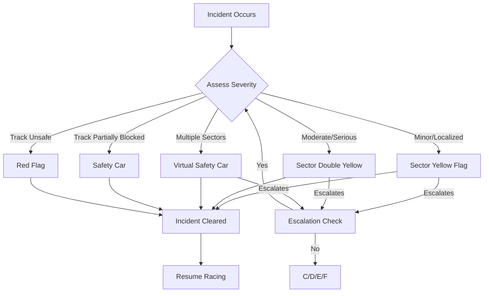
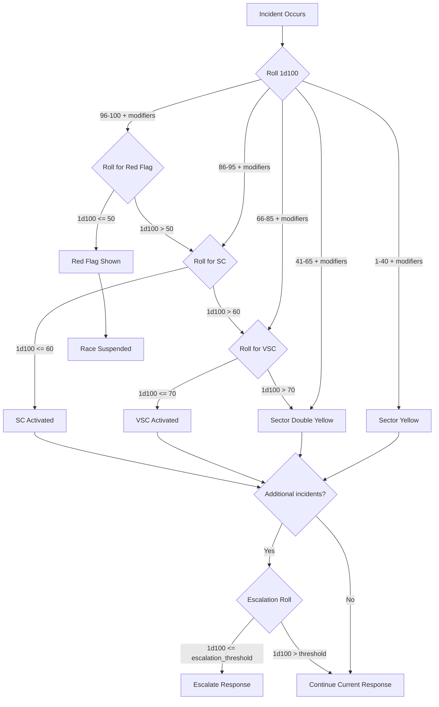

# Incident Response System Plan

## Overview

This document outlines the incident response system for F1 race simulations, handling various safety measures according to F1 sporting regulations.

## 1. Safety Response Types

### 1.1 Response Hierarchy

| Response Level | Trigger Conditions | Duration | Speed Limit |
|---------------|-------------------|----------|-------------|
| **Sector Yellow** | Minor incident in sector | Until cleared | No passing in sector |
| **Sector Double Yellow** | Serious incident in sector | Until cleared | Significantly reduced speed |
| **VSC (Virtual Safety Car)** | Incident requiring caution | Until cleared | VSC delta limit (typically 40% slower) |
| **Safety Car** | Track partially blocked | Until track clear | Follow safety car |
| **Red Flag** | Track completely blocked/unsafe | Until conditions safe | Race suspended |

### 1.2 Response Flow



---

## 2. Sector Flag System

### 2.1 Sector Definitions

Tracks are divided into 3 sectors for flag purposes:
- Sector 1: Start/Finish to end of first third
- Sector 2: End of Sector 1 to end of second third
- Sector 3: End of Sector 2 to Start/Finish

### 2.2 Yellow Flag Rules

```python
class SectorFlag(Enum):
    """Sector flag states"""
    GREEN = "green"
    YELLOW = "yellow"
    DOUBLE_YELLOW = "double_yellow"

class SectorFlagManager:
    """Manage sector flags during race"""
    
    def __init__(self, num_sectors: int = 3):
        self.num_sectors = num_sectors
        self.sector_flags: Dict[int, SectorFlag] = {
            i: SectorFlag.GREEN for i in range(1, num_sectors + 1)
        }
        self.flag_history: List[Dict] = []
        self.active_incidents: Dict[int, List[Incident]] = {
            i: [] for i in range(1, num_sectors + 1)
        }
    
    def set_yellow_flag(
        self,
        sector: int,
        incident: Incident,
        double_yellow: bool = False
    ) -> SectorFlag:
        """
        Set yellow flag for a sector.
        
        Args:
            sector: Sector number (1-3)
            incident: The incident causing the flag
            double_yellow: Whether to set double yellow
            
        Returns:
            New flag state
        """
        flag = SectorFlag.DOUBLE_YELLOW if double_yellow else SectorFlag.YELLOW
        
        # Check escalation
        current_flag = self.sector_flags[sector]
        if current_flag == SectorFlag.YELLOW and double_yellow:
            # Escalating from single to double yellow
            self._log_flag_change(sector, current_flag, flag, incident)
        elif current_flag == SectorFlag.GREEN:
            # New yellow flag
            self._log_flag_change(sector, current_flag, flag, incident)
            
        self.sector_flags[sector] = flag
        self.active_incidents[sector].append(incident)
        
        return flag
    
    def clear_yellow_flag(self, sector: int) -> SectorFlag:
        """Clear yellow flag when incident resolved"""
        if self.sector_flags[sector] != SectorFlag.GREEN:
            old_flag = self.sector_flags[sector]
            self.sector_flags[sector] = SectorFlag.GREEN
            self.active_incidents[sector] = []
            self._log_flag_change(sector, old_flag, SectorFlag.GREEN)
            
        return SectorFlag.GREEN
    
    def get_flag_state(self, sector: int) -> SectorFlag:
        """Get current flag state for sector"""
        return self.sector_flags.get(sector, SectorFlag.GREEN)
    
    def should_escalate_to_vsc(self) -> bool:
        """
        Check if situation requires VSC escalation.
        
        Conditions:
        - Multiple sectors with yellow flags
        - Serious incident spanning sectors
        - Recovery vehicle on track
        """
        yellow_sectors = sum(
            1 for f in self.sector_flags.values()
            if f in [SectorFlag.YELLOW, SectorFlag.DOUBLE_YELLOW]
        )
        
        double_yellow_sectors = sum(
            1 for f in self.sector_flags.values()
            if f == SectorFlag.DOUBLE_YELLOW
        )
        
        # Escalate if 2+ sectors flagged or any double yellow
        return yellow_sectors >= 2 or double_yellow_sectors >= 1
```

### 2.3 Yellow Flag Impact on Drivers

```python
@dataclass
class YellowFlagImpact:
    """Impact of yellow flags on driver behavior"""
    
    def get_sector_speed_limit(
        self,
        sector: int,
        flag_manager: SectorFlagManager,
        base_lap_time: float
    ) -> Optional[float]:
        """
        Calculate speed limit under yellow flags.
        
        Returns lap time delta or None if no limit.
        """
        flag = flag_manager.get_flag_state(sector)
        
        if flag == SectorFlag.YELLOW:
            # No passing, maintain speed but be cautious
            return None
        elif flag == SectorFlag.DOUBLE_YELLOW:
            # Significantly reduced speed (10-15% slower)
            return base_lap_time * 1.12
            
        return None
    
    def can_overtake(self, sector: int, flag_manager: SectorFlagManager) -> bool:
        """Check if overtaking allowed in sector"""
        flag = flag_manager.get_flag_state(sector)
        return flag == SectorFlag.GREEN
```

---

## 3. Virtual Safety Car (VSC) System

### 3.1 VSC Trigger Conditions

```python
class VSCTrigger:
    """Determine when VSC should be activated"""
    
    VSC_TRIGGER_CONDITIONS = [
        # Multiple sectors with incidents
        lambda fm: sum(1 for f in fm.sector_flags.values() 
                      if f != SectorFlag.GREEN) >= 2,
        
        # Serious incident requiring track workers
        lambda incidents: any(
            i.severity in [IncidentSeverity.MAJOR, IncidentSeverity.SEVERE]
            for i in incidents
        ),
        
        # Recovery vehicle needed
        lambda incidents: any(
            i.incident_type == IncidentType.VEHICLE_FAULT 
            and i.is_retirement
            for i in incidents
        ),
        
        # Debris on track
        lambda incidents: any(
            i.description and "debris" in i.description.lower()
            for i in incidents
        ),
    ]
    
    def should_activate_vsc(
        self,
        flag_manager: SectorFlagManager,
        recent_incidents: List[Incident]
    ) -> Tuple[bool, str]:
        """
        Determine if VSC should be activated.
        
        Returns:
            Tuple of (should_activate, reason)
        """
        # Check multiple sectors
        if sum(1 for f in flag_manager.sector_flags.values() 
               if f != SectorFlag.GREEN) >= 2:
            return True, "Multiple sectors affected"
            
        # Check serious incidents
        for incident in recent_incidents:
            if incident.severity in [IncidentSeverity.MAJOR, IncidentSeverity.SEVERE]:
                return True, f"Serious incident: {incident.description}"
                
            if incident.is_retirement:
                return True, f"Car stopped on track: {incident.driver}"
                
        return False, "No VSC conditions met"
```

### 3.2 VSC Delta Management

```python
@dataclass
class VSCConfig:
    """VSC configuration"""
    delta_reference: float  # Target lap time under VSC
    tolerance: float = 0.5  # +/- seconds allowed
    min_speed_factor: float = 0.35  # 35% slower than racing

class VSCManager:
    """Manage Virtual Safety Car periods"""
    
    def __init__(self, base_lap_time: float):
        self.base_lap_time = base_lap_time
        self.vsc_delta = base_lap_time * 1.40  # 40% slower
        self.is_active = False
        self.start_time: Optional[float] = None
        self.vsc_periods: List[Dict] = []
        
    def activate(self, race_time: float, reason: str):
        """Activate VSC"""
        self.is_active = True
        self.start_time = race_time
        
        self.vsc_periods.append({
            "start_time": race_time,
            "reason": reason,
            "end_time": None,
            "duration": None,
        })
        
    def deactivate(self, race_time: float):
        """Deactivate VSC"""
        if self.is_active and self.vsc_periods:
            self.is_active = False
            period = self.vsc_periods[-1]
            period["end_time"] = race_time
            period["duration"] = race_time - period["start_time"]
            
    def get_vsc_lap_time(self) -> float:
        """Get target lap time under VSC"""
        return self.vsc_delta
        
    def check_delta_compliance(
        self,
        driver_lap_time: float,
        tolerance: float = 0.5
    ) -> bool:
        """Check if driver is maintaining VSC delta"""
        return abs(driver_lap_time - self.vsc_delta) <= tolerance
```

---

## 4. Safety Car System

### 4.1 Safety Car Trigger Conditions

```python
class SafetyCarTrigger:
    """Determine when Safety Car should be deployed"""
    
    def should_deploy_safety_car(
        self,
        incidents: List[Incident],
        sector_flags: Dict[int, SectorFlag],
        track_blocked: bool = False
    ) -> Tuple[bool, str]:
        """
        Determine if Safety Car should be deployed.
        
        Triggers:
        - Track partially blocked
        - Multiple serious incidents
        - Recovery vehicle on racing line
        - Heavy rain/visibility issues
        - All sectors with yellow flags
        
        Returns:
            Tuple of (should_deploy, reason)
        """
        # Track blocked
        if track_blocked:
            return True, "Track partially blocked"
            
        # All sectors flagged
        if all(f != SectorFlag.GREEN for f in sector_flags.values()):
            return True, "All sectors under yellow flags"
            
        # Multiple serious incidents
        serious_count = sum(
            1 for i in incidents
            if i.severity in [IncidentSeverity.MAJOR, IncidentSeverity.SEVERE]
        )
        if serious_count >= 2:
            return True, f"Multiple serious incidents ({serious_count})"
            
        # Recovery vehicle needed on track
        for incident in incidents:
            if (incident.is_retirement and 
                incident.severity == IncidentSeverity.SEVERE):
                return True, f"Recovery vehicle required for {incident.driver}"
                
        return False, "No Safety Car conditions met"


class SafetyCarManager:
    """Manage Safety Car periods"""
    
    def __init__(self):
        self.is_deployed = False
        self.leader: Optional[str] = None
        self.start_time: Optional[float] = None
        self.laps_completed = 0
        self.sc_periods: List[Dict] = []
        
    def deploy(self, race_time: float, leader: str, lap: int):
        """Deploy Safety Car"""
        self.is_deployed = True
        self.leader = leader
        self.start_time = race_time
        
        self.sc_periods.append({
            "start_time": race_time,
            "start_lap": lap,
            "leader": leader,
            "end_time": None,
            "end_lap": None,
            "duration": None,
        })
        
    def recall(self, race_time: float, lap: int):
        """Recall Safety Car - will enter pit next lap"""
        # Safety Car will come in at end of next lap
        pass
        
    def deactivate(self, race_time: float, lap: int):
        """Safety Car enters pits, racing resumes"""
        if self.is_deployed and self.sc_periods:
            self.is_deployed = False
            period = self.sc_periods[-1]
            period["end_time"] = race_time
            period["end_lap"] = lap
            period["duration"] = race_time - period["start_time"]
            
    def get_delta_to_sc(self, driver_time: float, leader_time: float) -> float:
        """
        Calculate gap to car ahead under Safety Car.
        
        Drivers must maintain gaps (typically 10 car lengths).
        """
        return leader_time - driver_time
```

### 4.2 Safety Car Rules

```python
@dataclass
class SafetyCarRules:
    """Safety Car period rules"""
    
    # Gap maintenance
    min_gap_seconds: float = 1.0  # Minimum gap to car ahead
    max_gap_seconds: float = 3.0  # Maximum gap allowed
    
    # Overtaking
    allow_overtaking: bool = False  # No overtaking under SC
    allow_unlapping: bool = True  # Lapped cars may unlap
    
    # Pit stops
    pit_lane_open: bool = True  # Pit lane remains open
    sc_delta_time: float = 0.0  # Time delta under SC
    
    def can_pit_stop(self) -> bool:
        """Check if pit stops allowed under SC"""
        return self.pit_lane_open
        
    def get_sc_lap_time(self, base_lap_time: float) -> float:
        """Get lap time under Safety Car"""
        # Safety Car runs at reduced speed
        return base_lap_time * 1.3  # 30% slower
```

---

## 5. Red Flag System

### 5.1 Red Flag Trigger Conditions

```python
class RedFlagTrigger:
    """Determine when race should be red flagged"""
    
    RED_FLAG_CONDITIONS = [
        # Track completely blocked
        "track_blocked",
        # Multiple car collision blocking track
        "multi_car_collision",
        # Severe weather conditions
        "severe_weather",
        # Track surface unsafe (oil/debris)
        "track_unsafe",
        # Medical emergency requiring track access
        "medical_emergency",
        # Structural damage to barriers
        "barrier_damage",
    ]
    
    def should_red_flag(
        self,
        incidents: List[Incident],
        sector_flags: Dict[int, SectorFlag],
        weather_conditions: str = "dry"
    ) -> Tuple[bool, str]:
        """
        Determine if race should be red flagged.
        
        Returns:
            Tuple of (should_red_flag, reason)
        """
        # Track completely blocked
        if all(f == SectorFlag.DOUBLE_YELLOW for f in sector_flags.values()):
            return True, "Track completely blocked"
            
        # Multiple retirements blocking track
        blocking_cars = sum(
            1 for i in incidents
            if i.is_retirement and i.severity == IncidentSeverity.SEVERE
        )
        if blocking_cars >= 2:
            return True, f"Multiple cars stopped on track ({blocking_cars})"
            
        # Severe weather
        if weather_conditions in ["heavy_rain", "storm", "fog"]:
            return True, f"Unsafe weather conditions: {weather_conditions}"
            
        # Serious barrier damage
        for incident in incidents:
            if "barrier" in incident.description.lower():
                return True, "Barrier damage requiring repair"
                
        return False, "No red flag conditions met"


class RedFlagManager:
    """Manage red flag periods"""
    
    def __init__(self):
        self.is_red_flag = False
        self.start_time: Optional[float] = None
        self.lap_count: int = 0
        self.red_flag_periods: List[Dict] = []
        
    def red_flag(self, race_time: float, lap: int, reason: str):
        """Red flag the race"""
        self.is_red_flag = True
        self.start_time = race_time
        self.lap_count = lap
        
        self.red_flag_periods.append({
            "start_time": race_time,
            "start_lap": lap,
            "reason": reason,
            "end_time": None,
            "end_lap": None,
            "duration": None,
        })
        
    def resume(self, race_time: float, lap: int, standing_start: bool = False):
        """
        Resume race after red flag.
        
        Args:
            race_time: Current race time
            lap: Lap number to resume from
            standing_start: Whether to use standing start
        """
        if self.is_red_flag and self.red_flag_periods:
            self.is_red_flag = False
            period = self.red_flag_periods[-1]
            period["end_time"] = race_time
            period["end_lap"] = lap
            period["duration"] = race_time - period["start_time"]
            period["standing_start"] = standing_start
            
    def get_restart_procedure(self) -> str:
        """Get restart procedure"""
        # Standing start if significant delay
        # Rolling start if brief delay
        if self.red_flag_periods:
            duration = self.red_flag_periods[-1].get("duration", 0)
            if duration and duration > 600:  # > 10 minutes
                return "standing_start"
        return "rolling_start"
```

---

## 6. Integrated Response System

### 6.1 Incident Response Manager

```python
class IncidentResponseManager:
    """
    Central manager for all incident responses.
    
    Coordinates between sector flags, VSC, Safety Car, and Red Flag systems.
    """
    
    def __init__(self, base_lap_time: float, num_sectors: int = 3):
        # Sub-systems
        self.sector_flags = SectorFlagManager(num_sectors)
        self.vsc = VSCManager(base_lap_time)
        self.safety_car = SafetyCarManager()
        self.red_flag = RedFlagManager()
        
        # Triggers
        self.vsc_trigger = VSCTrigger()
        self.sc_trigger = SafetyCarTrigger()
        self.rf_trigger = RedFlagTrigger()
        
        # State
        self.current_state: str = "green"
        self.response_history: List[Dict] = []
        
    def process_incident(
        self,
        incident: Incident,
        race_time: float,
        lap: int,
        sector: int,
        weather: str = "dry"
    ) -> Dict:
        """
        Process an incident and determine appropriate response.
        
        Returns:
            Dict with response details
        """
        # Check red flag first (highest priority)
        should_rf, rf_reason = self.rf_trigger.should_red_flag(
            [incident],
            self.sector_flags.sector_flags,
            weather
        )
        
        if should_rf:
            self.red_flag.red_flag(race_time, lap, rf_reason)
            return {
                "response": "red_flag",
                "reason": rf_reason,
                "incident": incident
            }
            
        # Check for sector flags
        double_yellow = incident.severity in [
            IncidentSeverity.MAJOR, IncidentSeverity.SEVERE
        ]
        self.sector_flags.set_yellow_flag(sector, incident, double_yellow)
        
        # Check Safety Car
        should_sc, sc_reason = self.sc_trigger.should_deploy_safety_car(
            [incident],
            self.sector_flags.sector_flags
        )
        
        if should_sc and not self.safety_car.is_deployed:
            # Need to get leader - would come from race state
            self.safety_car.deploy(race_time, "Leader", lap)
            return {
                "response": "safety_car",
                "reason": sc_reason,
                "incident": incident
            }
            
        # Check VSC
        should_vsc, vsc_reason = self.vsc_trigger.should_activate_vsc(
            self.sector_flags,
            [incident]
        )
        
        if should_vsc and not self.vsc.is_active:
            self.vsc.activate(race_time, vsc_reason)
            return {
                "response": "vsc",
                "reason": vsc_reason,
                "incident": incident
            }
            
        # Default to sector yellow
        return {
            "response": "sector_yellow",
            "sector": sector,
            "double_yellow": double_yellow,
            "incident": incident
        }
    
    def update(self, race_time: float, lap: int) -> Optional[Dict]:
        """
        Update response state.
        
        Called each simulation interval to check for escalations
        or de-escalations.
        """
        # Check if VSC should escalate to Safety Car
        if self.vsc.is_active:
            should_sc, reason = self.sc_trigger.should_deploy_safety_car(
                [],
                self.sector_flags.sector_flags
            )
            if should_sc:
                self.vsc.deactivate(race_time)
                self.safety_car.deploy(race_time, "Leader", lap)
                return {
                    "change": "vsc_to_sc",
                    "reason": reason
                }
                
        # Check if sector flags should escalate
        if self.sector_flags.should_escalate_to_vsc():
            if not self.vsc.is_active and not self.safety_car.is_deployed:
                self.vsc.activate(race_time, "Multiple sectors affected")
                return {
                    "change": "yellow_to_vsc",
                    "reason": "Multiple sectors flagged"
                }
                
        return None
    
    def clear_incident(
        self,
        incident: Incident,
        race_time: float,
        lap: int
    ) -> Dict:
        """Clear an incident and potentially downgrade response"""
        # Find which sector had the incident
        for sector, incidents in self.sector_flags.active_incidents.items():
            if incident in incidents:
                incidents.remove(incident)
                
                # If no more incidents in sector, clear flag
                if not incidents:
                    self.sector_flags.clear_yellow_flag(sector)
                    
        # Check if we can downgrade response
        active_flags = sum(
            1 for f in self.sector_flags.sector_flags.values()
            if f != SectorFlag.GREEN
        )
        
        if active_flags == 0:
            # All clear
            if self.vsc.is_active:
                self.vsc.deactivate(race_time)
                return {"change": "vsc_to_green"}
            elif self.safety_car.is_deployed:
                self.safety_car.recall(race_time, lap)
                return {"change": "sc_to_green"}
                
        return {"change": "incident_cleared"}
        
    def get_current_state(self) -> Dict:
        """Get current response state"""
        return {
            "sector_flags": {
                k: v.value for k, v in self.sector_flags.sector_flags.items()
            },
            "vsc_active": self.vsc.is_active,
            "safety_car_deployed": self.safety_car.is_deployed,
            "red_flag": self.red_flag.is_red_flag,
            "lap_time_target": (
                self.vsc.get_vsc_lap_time() if self.vsc.is_active else None
            ),
        }
```

---

## 7. Integration with Simulation

### 7.1 Modified Simulator Integration

```python
class TimeSteppedDRSSimulator:
    """Extended simulator with incident response"""
    
    def __init__(self, config, drivers, simulation_config=None):
        super().__init__(config, drivers, simulation_config)
        
        # Initialize incident response
        base_lap_time = config.calculate_base_lap_time()
        self.response_manager = IncidentResponseManager(base_lap_time)
        
    def simulate_interval(
        self,
        driver: DriverRaceState,
        target: Optional[DriverRaceState],
        sector: SectorConfig,
        sector_interval: int,
        current_lap: int
    ):
        """Simulate interval with incident response"""
        # Get current response state
        response_state = self.response_manager.get_current_state()
        
        # Apply speed limits if active
        if response_state["vsc_active"]:
            # Use VSC delta
            pass
        elif response_state["safety_car_deployed"]:
            # Follow safety car
            pass
            
        # Check for sector flags
        sector_num = sector.sector_number
        flag = response_state["sector_flags"].get(sector_num, "green")
        
        # Check for incidents
        # ... incident detection ...
        
        # Update response manager
        self.response_manager.update(
            current_time=driver.cumulative_time,
            lap=current_lap
        )
```

---

## 8. Implementation Plan

### Phase 1: Core Response System
1. Create `src/incidents/response/` directory
2. Implement `SectorFlagManager`
3. Implement `VSCManager`
4. Implement `SafetyCarManager`
5. Implement `RedFlagManager`

### Phase 2: Response Triggers
1. Implement `VSCTrigger`
2. Implement `SafetyCarTrigger`
3. Implement `RedFlagTrigger`
4. Implement escalation logic

### Phase 3: Integration
1. Implement `IncidentResponseManager`
2. Integrate with `IncidentManager`
3. Integrate with `TimeSteppedDRSSimulator`
4. Add response state to simulation output

### Phase 4: Testing
1. Test sector flag system
2. Test VSC activation/deactivation
3. Test Safety Car deployment
4. Test Red Flag scenarios
5. Test escalation/de-escalation

---

## 9. Example Scenarios

### Scenario 1: Single Car Incident
```
Lap 23: Verstappen locks up and goes off track in Sector 2
Response: Sector 2 Yellow Flag
Duration: 2 laps
Outcome: Sector cleared, green flag
```

### Scenario 2: Serious Incident
```
Lap 45: Leclerc crashes heavily in Sector 1, car stopped
Response: Sector 1 Double Yellow -> VSC activated
Duration: 3 laps
Outcome: Car recovered, VSC ended
```

### Scenario 3: Multiple Incidents
```
Lap 67: Rain begins, Hamilton spins in Sector 2, Sainz crashes in Sector 3
Response: Sectors 2&3 Yellow -> VSC -> Safety Car
Duration: 5 laps
Outcome: Track cleared, SC ended
```

### Scenario 4: Race Stoppage
```
Lap 15: Multi-car collision in Turn 1, track blocked
Response: Red Flag
Duration: 20 minutes
Outcome: Standing restart
```

---

## 10. Unlapping System (Safety Car)

### 10.1 Overview

Under Safety Car conditions, lapped cars may be allowed to unlap themselves to ensure a fair restart. This is triggered by Race Control decision.

### 10.2 Unlapping Rules (F1 Sporting Regulations)

```
ARTICLE 55.14: When the safety car is ready to leave the track, all lapped cars 
will be required to pass the cars on the lead lap and the safety car.

ARTICLE 55.15: Once the last lapped car has passed the leader, the safety car 
will return to the pits at the end of the following lap.
```

### 10.3 Unlapping System Design

```python
class UnlappingManager:
    """
    Manage unlapping procedure under Safety Car.
    
    Key principles:
    1. Only cars lapped by the leader can unlap
    2. Unlapping is authorized by Race Control
    3. Cars must pass SC and all cars on lead lap
    4. After unlapping, cars rejoin at the back
    5. Once complete, SC comes in next lap
    """
    
    def __init__(self, safety_car_manager: SafetyCarManager):
        self.sc_manager = safety_car_manager
        self.unlapping_authorized = False
        self.lapped_cars: List[str] = []  # Cars that can unlap
        self.unlapped_cars: List[str] = []  # Cars that have completed unlapping
        self.unlapping_start_lap: Optional[int] = None
        
    def authorize_unlapping(self, race_control_decision: bool = True):
        """
        Race Control authorizes unlapping procedure.
        
        This is typically done when:
        - SC has been out for sufficient time
        - Track conditions permit safe unlapping
        - Restart is imminent
        """
        if not self.sc_manager.is_deployed:
            return False, "Safety Car not deployed"
            
        if not race_control_decision:
            return False, "Race Control has not authorized"
            
        self.unlapping_authorized = True
        return True, "Unlapping authorized"
        
    def identify_lapped_cars(
        self,
        car_positions: Dict[str, int],  # Car name -> position
        total_laps: int  # Laps completed by leader
    ) -> List[str]:
        """
        Identify cars that are lapped (1+ laps down).
        
        Args:
            car_positions: Current positions of all cars
            total_laps: Laps completed by race leader
            
        Returns:
            List of car names that can unlap
        """
        lapped = []
        
        for car_name, position in car_positions.items():
            # Car is lapped if they are more than 1 lap down
            # This would need actual lap count tracking
            # Simplified: cars not on lead lap
            car_lap = self._get_car_lap(car_name)
            
            if car_lap < total_laps:
                lapped.append({
                    "name": car_name,
                    "position": position,
                    "laps_down": total_laps - car_lap
                })
                
        # Sort by position (cars closest to leader unlap first)
        lapped.sort(key=lambda x: x["position"])
        
        return [c["name"] for c in lapped]
        
    def execute_unlap_procedure(self, car_name: str) -> bool:
        """
        Execute unlapping for a single car.
        
        Procedure:
        1. Car passes Safety Car
        2. Car passes all cars on lead lap
        3. Car rejoins at the back of the field
        4. Car is now on lead lap
        
        Returns:
            True if unlapping completed successfully
        """
        if not self.unlapping_authorized:
            return False
            
        if car_name not in self.lapped_cars:
            return False
            
        # Simulate unlapping procedure
        # In real implementation, this would modify positions/gaps
        self.lapped_cars.remove(car_name)
        self.unlapped_cars.append(car_name)
        
        return True
        
    def check_unlapping_complete(self) -> bool:
        """
        Check if all lapped cars have unlapped.
        
        When complete:
        - SC will come in at end of next lap
        - Racing resumes on following lap
        """
        return len(self.lapped_cars) == 0 and len(self.unlapped_cars) > 0
        
    def get_restart_lap(self) -> Optional[int]:
        """
        Get the lap when racing will resume.
        
        Returns:
            Lap number for restart, or None if unlapping not complete
        """
        if not self.check_unlapping_complete():
            return None
            
        # Racing resumes the lap after SC comes in
        return self.sc_manager.activation_lap + 2
        
    def reset(self):
        """Reset unlapping state"""
        self.unlapping_authorized = False
        self.lapped_cars = []
        self.unlapped_cars = []
        self.unlapping_start_lap = None
```

### 10.4 Unlapping Procedure Flow

```
1. SC Deployed
   ↓
2. Race Control monitors situation
   ↓
3. Race Control authorizes unlapping
   ↓
4. Message: "LAPPED CARS MAY NOW OVERTAKE"
   ↓
5. Lapped cars pass SC and lead lap cars
   ↓
6. Cars rejoin at back of field
   ↓
7. All lapped cars complete procedure
   ↓
8. Message: "SAFETY CAR IN THIS LAP"
   ↓
9. SC enters pits at end of lap
   ↓
10. Racing resumes next lap
```

### 10.5 Race Control Decision Logic

```python
class RaceControlDecision:
    """
    Simulate Race Control decisions for unlapping.
    """
    
    def should_authorize_unlapping(
        self,
        sc_duration_laps: int,
        lapped_cars_count: int,
        track_conditions: str,
        laps_remaining: int
    ) -> Tuple[bool, str]:
        """
        Determine if Race Control should authorize unlapping.
        
        Factors:
        - SC has been out for sufficient time (typically 3+ laps)
        - There are lapped cars to unlap
        - Track conditions permit safe unlapping
        - Sufficient laps remaining for procedure + restart
        
        Returns:
            Tuple of (should_authorize, reason)
        """
        # Minimum SC duration
        if sc_duration_laps < 3:
            return False, "SC not out long enough"
            
        # Need lapped cars
        if lapped_cars_count == 0:
            return False, "No lapped cars"
            
        # Track conditions
        if track_conditions in ["wet", "poor"]:
            return False, "Track conditions unsafe"
            
        # Sufficient laps remaining
        if laps_remaining < 5:
            return False, "Insufficient laps for procedure"
            
        return True, "Unlapping authorized by Race Control"
```

### 10.6 Integration with Safety Car

```python
class SafetyCarManagerWithUnlapping(SafetyCarManager):
    """Extended Safety Car manager with unlapping support"""
    
    def __init__(self, base_lap_time: float):
        super().__init__(base_lap_time)
        self.unlapping = UnlappingManager(self)
        
    def deploy(self, race_time, lap, reason, leader, car_order, gaps):
        """Deploy SC and reset unlapping"""
        super().deploy(race_time, lap, reason, leader, car_order, gaps)
        self.unlapping.reset()
        
    def recall(self, race_time, lap):
        """
        Signal SC to come in.
        
        If unlapping authorized but not complete, wait.
        """
        if self.unlapping.unlapping_authorized:
            if not self.unlapping.check_unlapping_complete():
                return False, "Unlapping not yet complete"
                
        super().recall(race_time, lap)
        return True, "SC coming in this lap"
```

### 10.7 Example Scenario

```
Lap 45: Safety Car deployed due to debris

Lap 48: Race Control authorizes unlapping
         Message: "LAPPED CARS MAY NOW OVERTAKE"
         
Lap 48-49: 
  - Norris (P15, 1 lap down) unlaps, rejoins at back
  - Alonso (P17, 2 laps down) unlaps, rejoins at back
  - Zhou (P19, 1 lap down) unlaps, rejoins at back
  
Lap 50: All lapped cars complete procedure
         Message: "SAFETY CAR IN THIS LAP"
         
Lap 50 (end): SC enters pits

Lap 51: Racing resumes with all cars on lead lap
```

---

## 11. Red Flag System

### 11.1 Overview

The red flag is the highest level of race interruption. It stops the race completely when conditions are unsafe to continue.

### 11.2 Red Flag Triggers

```python
class RedFlagTrigger:
    """
    Determine when red flag should be shown.
    Based on F1 Sporting Regulations.
    """
    
    def should_red_flag(
        self,
        incidents: List[Incident],
        sector_flags: Dict[int, SectorFlag],
        weather: str = "dry",
        track_blocked: bool = False
    ) -> Tuple[bool, str]:
        """
        Determine if red flag should be shown.
        
        Triggers:
        - Track completely blocked
        - Multiple serious collisions
        - Severe weather (heavy rain, storm, poor visibility)
        - Track surface unsafe (oil, major debris)
        - Medical emergency requiring track access
        - Structural barrier damage
        
        Returns:
            Tuple of (should_red_flag, reason)
        """
        # Track completely blocked
        if track_blocked:
            return True, "Track completely blocked"
            
        # All sectors under double yellow
        if all(f == SectorFlag.DOUBLE_YELLOW for f in sector_flags.values()):
            return True, "All sectors unsafe"
            
        # Multiple serious incidents
        serious_incidents = sum(
            1 for i in incidents
            if i.severity == IncidentSeverity.SEVERE
        )
        if serious_incidents >= 2:
            return True, f"Multiple serious incidents ({serious_incidents})"
            
        # Severe weather
        if weather in ["heavy_rain", "storm", "fog", "poor_visibility"]:
            return True, f"Severe weather: {weather}"
            
        # Medical emergency
        for incident in incidents:
            if "medical" in incident.description.lower():
                return True, "Medical emergency"
                
        return False, "No red flag conditions met"
```

### 11.3 Race Distance Thresholds

Based on F1 Sporting Regulations Article 5.4:

```python
class RedFlagRaceDistanceRules:
    """
    Race distance rules for red flag situations.
    """
    
    # Thresholds
    MIN_LAPS_FOR_RESULT = 2  # Minimum laps for classification
    RESUME_THRESHOLD = 0.75   # 75% - can still resume
    END_RACE_THRESHOLD = 0.90  # 90% - race may be ended
    
    def determine_outcome(
        self,
        completed_laps: int,
        total_laps: int,
        race_time: float,
        max_race_duration: float = 7200  # 2 hours
    ) -> Dict:
        """
        Determine race outcome based on red flag timing.
        
        Returns dict with:
        - outcome: "restart", "end", "resume", "abandon"
        - reason: Explanation
        - classification_lap: Which lap to use for results
        """
        completion_ratio = completed_laps / total_laps
        
        # Less than 2 laps - no result
        if completed_laps < self.MIN_LAPS_FOR_RESULT:
            return {
                "outcome": "abandon",
                "reason": "Less than 2 laps completed",
                "classification_lap": 0,
                "points_awarded": False
            }
            
        # More than 90% complete - race ends
        if completion_ratio >= self.END_RACE_THRESHOLD:
            return {
                "outcome": "end",
                "reason": f"More than 90% complete ({completion_ratio:.1%})",
                "classification_lap": completed_laps,
                "points_awarded": True,
                "full_points": True
            }
            
        # More than 75% but less than 90% - race may end
        if completion_ratio >= self.RESUME_THRESHOLD:
            # Check if conditions allow restart
            can_restart = self._can_restart_race(race_time, max_race_duration)
            
            if not can_restart:
                return {
                    "outcome": "end",
                    "reason": f"75-90% complete, insufficient time for restart",
                    "classification_lap": completed_laps,
                    "points_awarded": True,
                    "full_points": True
                }
            else:
                return {
                    "outcome": "restart",
                    "reason": f"75-90% complete, but restart possible",
                    "restart_type": "standing",
                    "remaining_laps": total_laps - completed_laps
                }
                
        # Less than 75% - always restart
        return {
            "outcome": "restart",
            "reason": f"Less than 75% complete ({completion_ratio:.1%})",
            "restart_type": "standing",
            "remaining_laps": total_laps - completed_laps
        }
    
    def _can_restart_race(
        self,
        current_race_time: float,
        max_duration: float = 7200
    ) -> bool:
        """
        Check if race can be restarted within time limits.
        
        F1 races have a maximum duration (typically 2 hours + 1 lap).
        """
        # Assume restart takes ~10 minutes + remaining laps
        restart_overhead = 600  # 10 minutes for red flag period
        
        return (current_race_time + restart_overhead) < max_duration
```

### 11.4 Red Flag Procedure

```python
class RedFlagManager:
    """
    Manage red flag periods.
    """
    
    def __init__(self, total_laps: int, track_length_km: float):
        self.total_laps = total_laps
        self.track_length = track_length_km
        self.total_distance = total_laps * track_length_km
        
        # State
        self.is_red_flag = False
        self.start_time: Optional[float] = None
        self.start_lap: Optional[int] = None
        self.start_distance: float = 0.0  # Distance covered when RF shown
        
        # Results
        self.outcome: Optional[str] = None
        self.classification_lap: Optional[int] = None
        
        # History
        self.red_flag_periods: List[Dict] = []
        
    def show_red_flag(
        self,
        race_time: float,
        lap: int,
        reason: str,
        car_positions: Dict[str, float]  # car -> distance
    ):
        """
        Show red flag.
        
        All cars must return to pits immediately.
        """
        if self.is_red_flag:
            return False, "Red flag already shown"
            
        self.is_red_flag = True
        self.start_time = race_time
        self.start_lap = lap
        self.start_distance = max(car_positions.values()) if car_positions else 0
        
        self.red_flag_periods.append({
            "start_time": race_time,
            "start_lap": lap,
            "reason": reason,
            "start_distance": self.start_distance,
            "end_time": None,
            "outcome": None,
        })
        
        return True, f"RED FLAG - Lap {lap}: {reason}"
        
    def assess_race_status(self) -> Dict:
        """
        Determine race outcome based on distance covered.
        
        Called after red flag to decide:
        - End race (if >90% or conditions prevent restart)
        - Standing restart (if <90% and conditions permit)
        """
        distance_rules = RedFlagRaceDistanceRules()
        
        outcome = distance_rules.determine_outcome(
            completed_laps=self.start_lap,
            total_laps=self.total_laps,
            race_time=self.start_time if self.start_time else 0
        )
        
        self.outcome = outcome["outcome"]
        self.classification_lap = outcome.get("classification_lap")
        
        return outcome
        
    def resume_race(
        self,
        race_time: float,
        standing_start: bool = True
    ) -> Dict:
        """
        Resume race after red flag.
        
        Args:
            race_time: Current time
            standing_start: Whether to use standing start
            
        Returns:
            Dict with restart details
        """
        if not self.is_red_flag:
            return {"error": "Red flag not active"}
            
        self.is_red_flag = False
        
        if self.red_flag_periods:
            period = self.red_flag_periods[-1]
            period["end_time"] = race_time
            period["duration"] = race_time - period["start_time"]
            period["outcome"] = "restart"
            period["standing_start"] = standing_start
            
        return {
            "outcome": "restart",
            "restart_type": "standing" if standing_start else "rolling",
            "resumed_at": race_time,
            "remaining_laps": self.total_laps - self.start_lap
        }
        
    def end_race_early(self, race_time: float) -> Dict:
        """
        End race early due to red flag.
        
        Results are taken from last completed lap before red flag.
        """
        if not self.is_red_flag:
            return {"error": "Red flag not active"}
            
        self.is_red_flag = False
        
        if self.red_flag_periods:
            period = self.red_flag_periods[-1]
            period["end_time"] = race_time
            period["outcome"] = "ended"
            
        return {
            "outcome": "ended",
            "classification_lap": self.start_lap,
            "reason": self.outcome or "Red flag - race distance threshold met",
            "full_points": True if self.start_lap / self.total_laps >= 0.75 else False
        }
```

### 11.5 Restart Procedures

```python
class RedFlagRestart:
    """
    Manage restart after red flag.
    """
    
    def __init__(self, red_flag_manager: RedFlagManager):
        self.rf_manager = red_flag_manager
        
    def prepare_standing_restart(
        self,
        grid_positions: Dict[str, int],  # car -> grid position
        car_status: Dict[str, str]  # car -> status (running, retired, etc.)
    ) -> Dict:
        """
        Prepare standing restart grid.
        
        Grid order is based on positions at last completed lap before red flag.
        """
        # Filter out retired cars
        running_cars = {
            car: pos for car, pos in grid_positions.items()
            if car_status.get(car) == "running"
        }
        
        # Sort by position
        sorted_grid = sorted(running_cars.items(), key=lambda x: x[1])
        
        return {
            "restart_type": "standing",
            "grid": [car for car, _ in sorted_grid],
            "positions": {car: i+1 for i, (car, _) in enumerate(sorted_grid)},
            "formation_lap": True,
        }
        
    def get_restart_message(self) -> str:
        """Get restart announcement message"""
        if self.rf_manager.outcome == "end":
            return "RACE ENDED - Results taken from lap before red flag"
        elif self.rf_manager.outcome == "restart":
            return "RACE WILL RESUME - Standing start"
        else:
            return "RACE SUSPENDED"
```

### 11.6 Example Red Flag Scenarios

**Scenario 1: Early Red Flag (20% complete)**
```
Lap 15 of 70: Multi-car collision blocks track
Red Flag shown
Distance: 20%
Outcome: Standing restart, remaining 55 laps
Restart: Grid based on positions at lap 14
```

**Scenario 2: Late Red Flag (85% complete)**
```
Lap 60 of 70: Heavy rain, aquaplaning incidents
Red Flag shown  
Distance: 85%
Outcome: Race ended (over 75%, insufficient time)
Results: Classification from lap 59
Full points awarded
```

**Scenario 3: Very Late Red Flag (95% complete)**
```
Lap 67 of 70: Major barrier damage
Red Flag shown
Distance: 95%
Outcome: Race ended (over 90% threshold)
Results: Classification from lap 66
Full points awarded
```

## Summary

This incident response system provides:

1. **Sector Flags**: Localized warnings for minor incidents
2. **VSC**: Race-neutralizing caution for moderate incidents  
3. **Safety Car**: Physical pacing for serious incidents with unlapping support
4. **Red Flag**: Race suspension with distance-based outcome rules
5. **Unlapping System**: Allows lapped cars to regain lead lap under SC

The system follows F1 sporting regulations for all response types and handles escalation/de-escalation appropriately.

---

## 12. Dice-Controlled Incident Escalation System

### 12.1 Overview

All safety responses are triggered through dice rolls originating from the existing incident system. The severity of incidents determines the escalation path, with dice rolls controlling:
- Response type (yellow → VSC → SC → red flag)
- Duration of VSC/SC periods
- Red flag timing and race continuation

### 12.2 Severity-Based Escalation Dice

When an incident occurs, the system rolls dice to determine the appropriate safety response:

```python
class IncidentEscalationDice:
    """
    Dice-controlled escalation from incident to safety response.
    """
    
    def determine_response(self, incident: Incident) -> SafetyResponse:
        """
        Roll dice to determine safety response based on incident severity.
        
        Dice rolls:
        1. Base response roll (1d100)
        2. Severity modifier applied
        3. Escalation check for higher responses
        """
        base_roll = roll_d100()  # 1-100
        
        # Apply severity modifier
        severity_mod = self._get_severity_modifier(incident.severity)
        modified_roll = base_roll + severity_mod
        
        # Determine base response
        if modified_roll <= 40:
            return SectorYellow(incident.sector)
        elif modified_roll <= 65:
            return SectorDoubleYellow(incident.sector)
        elif modified_roll <= 85:
            return self._check_vsc_eligibility(incident)
        elif modified_roll <= 95:
            return self._check_sc_eligibility(incident)
        else:
            return self._check_red_flag_eligibility(incident)
    
    def _get_severity_modifier(self, severity: IncidentSeverity) -> int:
        """
        Dice modifier based on incident severity.
        Higher severity = more likely to trigger higher responses.
        """
        modifiers = {
            IncidentSeverity.MINOR: -20,      # Less likely for major responses
            IncidentSeverity.MODERATE: 0,      # No modifier
            IncidentSeverity.MAJOR: +15,       # More likely for SC/VSC
            IncidentSeverity.SEVERE: +30,      # Very likely for SC/red flag
        }
        return modifiers.get(severity, 0)
```

### 12.3 Escalation Flow with Dice



### 12.4 Escalation Threshold Table

| Current Response | Escalation Threshold | Next Response |
|------------------|---------------------|---------------|
| Sector Yellow | 30% (roll ≤ 30) | Sector Double Yellow |
| Sector Double Yellow | 25% (roll ≤ 25) | VSC |
| VSC | 20% (roll ≤ 20) | SC |
| SC | 15% (roll ≤ 15) | Red Flag |

---

## 13. Gaussian Distribution for VSC/SC Duration

### 13.1 Duration Dice System

VSC and SC durations are determined by Gaussian (normal) distributions based on real-world data:

```python
class DurationDiceRoller:
    """
    Gaussian distribution-based duration rolling.
    Ensures durations fall within 3-sigma of real-world typical values.
    """
    
    # Real-world statistics from FastF1 calibration
    VSC_MEAN_LAPS = 2.8
    VSC_STD_DEV = 0.8
    
    SC_MEAN_LAPS = 4.2
    SC_STD_DEV = 1.5
    
    def roll_vsc_duration(self) -> int:
        """
        Roll VSC duration using Gaussian distribution.
        
        Returns:
            Duration in laps, clamped to valid range (1-5 laps)
        """
        # Box-Muller transform for normal distribution
        u1 = random.random()
        u2 = random.random()
        z = math.sqrt(-2 * math.log(u1)) * math.cos(2 * math.pi * u2)
        
        # Scale to our distribution
        duration = self.VSC_MEAN_LAPS + (z * self.VSC_STD_DEV)
        
        # Clamp to valid range (within 3-sigma and practical limits)
        duration = max(1.0, min(5.0, duration))
        
        return int(round(duration))
    
    def roll_sc_duration(self) -> int:
        """
        Roll SC duration using Gaussian distribution.
        
        Returns:
            Duration in laps, clamped to valid range (1-10 laps)
        """
        u1 = random.random()
        u2 = random.random()
        z = math.sqrt(-2 * math.log(u1)) * math.cos(2 * math.pi * u2)
        
        duration = self.SC_MEAN_LAPS + (z * self.SC_STD_DEV)
        duration = max(1.0, min(10.0, duration))
        
        return int(round(duration))
```

### 13.2 Duration Distribution

| Response | Mean | Std Dev | 3-Sigma Range | Practical Range |
|----------|------|---------|---------------|-----------------|
| **VSC** | 2.8 laps | 0.8 laps | 0.4 - 5.2 laps | 1 - 5 laps |
| **SC** | 4.2 laps | 1.5 laps | -0.3 - 8.7 laps | 1 - 10 laps |

### 13.3 Duration Modifiers

Additional dice rolls can modify duration based on circumstances:

```python
def apply_duration_modifiers(
    base_duration: int,
    track_conditions: str,
    incident_count: int
) -> int:
    """
    Apply modifiers to base duration.
    
    Modifiers (dice-based):
    - Wet conditions: +1d2 laps
    - Multiple incidents: +1 lap per incident beyond first
    - Recovery difficulty roll (1d100): extend if > 70
    """
    modified = base_duration
    
    # Weather modifier
    if track_conditions == "wet":
        modified += roll_d2()  # 1-2 additional laps
    elif track_conditions == "heavy_rain":
        modified += roll_d3()  # 1-3 additional laps
    
    # Incident cascade modifier
    if incident_count > 1:
        modified += (incident_count - 1)
    
    # Recovery difficulty
    recovery_roll = roll_d100()
    if recovery_roll > 70:
        modified += 1  # Complex recovery
    if recovery_roll > 90:
        modified += 1  # Very complex recovery
    
    return min(modified, 10)  # Cap at 10 laps
```

---

## 14. Dice-Controlled Red Flag Timing

### 14.1 Red Flag Stop Timing

When a red flag is triggered, dice rolls determine the race stoppage characteristics:

```python
class RedFlagTimingDice:
    """
    Dice-controlled red flag timing system.
    Supports future weather system integration.
    """
    
    def determine_stoppage_duration(
        self,
        weather_condition: str,
        track_damage: int,  # 0-100 scale
        incident_severity: IncidentSeverity
    ) -> Dict:
        """
        Roll dice to determine red flag stoppage timing.
        
        Returns dict with:
        - min_resume_time: Minimum time before restart (seconds)
        - max_resume_time: Maximum time before restart (seconds)
        - weather_clearance_roll: Roll needed for weather to clear
        """
        # Base stoppage time roll (1d100)
        base_time_roll = roll_d100()
        
        # Base duration table (minutes)
        if base_time_roll <= 30:
            base_minutes = 10  # Quick clear
        elif base_time_roll <= 60:
            base_minutes = 20  # Standard
        elif base_time_roll <= 85:
            base_minutes = 35  # Extended
        else:
            base_minutes = 50  # Major delay
        
        # Weather modifier (for future weather system)
        weather_mod = self._get_weather_modifier(weather_condition)
        
        # Track damage modifier
        damage_mod = track_damage / 50  # 0-2 additional minutes per 50 damage
        
        total_minutes = base_minutes + weather_mod + damage_mod
        
        # Weather clearance dice (for weather system integration)
        clearance_threshold = self._get_clearance_threshold(weather_condition)
        
        return {
            "min_resume_time": total_minutes * 60,
            "max_resume_time": (total_minutes + 15) * 60,
            "weather_clearance_roll": clearance_threshold,
            "base_roll": base_time_roll,
        }
    
    def _get_weather_modifier(self, condition: str) -> int:
        """Additional time for weather conditions"""
        modifiers = {
            "dry": 0,
            "light_rain": 5,
            "heavy_rain": 15,
            "storm": 30,
            "fog": 20,
        }
        return modifiers.get(condition, 0)
    
    def _get_clearance_threshold(self, condition: str) -> int:
        """
        Dice threshold for weather clearance.
        Roll 1d100 each minute, resume when roll <= threshold.
        """
        thresholds = {
            "dry": 100,        # Always clear
            "light_rain": 70,  # 70% chance per minute
            "heavy_rain": 40,  # 40% chance per minute
            "storm": 15,       # 15% chance per minute
            "fog": 25,         # 25% chance per minute
        }
        return thresholds.get(condition, 50)
```

### 14.2 Red Flag Timing Table

| 1d100 Roll | Base Duration | Typical Scenario |
|------------|---------------|------------------|
| 1-30 | 10 minutes | Quick debris clear |
| 31-60 | 20 minutes | Standard incident |
| 61-85 | 35 minutes | Complex recovery |
| 86-100 | 50+ minutes | Major barrier repair/weather |

### 14.3 Weather System Integration

The red flag timing system includes hooks for future weather implementation:

```python
def check_weather_clearance(
    self,
    current_condition: str,
    elapsed_minutes: int
) -> Tuple[bool, str]:
    """
    Check if weather has cleared for restart.
    
    Roll 1d100 each minute, clear if roll <= threshold.
    """
    threshold = self._get_clearance_threshold(current_condition)
    roll = roll_d100()
    
    if roll <= threshold:
        # Weather cleared - check improvement level
        if roll <= threshold / 2:
            return True, "dry"  # Fully clear
        else:
            return True, "improving"  # Better but not perfect
    
    # Weather persists or worsens
    if roll >= 95:
        return False, "worsening"  # Weather got worse!
    
    return False, current_condition
```

---

## 15. Data-Driven Incident Frequency Fading System

### 15.1 Overview

To prevent races from becoming "crashfests," the system implements a fading mechanism that reduces incident probability as the number of incidents increases.

```python
class IncidentFrequencyFader:
    """
    Data-driven system to fade incident frequency over race.
    Prevents excessive incidents while maintaining realism.
    """
    
    # Target incident counts based on FastF1 calibration
    TARGET_NORMAL_RACE = {
        "total_incidents": 4,
        "yellow_flags": 2.5,
        "vsc_periods": 0.4,
        "sc_periods": 1.0,
        "red_flags": 0.15,
    }
    
    TARGET_CHAOS_RACE = {
        "total_incidents": 15,
        "yellow_flags": 5.6,
        "vsc_periods": 1.1,
        "sc_periods": 5.3,
        "red_flags": 1.4,
    }
    
    def __init__(self, race_type: str = "normal"):
        self.targets = (
            self.TARGET_CHAOS_RACE if race_type == "chaos"
            else self.TARGET_NORMAL_RACE
        )
        self.incident_counts = defaultdict(int)
        self.fading_active = True
    
    def calculate_fade_factor(
        self,
        incident_type: str,
        current_count: int,
        laps_completed: int,
        total_laps: int
    ) -> float:
        """
        Calculate probability fade factor.
        
        Returns multiplier (0.0 - 1.0) for incident probability.
        """
        target = self.targets.get(incident_type, 5)
        
        # Progress through race (0.0 to 1.0)
        race_progress = laps_completed / total_laps
        
        # Calculate how many incidents we "should" have had by now
        expected_by_now = target * race_progress
        
        # If we're ahead of target, fade probability
        if current_count > expected_by_now:
            # Fade more aggressively as we exceed target
            excess = current_count - expected_by_now
            fade = max(0.1, 1.0 - (excess * 0.3))  # 30% fade per excess incident
            return fade
        
        # If we're behind target, slightly increase probability
        if current_count < expected_by_now * 0.5:
            return 1.2  # 20% boost to catch up
        
        return 1.0  # No change
```

### 15.2 Fading Curves

```
Incident Probability Multiplier
    |
1.2 |      _______________
    |     /
1.0 |____/
    |         \
0.7 |          \
    |           \
0.4 |            \
    |             \
0.1 |              \_____
    |_________________________
      0   25%  50%  75%  100%
                Race Progress

Curve varies by how many incidents have occurred vs expected:
- Above expected line: probability fades
- Below expected line: probability may increase slightly
```

### 15.3 Fading Application

```python
def apply_fading_to_roll(
    self,
    base_roll: int,
    incident_type: str,
    current_count: int,
    laps_completed: int,
    total_laps: int
) -> int:
    """
    Apply fading to a dice roll.
    
    Higher fade factor = higher effective roll = less likely to trigger
    """
    fade_factor = self.calculate_fade_factor(
        incident_type, current_count, laps_completed, total_laps
    )
    
    # Adjust roll (higher = less likely to trigger incident)
    adjusted_roll = int(base_roll / fade_factor)
    
    return min(100, adjusted_roll)  # Cap at 100
```

### 15.4 Escalation-Specific Fading

Different safety responses have different fading characteristics:

| Response Type | Fade Rate | Reason |
|---------------|-----------|--------|
| Sector Yellow | Slow (10% per excess) | Common, acceptable |
| Double Yellow | Medium (20% per excess) | Less common |
| VSC | Fast (30% per excess) | Disruptive |
| SC | Very Fast (40% per excess) | Very disruptive |
| Red Flag | Immediate (100% after 1) | Race-ending impact |

### 15.5 Chaos Race Mode

For races that should have higher incident rates:

```python
def set_chaos_mode(self, chaos_level: int = 1):
    """
    Set chaos mode for wet/random races.
    
    Levels:
    0: Normal race (default targets)
    1: Chaotic (1.5x targets)
    2: Mayhem (2.5x targets)
    3: Carnage (4x targets)
    """
    multipliers = {0: 1.0, 1: 1.5, 2: 2.5, 3: 4.0}
    mult = multipliers.get(chaos_level, 1.0)
    
    for key in self.targets:
        self.targets[key] *= mult
```

---

## 16. Implementation Priority

### Phase 1: Core Dice System
1. Implement `IncidentEscalationDice` class
2. Add severity-based response selection
3. Connect to existing incident manager

### Phase 2: Duration System
1. Implement `DurationDiceRoller` with Gaussian distribution
2. Add VSC/SC duration rolling
3. Add duration modifiers

### Phase 3: Red Flag Timing
1. Implement `RedFlagTimingDice` class
2. Add weather system hooks
3. Integrate with existing red flag manager

### Phase 4: Fading System
1. Implement `IncidentFrequencyFader`
2. Add target-based probability adjustment
3. Add chaos mode support
4. Test and calibrate with real race data

### Phase 5: Integration & Testing
1. Wire all systems together
2. Run simulations against FastF1 data
3. Tune parameters for realism
4. Add configuration options for race directors

---

## 17. Rolling Start System

### 17.1 Overview

Rolling starts occur when the race begins (or restarts) behind the Safety Car rather than from a standing start. This is governed by F1 Sporting Regulations and is used in specific circumstances such as wet conditions or poor visibility.

**Key Principle**: All laps completed behind the Safety Car, including formation laps, count as race laps.

### 17.2 Rolling Start Triggers

According to F1 Sporting Regulations, rolling starts may be used in the following circumstances:

```python
class RollingStartTrigger:
    """
    Determine when rolling start should be used.
    """
    
    def should_use_rolling_start(
        self,
        weather_condition: str,
        track_visibility: str,
        race_director_decision: Optional[str] = None,
        is_red_flag_restart: bool = False,
    ) -> Tuple[bool, str]:
        """
        Determine if race should use rolling start.
        
        Returns:
            Tuple of (use_rolling_start, reason)
        """
        # Race director explicit decision
        if race_director_decision == "rolling_start":
            return True, "Race Director decision"
        
        # Wet conditions
        if weather_condition in ["heavy_rain", "storm"]:
            return True, "Heavy rain conditions"
        
        # Poor visibility
        if track_visibility in ["poor", "very_poor", "fog"]:
            return True, "Poor visibility"
        
        # Standing water on grid (not implemented yet)
        # if standing_water_on_grid:
        #     return True, "Standing water on grid"
        
        # Red flag restart - Race Director may choose rolling start
        if is_red_flag_restart:
            # Dice roll for Race Director decision (dry conditions)
            import random
            if random.random() < 0.15:  # 15% chance for rolling restart
                return True, "Red flag - Race Director opted for rolling restart"
        
        return False, "Conditions suitable for standing start"
```

### 17.3 Rolling Start Procedure

```
Phase 1: Formation Lap(s) Behind SC
├── All cars in grid order behind Safety Car
├── SC lights ON
├── Overtaking PROHIBITED
└── Laps count toward race distance

Phase 2: SC Lights Out
├── SC lights go out at designated point
├── Leader controls pace
├── Field remains bunched
└── Overtaking still PROHIBITED

Phase 3: Race Start
├── Leader accelerates after control line
├── Green flags waved
├── Overtaking PERMITTED
└── Racing resumes
```

### 17.4 Lap Counting Rules

**Critical Rule**: ALL laps behind the Safety Car count as race laps.

```python
@dataclass
class RollingStartManager:
    """
    Manage rolling start procedures and lap counting.
    """
    
    total_race_laps: int
    completed_laps: int = 0
    
    # State
    is_rolling_start: bool = False
    formation_laps_completed: int = 0
    sc_lights_out: bool = False
    race_started: bool = False
    
    def start_formation_lap(self, lap_number: int) -> Dict:
        """
        Begin formation lap behind Safety Car.
        
        The formation lap IS counted as a race lap.
        """
        self.is_rolling_start = True
        self.formation_laps_completed += 1
        self.completed_laps += 1  # Counts toward race distance!
        
        return {
            "phase": "formation",
            "lap": lap_number,
            "completed_laps": self.completed_laps,
            "remaining_laps": self.total_race_laps - self.completed_laps,
            "sc_lights": "ON",
            "overtaking": "PROHIBITED",
        }
    
    def sc_lights_out(self, lap_number: int) -> Dict:
        """
        Safety Car lights go out - leader controls pace.
        
        Still behind SC but leader can control pace until start line.
        """
        self.sc_lights_out = True
        
        return {
            "phase": "sc_lights_out",
            "lap": lap_number,
            "message": "SC lights out - leader controls pace",
            "overtaking": "PROHIBITED until after control line",
        }
    
    def race_start(self, lap_number: int) -> Dict:
        """
        Race officially starts - green flags.
        
        This happens when leader crosses the control line.
        """
        self.race_started = True
        
        return {
            "phase": "race_start",
            "lap": lap_number,
            "message": "GREEN FLAG - Racing begins",
            "overtaking": "PERMITTED",
            "laps_completed_under_sc": self.formation_laps_completed,
        }
    
    def get_lap_count_status(self) -> Dict:
        """
        Get current lap counting status.
        
        Returns information about how many laps remain.
        """
        return {
            "total_race_laps": self.total_race_laps,
            "completed_laps": self.completed_laps,
            "remaining_laps": self.total_race_laps - self.completed_laps,
            "laps_under_sc": self.formation_laps_completed,
            "is_rolling_start": self.is_rolling_start,
        }
```

### 17.5 Red Flag Restart with Rolling Start

After a red flag, the race may restart with a rolling start at the Race Director's discretion:

```python
class RedFlagRollingRestart:
    """
    Handle red flag restart with rolling start.
    """
    
    def __init__(self, red_flag_manager: RedFlagManager):
        self.rf_manager = red_flag_manager
        self.rolling_start = RollingStartManager(
            total_race_laps=red_flag_manager.total_laps
        )
    
    def prepare_rolling_restart(
        self,
        grid_positions: Dict[str, int],
        laps_completed_before_rf: int,
    ) -> Dict:
        """
        Prepare rolling restart after red flag.
        
        Args:
            grid_positions: Final classification positions at red flag
            laps_completed_before_rf: Laps completed before red flag shown
            
        Returns:
            Restart configuration
        """
        # Set completed laps (they count!)
        self.rolling_start.completed_laps = laps_completed_before_rf
        
        return {
            "restart_type": "rolling",
            "grid": grid_positions,
            "laps_completed": laps_completed_before_rf,
            "laps_remaining": self.rf_manager.total_laps - laps_completed_before_rf,
            "procedure": "formation_lap_behind_sc",
        }
    
    def execute_rolling_restart(self) -> Dict:
        """
        Execute the rolling restart procedure.
        
        Sequence:
        1. Formation lap behind SC (counts as race lap)
        2. SC lights out at designated point
        3. Leader controls pace to control line
        4. Green flag at control line - racing resumes
        """
        # Formation lap
        formation = self.rolling_start.start_formation_lap(
            self.rolling_start.completed_laps + 1
        )
        
        # SC lights out
        lights_out = self.rolling_start.sc_lights_out(
            self.rolling_start.completed_laps
        )
        
        # Race start
        race_start = self.rolling_start.race_start(
            self.rolling_start.completed_laps
        )
        
        return {
            "formation_lap": formation,
            "sc_lights_out": lights_out,
            "race_start": race_start,
            "total_laps_under_sc": self.rolling_start.formation_laps_completed,
        }
```

### 17.6 Overtaking Rules During Rolling Start

```python
class RollingStartOvertakingRules:
    """
    Enforce overtaking rules during rolling start phases.
    """
    
    def can_overtake(
        self,
        rolling_start_manager: RollingStartManager,
        car_position: str,  # "leader", "following", "lapped"
        has_crossed_control_line: bool,
    ) -> bool:
        """
        Determine if overtaking is permitted.
        
        Rules:
        - Formation lap: NO overtaking
        - SC lights out to control line: NO overtaking
        - After control line (green flag): Overtaking permitted
        """
        if not rolling_start_manager.is_rolling_start:
            return True  # Normal racing conditions
        
        if not rolling_start_manager.race_started:
            # Still in formation or SC lights out phase
            return False
        
        # Race has started - check if this car has crossed control line
        if has_crossed_control_line:
            return True
        
        return False
    
    def get_penalty_for_illegal_overtake(self) -> Dict:
        """
        Get penalty for illegal overtake during rolling start.
        
        Typically 5 or 10 second time penalty.
        """
        return {
            "penalty_type": "time",
            "penalty_seconds": 5,
            "reason": "Illegal overtake during rolling start procedure",
        }
```

### 17.7 Integration with Safety Car System

```python
class RollingStartSafetyCarIntegration:
    """
    Integrate rolling start with Safety Car system.
    """
    
    def __init__(
        self,
        safety_car_manager: SafetyCarManager,
        rolling_start_manager: RollingStartManager,
    ):
        self.sc_manager = safety_car_manager
        self.rs_manager = rolling_start_manager
    
    def start_formation_lap(self, race_time: float, lap: int) -> Dict:
        """
        Start formation lap for rolling start.
        
        Safety Car leads the field for one or more formation laps.
        """
        # Deploy SC if not already deployed
        if not self.sc_manager.is_deployed:
            self.sc_manager.deploy(race_time, "Leader", lap, "Rolling start formation")
        
        # Record formation lap
        formation = self.rs_manager.start_formation_lap(lap)
        
        return {
            "sc_deployed": True,
            "formation_lap": formation,
            "message": f"Formation lap {self.rs_manager.formation_laps_completed} - SC leads field",
        }
    
    def signal_sc_lights_out(self, race_time: float, lap: int) -> Dict:
        """
        Signal SC lights out at designated point.
        
        SC will enter pits at end of this lap.
        """
        # SC lights go out
        self.rs_manager.sc_lights_out(lap)
        
        # Recall SC (will enter pits at end of lap)
        self.sc_manager.recall(race_time, lap)
        
        return {
            "sc_lights": "OUT",
            "message": "Safety Car lights out - leader controls pace",
            "sc_entering_pits": True,
        }
    
    def green_flag_start(self, race_time: float, lap: int) -> Dict:
        """
        Green flag - race officially starts.
        """
        # Deactivate SC
        self.sc_manager.deactivate(race_time, lap)
        
        # Record race start
        start_info = self.rs_manager.race_start(lap)
        
        return {
            "green_flag": True,
            "sc_deactivated": True,
            "laps_under_sc": self.rs_manager.formation_laps_completed,
            "message": "GREEN FLAG - Racing resumes",
        }
```

### 17.8 Race Distance Calculation

```python
class RollingStartRaceDistance:
    """
    Calculate race distance with rolling start laps included.
    """
    
    def __init__(self, total_laps: int):
        self.total_laps = total_laps
        self.laps_under_rolling_start = 0
    
    def add_formation_lap(self):
        """Add a formation lap (counts toward race distance)"""
        self.laps_under_rolling_start += 1
    
    def get_effective_race_distance(self, current_lap: int) -> Dict:
        """
        Get effective race distance accounting for rolling start laps.
        
        Returns:
            Dict with race distance information
        """
        return {
            "total_race_laps": self.total_laps,
            "laps_under_rolling_start": self.laps_under_rolling_start,
            "racing_laps_required": self.total_laps - self.laps_under_rolling_start,
            "current_lap": current_lap,
            "laps_remaining": self.total_laps - current_lap,
        }
    
    def is_race_finished(self, current_lap: int) -> bool:
        """Check if race is finished"""
        return current_lap >= self.total_laps
```

### 17.9 Example: Rolling Start Race

```
Initial Start (Wet Conditions):
================================
Lap 1:  Formation lap behind SC - LIGHTS ON
        - All cars follow SC in grid order
        - Lap counts toward race distance
        
Lap 1 (continued): SC lights OUT at pit entry
        - Leader (VER) controls pace
        - Field remains bunched
        - Still no overtaking
        
Lap 1 (continued): VER crosses control line - GREEN FLAG
        - Racing begins
        - Overtaking permitted
        - 69 laps remaining (70 total - 1 formation)

Red Flag Restart (Rolling):
============================
Lap 45: Red flag shown - race suspended
        - Classification from lap 44
        
Restart Procedure:
        - Cars form up behind SC in classification order
        - Rolling restart chosen by Race Director
        
Lap 45: Formation lap behind SC
        - Counts as race lap
        - SC leads field
        
Lap 45: SC lights out
        - Leader controls pace to control line
        
Lap 45: Green flag at control line
        - Racing resumes
        - 25 laps remaining (70 - 45)
```

### 17.10 Implementation Notes

1. **Lap Counting**: Critical that formation laps count toward race distance
2. **Overtaking Rules**: Strictly enforced - no overtaking until after control line
3. **SC Behavior**: SC lights out signals impending restart, SC enters pits at end of lap
4. **Leader Responsibility**: Leader controls restart pace, cannot be overtaken until after control line
5. **Race Director Discretion**: Rolling start can be chosen for safety reasons even in dry conditions
