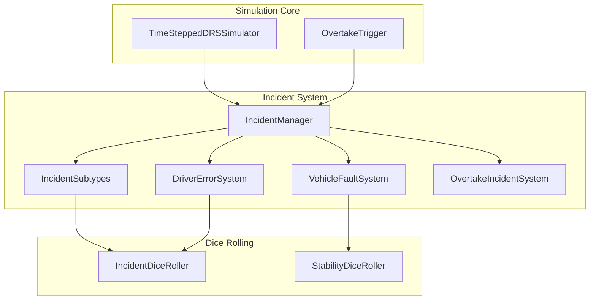

# Incident System Plan - Formula 1 Simulator

## Overview

This document outlines the comprehensive incident system design for the Mujica F1 Modeler. The incident system adds realistic race incidents including crashes, driver errors, and vehicle faults to create dramatic and unpredictable race simulations.

## 1. System Architecture

### 1.1 High-Level Architecture



### 1.2 Incident Categories

| Category | Subtypes | Trigger Mechanism |
|----------|----------|------------------|
| **Overtaking Incidents** | Collision during overtake, Double attack | Overtake trigger system |
| **Driver Errors** | Single-car incident, Multi-car incident, Mistake affecting others | DR-based probability |
| **Vehicle Faults** | Engine, Hybrid, Battery, Chassis, Suspension, Tyres | Stability-based probability |

---

## 2. Overtaking Incident System

### 2.1 Crash During Overtake

When an overtake attempt fails, there's a chance of collision based on:

```python
class OvertakeIncidentProbability:
    """Calculate collision probability during overtake attempts"""
    
    # Base collision probability per overtake attempt
    BASE_COLLISION_PROB = 0.05  # 5% base chance
    
    def get_collision_probability(
        self,
        situation: OvertakeSituation,
        dr_margin: float,
        speed_delta: float,
        track_difficulty: TrackDifficulty
    ) -> float:
        """
        Calculate collision probability for current overtake attempt
        
        Args:
            situation: DRS zone, end of DRS, or elsewhere
            dr_margin: DR difference between attacker and defender
            speed_delta: Speed difference in km/h
            track_difficulty: Track safety rating
            
        Returns:
            Probability of collision (0.0 to 1.0)
        """
        prob = self.BASE_COLLISION_PROB
        
        # DR margin impact
        # Higher DR attacker vs lower DR defender = higher risk
        if dr_margin < -3:  # Attacker much worse than defender
            prob *= 1.5  # Increased risk
        elif dr_margin > 3:  # Attacker much better than defender
            prob *= 0.7  # Reduced risk
            
        # Speed delta impact
        if speed_delta > 30:
            prob *= 1.3
        elif speed_delta < 10:
            prob *= 0.8
            
        # Track difficulty modifier
        prob *= track_difficulty.collision_risk_factor
        
        # Situation modifier
        if situation == OvertakeSituation.ELSEWHERE:
            prob *= 1.2  # Higher risk outside DRS zones
            
        return min(1.0, prob)
```

### 2.2 Double Attack Scenario

The double attack scenario allows a defender to immediately counter-attack after being overtaken.

```python
class DoubleAttackSystem:
    """
    Handle double-attack scenarios where defender immediately counters
    """
    
    def __init__(self):
        self.double_attack_enabled = True
        self.cooldown_seconds = 3.0  # Minimum time before counter
        
    def can_initiate_double_attack(
        self,
        attacker: DriverRaceState,
        defender: DriverRaceState,
        time_since_overtake: float,
        situation: OvertakeSituation
    ) -> Tuple[bool, str]:
        """
        Determine if defender can initiate double attack
        
        Returns:
            Tuple of (can_attack, reason)
        """
        # Check cooldown
        if time_since_overtake < self.cooldown_seconds:
            return False, f"Cooldown active ({time_since_overtake:.1f}s)"
            
        # Check if defender has fresh tyres
        if defender.tyre_degradation > 1.15:
            return False, "Tyres too degraded"
            
        # Check if attacker has DRS disadvantage
        if attacker.drs_available and not defender.drs_available:
            return False, "Attacker has DRS advantage"
            
        # Check DR value - defender must be competitive
        dr_diff = defender.dr_value - attacker.dr_value
        if dr_diff < -5:
            return False, "DR too low for counter-attack"
            
        return True, "Double attack available"
```

### 2.3 Double Attack Dice Resolution

```python
class DoubleAttackConfrontation:
    """
    Resolve double-attack scenarios using confronting dice
    """
    
    def resolve(
        self,
        original_attacker: DriverRaceState,
        original_defender: DriverRaceState,
        situation: OvertakeSituation,
        is_counter_attack: bool = True
    ) -> ConfrontationResult:
        """
        Resolve double-attack confrontation
        
        Special rules for double attacks:
        - Attacker gets -2 penalty (defending position is harder)
        - Defender gets +2 bonus (fresh attack)
        - Same dice formula as normal overtake
        """
        attacker_roll = random.randint(1, 10)
        defender_roll = random.randint(1, 10)
        
        # Calculate modifiers
        attacker_mods = self._calc_double_attack_mods(
            original_attacker, original_defender, situation
        )
        defender_mods = self._calc_double_defend_mods(
            original_attacker, original_defender, situation
        )
        
        # Apply double-attack specific modifiers
        attacker_mods["Attacker_Penalty"] = -2.0  # Defending is harder
        defender_mods["Defender_Bonus"] = 2.0  # Fresh attack
        
        attacker_total = attacker_roll + sum(attacker_mods.values())
        defender_total = defender_roll + sum(defender_mods.values())
        
        return ConfrontationResult(...)
```

---

## 3. Driver Error System

### 3.1 Error Types and Triggers

```python
from enum import Enum
from dataclasses import dataclass
from typing import Dict, List, Optional

class DriverErrorType(Enum):
    """Types of driver errors"""
    LOCKED_BRAKES = "locked_brakes"
    OFF_TRACK = "off_track"
    CORNER_MISTAKE = "corner_mistake"
    SPIN = "spin"
    POLE_POSITION_ERROR = "pole_position_error"
    UNDERSHOOT_CORNER = "undershoot_corner"
    OVERSHOOT_CORNER = "overshoot_corner"

@dataclass
class DriverError:
    """Represents a driver error incident"""
    driver: str
    error_type: DriverErrorType
    severity: float  # 0.0 to 1.0
    time_penalty: float  # Seconds added to lap time
    position_impact: int  # Positions lost/gained
    affected_drivers: List[str]  # Other drivers affected
    narrative_text: str
```

### 3.2 DR-Based Error Probability

```python
class DriverErrorProbability:
    """
    Calculate driver error probability based on DR value
    Higher DR = Lower error probability
    """
    
    # Base error probability per lap
    BASE_ERROR_PROB = 0.03  # 3% per lap
    
    def get_error_probability(
        self,
        dr_value: float,
        lap_number: int,
        tyre_degradation: float,
        race_position: int,
        under_pressure: bool
    ) -> float:
        """
        Calculate error probability for a driver
        
        Args:
            dr_value: Driver's DR value (typically 80-92)
            lap_number: Current lap
            tyre_degradation: Current tyre degradation factor
            race_position: Current position (1 = leader)
            under_pressure: Being pressured by car behind
            
        Returns:
            Error probability (0.0 to 1.0)
        """
        prob = self.BASE_ERROR_PROB
        
        # DR modifier - higher DR = lower error probability
        # Formula: Base - (DR - 80) * factor
        dr_factor = (dr_value - 80) / 40  # DR 92 = 0.3 reduction
        prob -= dr_factor * 0.02  # Max reduction of 0.02
        
        # Tyre degradation factor
        if tyre_degradation > 1.2:
            prob *= 1.5
        elif tyre_degradation > 1.1:
            prob *= 1.2
            
        # Position factor - leaders make fewer errors
        if race_position <= 3:
            prob *= 0.8
        elif race_position >= 15:
            prob *= 1.2  # Backmarkers make more errors
            
        # Pressure factor
        if under_pressure:
            prob *= 1.3
            
        # Lap factor - first laps have more errors
        if lap_number == 1:
            prob *= 1.5
        elif lap_number <= 3:
            prob *= 1.2
            
        return max(0.0, min(1.0, prob))
```

### 3.3 Error Resolution Using Dice

```python
class DriverErrorResolver:
    """
    Resolve driver errors using confronting dice mechanics
    """
    
    def resolve_error(
        self,
        error_type: DriverErrorType,
        driver: DriverRaceState,
        affected_drivers: List[DriverRaceState],
        track_difficulty: TrackDifficulty
    ) -> ErrorResolution:
        """
        Resolve a driver error incident
        
        The driver rolls to see how badly they mess up
        Affected drivers also roll to avoid consequences
        """
        # Driver error roll
        driver_roll = random.randint(1, 10)
        
        # DR modifier for error severity
        dr_modifier = (driver.dr_value - 80) / 2  # -5 to +6
        
        # Calculate error severity
        error_roll = driver_roll + dr_modifier
        
        # Determine outcome based on roll
        if error_roll >= 12:
            severity = "minor"
            time_penalty = 0.5
        elif error_roll >= 8:
            severity = "moderate"
            time_penalty = 1.5
        elif error_roll >= 4:
            severity = "major"
            time_penalty = 3.0
        else:
            severity = "severe"
            time_penalty = 5.0
            
        # Check if other drivers are affected
        affected_outcomes = []
        for affected in affected_drivers:
            affected_roll = random.randint(1, 10)
            affected_dr_mod = (affected.dr_value - 80) / 2
            
            if affected_roll + affected_dr_mod >= 10:
                # Avoided the incident
                affected_outcomes.append({
                    "driver": affected.name,
                    "avoided": True
                })
            else:
                # Caught in the incident
                affected_outcomes.append({
                    "driver": affected.name,
                    "avoided": False,
                    "time_loss": time_penalty * 0.5  # Half the penalty
                })
                
        return ErrorResolution(
            error_type=error_type,
            severity=severity,
            time_penalty=time_penalty,
            driver=driver.name,
            affected_outcomes=affected_outcomes
        )
```

---

## 4. Vehicle Fault System

### 4.1 Stability-Based Probability

Each team has a stability rating (稳定性) that directly affects fault probability.
Based on actual team data from `data/spain_team.csv`:

| Team | Stability |
|------|-----------|
| Aston Martin | 98.5 |
| Haas | 97.5 |
| Alpine | 97.75 |
| Mercedes | 97.0 |
| Andretti | 97.0 |
| Red Bull | 96.0 |
| AlphaTauri | 96.0 |
| McLaren | 96.5 |
| Ferrari | 95.0 |
| Alfa Romeo | 95.0 |
| Williams | 95.0 |

Stability range: **95.0 - 98.5** (higher = more stable)

```python
@dataclass
class TeamStability:
    """Team's car stability configuration"""
    team_name: str
    base_stability: float  # 95-100, higher = more stable
    
    # Component-specific reliability (1-10, higher = more reliable)
    engine_reliability: int = 8
    hybrid_reliability: int = 8
    battery_reliability: int = 7
    chassis_reliability: int = 8
    suspension_reliability: int = 8
    tyre_reliability: int = 9
    
    def get_fault_probability(
        self,
        laps_on_pu: int,
        race_distance_km: float,
        has_incident_damage: bool,
        lap_progress: float = 0.5  # Progress through current stint
    ) -> float:
        """
        Calculate base fault probability for this team
        
        Based on dice_rolling_rules.md structure:
        - Stability >= 96: 81-90 = driver error, 91-100 = mechanical fault
        - Stability < 96: 91-100 = driver error, 81-90 = mechanical fault
        
        Args:
            laps_on_pu: Laps completed on current power unit
            race_distance_km: Total race distance
            has_incident_damage: Whether car has existing damage
            lap_progress: Progress through the current lap (0.0 to 1.0)
            
        Returns:
            Fault probability per lap
        """
        # Base probability from stability (inverse relationship)
        # Higher stability = lower fault probability
        # Range: 95 -> 0.02, 98.5 -> 0.007
        stability_factor = (100 - self.base_stability) / 250
        
        # PU age factor - faults increase with PU age
        # More significant in later stages of PU life
        pu_factor = (laps_on_pu / 50) * 0.01
        
        # Race distance factor
        distance_factor = race_distance_km / 300 * 0.005
        
        # Damage factor
        damage_factor = 0.0
        if has_incident_damage:
            damage_factor = 0.02
            
        # Lap position factor - faults more likely at certain lap points
        # Approaching pit stops or after safety cars
        position_factor = 1.0
        if 0.3 < lap_progress < 0.4:  # Approaching pit window
            position_factor = 1.3
            
        total_prob = (
            stability_factor * position_factor + 
            pu_factor + 
            distance_factor + 
            damage_factor
        )
        
        return min(0.08, max(0.005, total_prob))  # Cap between 0.5% and 8%
```

### 4.2 Component Fault Types

```python
@dataclass
class ComponentFault:
    """Represents a component failure"""
    component: str  # engine, hybrid, battery, chassis, suspension, tyre
    fault_type: str  # Specific fault description
    severity: str  # minor, moderate, major, terminal
    time_loss: float  # Seconds lost
    repairable: bool  # Can be repaired during race
    affected_systems: List[str]  # Other systems affected

class ComponentFaultSystem:
    """
    Handle component fault types and their effects
    Based on dice_rolling_rules.md structure
    """
    
    COMPONENT_FAULT_TABLES = {
        "engine": {
            "internal_combustion": {
                "roll_range": (1, 3),
                "fault_type": "Internal combustion failure",
                "severity": "major",
                "time_loss": 15.0,
                "repairable": True
            },
            "hybrid_system": {
                "roll_range": (4, 6),
                "fault_type": "Hybrid system failure",
                "severity": "major",
                "time_loss": 12.0,
                "repairable": True
            },
            "battery_issue": {
                "roll_range": (7, 9),
                "fault_type": "Battery issue or oil leak",
                "severity": "moderate",
                "time_loss": 8.0,
                "repairable": True
            },
            "catastrophic": {
                "roll_range": (10, 10),
                "fault_type": "Complete engine failure",
                "severity": "terminal",
                "time_loss": 0.0,  # Retirement
                "repairable": False
            }
        },
        "chassis_suspension": {
            "roll_range": (1, 3),
            "fault_type": "Chassis failure",
            "severity": "major",
            "time_loss": 20.0,
            "repairable": True
        },
        "hydraulics": {
            "roll_range": (4, 6),
            "fault_type": "Hydraulic system failure",
            "severity": "major",
            "time_loss": 15.0,
            "repairable": True
        },
        "electrical": {
            "roll_range": (7, 9),
            "fault_type": "Electrical system failure",
            "severity": "moderate",
            "time_loss": 10.0,
            "repairable": True
        },
        "catastrophic": {
            "roll_range": (10, 10),
            "fault_type": "Catastrophic failure",
            "severity": "terminal",
            "time_loss": 0.0,
            "repairable": False
        }
    }
    
    TYRE_FAULT_TABLES = {
        "debris_damage": {
            "roll_range": (1, 3),
            "fault_type": "Debris puncture",
            "severity": "moderate",
            "time_loss": 3.0,
            "repairable": False  # Requires pit stop
        },
        "overheating_burst": {
            "roll_range": (4, 6),
            "fault_type": "Tyre overheat burst",
            "severity": "major",
            "time_loss": 5.0,
            "repairable": False
        },
        "manufacturing_defect": {
            "roll_range": (7, 9),
            "fault_type": "Tyre manufacturing defect",
            "severity": "moderate",
            "time_loss": 2.0,
            "repairable": False
        },
        "structural_failure": {
            "roll_range": (10, 10),
            "fault_type": "Complete tyre structural failure",
            "severity": "major",
            "time_loss": 8.0,
            "repairable": False
        }
    }
```

### 4.3 Fault Resolution Flow

```python
class VehicleFaultResolver:
    """
    Resolve vehicle faults using stability-based probability
    """
    
    def __init__(self, team_stability: TeamStability):
        self.stability = team_stability
        
    def check_for_fault(
        self,
        current_lap: int,
        has_incident_damage: bool = False
    ) -> Optional[ComponentFault]:
        """
        Check if a fault occurs for this team
        
        Returns:
            ComponentFault if fault occurs, None otherwise
        """
        # Calculate fault probability
        prob = self.stability.get_fault_probability(
            laps_on_pu=current_lap,
            race_distance_km=current_lap * 5.0,  # Approximate
            has_incident_damage=has_incident_damage
        )
        
        # Roll for fault
        if random.random() > prob:
            return None
            
        # Fault occurred - determine component
        component_roll = random.randint(1, 100)
        
        # Component selection table
        if component_roll <= 50:
            return self._resolve_engine_fault()
        elif component_roll <= 70:
            return self._resolve_chassis_fault()
        elif component_roll <= 90:
            return self._resolve_tyre_fault()
        else:
            return self._resolve_misc_fault()
            
    def _resolve_engine_fault(self) -> ComponentFault:
        """Resolve engine-related fault"""
        roll = random.randint(1, 10)
        
        for fault_type, config in self.COMPONENT_FAULT_TABLES["engine"].items():
            if config["roll_range"][0] <= roll <= config["roll_range"][1]:
                return ComponentFault(
                    component="engine",
                    fault_type=config["fault_type"],
                    severity=config["severity"],
                    time_loss=config["time_loss"],
                    repairable=config["repairable"],
                    affected_systems=["PU"] if config["severity"] == "major" else []
                )
                
    # Similar methods for other component types...
```

---

## 5. Incident Manager

### 5.1 Main Incident Manager Class

```python
from dataclasses import dataclass
from typing import Dict, List, Optional, Tuple
from enum import Enum
import random

class IncidentType(Enum):
    """Main incident categories"""
    OVERTAKE_COLLISION = "overtake_collision"
    DRIVER_ERROR = "driver_error"
    VEHICLE_FAULT = "vehicle_fault"
    DOUBLE_ATTACK = "double_attack"
    INCIDENT_DAMAGE = "incident_damage"

@dataclass
class Incident:
    """Represents a race incident"""
    incident_id: str
    incident_type: IncidentType
    time: float  # Race time in seconds
    lap: int
    driver: str
    severity: str  # minor, moderate, major, severe
    description: str
    position_impact: int  # Positions lost
    time_penalty: float  # Seconds added
    is_retirement: bool = False
    affected_drivers: List[str] = None
    narrative: str = ""
    
    def __post_init__(self):
        if self.affected_drivers is None:
            self.affected_drivers = []

class IncidentManager:
    """
    Central manager for all race incidents
    
    Responsibilities:
    - Track incident probability per simulation interval
    - Roll for incidents at appropriate times
    - Apply incident effects to drivers
    - Generate narrative descriptions
    """
    
    def __init__(
        self,
        team_stabilities: Dict[str, TeamStability],
        incident_config: Optional[Dict] = None
    ):
        self.team_stabilities = team_stabilities
        self.config = incident_config or self._get_default_config()
        
        # Incident tracking
        self.incidents: List[Incident] = []
        self.active_incidents: Dict[str, Incident] = {}
        self.incident_count = 0
        
        # Sub-systems
        self.driver_error_system = DriverErrorProbability()
        self.vehicle_fault_system = None  # Initialize per team
        self.overtake_incident_system = OvertakeIncidentProbability()
        self.double_attack_system = DoubleAttackSystem()
        
    def _get_default_config(self) -> Dict:
        """Get default incident configuration"""
        return {
            "base_overtake_collision_prob": 0.03,
            "base_driver_error_prob": 0.02,
            "min_interval_for_incident": 5.0,  # Seconds
            "max_incidents_per_race": 5,
            "enable_double_attack": True,
            "enable_vehicle_faults": True,
            "enable_driver_errors": True
        }
        
    def check_incident(
        self,
        current_time: float,
        lap: int,
        drivers: Dict[str, DriverRaceState],
        is_overtake_situation: bool,
        situation: OvertakeSituation,
        last_incident_time: float
    ) -> Optional[Incident]:
        """
        Check if an incident occurs at current time
        
        Args:
            current_time: Current race time
            lap: Current lap number
            drivers: Dictionary of driver states
            is_overtake_situation: Whether an overtake is in progress
            situation: Overtake situation type
            
        Returns:
            Incident if one occurs, None otherwise
        """
        # Check minimum interval
        if current_time - last_incident_time < self.config["min_interval_for_incident"]:
            return None
            
        # Check max incidents
        if len(self.incidents) >= self.config["max_incidents_per_race"]:
            return None
            
        # Roll for incident type
        incident_roll = random.randint(1, 100)
        
        if is_overtake_situation and incident_roll <= 40:
            return self._check_overtake_incident(drivers, situation, current_time, lap)
        elif incident_roll <= 60:
            return self._check_driver_error(drivers, current_time, lap)
        else:
            return self._check_vehicle_fault(drivers, current_time, lap)
            
    def _check_overtake_incident(
        self,
        drivers: Dict[str, DriverRaceState],
        situation: OvertakeSituation,
        current_time: float,
        lap: int
    ) -> Optional[Incident]:
        """Check for overtake-related incident"""
        # Get attacker and defender
        attacker, defender = self._get_overtake_pair(drivers)
        if not attacker or not defender:
            return None
            
        # Check collision probability
        dr_margin = attacker.dr_value - defender.dr_value
        speed_delta = self._estimate_speed_delta(attacker, defender)
        
        collision_prob = self.overtake_incident_system.get_collision_probability(
            situation, dr_margin, speed_delta, TrackDifficulty.MEDIUM
        )
        
        if random.random() < collision_prob:
            return self._create_overtake_collision(
                attacker, defender, situation, current_time, lap
            )
            
        return None
        
    def _check_driver_error(
        self,
        drivers: Dict[str, DriverRaceState],
        current_time: float,
        lap: int
    ) -> Optional[Incident]:
        """Check for driver error incident"""
        # Select random driver
        driver = random.choice(list(drivers.values()))
        
        # Check error probability
        error_prob = self.driver_error_system.get_error_probability(
            dr_value=driver.dr_value,
            lap_number=lap,
            tyre_degradation=driver. tyre_degradation,
            race_position=driver.position,
            under_pressure=driver.gap_to_ahead < 1.0
        )
        
        if random.random() < error_prob:
            return self._create_driver_error(driver, current_time, lap)
            
        return None
        
    def _check_vehicle_fault(
        self,
        drivers: Dict[str, DriverRaceState],
        current_time: float,
        lap: int
    ) -> Optional[Incident]:
        """Check for vehicle fault incident"""
        # Select random driver
        driver = random.choice(list(drivers.values()))
        
        # Get team stability
        team_stability = self.team_stabilities.get(driver.team)
        if not team_stability:
            return None
            
        # Check fault probability
        fault_prob = team_stability.get_fault_probability(
            laps_on_pu=lap,
            race_distance_km=lap * 5.0,
            has_incident_damage=False
        )
        
        if random.random() < fault_prob:
            return self._create_vehicle_fault(driver, team_stability, current_time, lap)
            
        return None
        
    def _create_overtake_collision(
        self,
        attacker: DriverRaceState,
        defender: DriverRaceState,
        situation: OvertakeSituation,
        current_time: float,
        lap: int
    ) -> Incident:
        """Create overtake collision incident"""
        self.incident_count += 1
        
        # Determine severity based on DR margin
        dr_diff = abs(attacker.dr_value - defender.dr_value)
        if dr_diff > 5:
            severity = "minor"
            time_penalty = 2.0
        elif dr_diff > 2:
            severity = "moderate"
            time_penalty = 5.0
        else:
            severity = "major"
            time_penalty = 10.0
            
        # Generate narrative
        narrative = (
            f"{attacker.name} attempts to overtake {defender.name} "
            f"in {situation.value}, but they collide! "
            f"Both drivers continue but lose time."
        )
        
        return Incident(
            incident_id=f"INC_{self.incident_count:03d}",
            incident_type=IncidentType.OVERTAKE_COLLISION,
            time=current_time,
            lap=lap,
            driver=attacker.name,
            severity=severity,
            description=f"Collision during overtake attempt",
            position_impact=0,
            time_penalty=time_penalty,
            affected_drivers=[attacker.name, defender.name],
            narrative=narrative
        )
        
    def _create_driver_error(
        self,
        driver: DriverRaceState,
        current_time: float,
        lap: int
    ) -> Incident:
        """Create driver error incident"""
        self.incident_count += 1
        
        # Select error type
        error_types = list(DriverErrorType)
        error_type = random.choice(error_types)
        
        # Generate narrative based on error type
        narratives = {
            DriverErrorType.LOCKED_BRAKES: f"{driver.name} locks up at the braking zone",
            DriverErrorType.OFF_TRACK: f"{driver.name} runs wide and goes off track",
            DriverErrorType.SPIN: f"{driver.name} spins out of control",
            DriverErrorType.CORNER_MISTAKE: f"{driver.name} makes a mistake at the corner",
            DriverErrorType.POLE_POSITION_ERROR: f"{driver.name} loses control at the apex",
        }
        
        return Incident(
            incident_id=f"INC_{self.incident_count:03d}",
            incident_type=IncidentType.DRIVER_ERROR,
            time=current_time,
            lap=lap,
            driver=driver.name,
            severity="moderate",
            description=error_type.value,
            position_impact=-1,
            time_penalty=3.0,
            narrative=narratives.get(error_type, f"{driver.name} makes an error")
        )
        
    def _create_vehicle_fault(
        self,
        driver: DriverRaceState,
        team_stability: TeamStability,
        current_time: float,
        lap: int
    ) -> Incident:
        """Create vehicle fault incident"""
        self.incident_count += 1
        
        # Resolve component fault
        resolver = VehicleFaultResolver(team_stability)
        fault = resolver.check_for_fault(lap)
        
        if fault:
            return Incident(
                incident_id=f"INC_{self.incident_count:03d}",
                incident_type=IncidentType.VEHICLE_FAULT,
                time=current_time,
                lap=lap,
                driver=driver.name,
                severity=fault.severity,
                description=f"{fault.component}: {fault.fault_type}",
                position_impact=0,
                time_penalty=fault.time_loss,
                is_retirement=not fault.repairable,
                narrative=f"{driver.name}'s car suffers a {fault.fault_type}"
            )
            
        return None
```

---

## 6. Integration with Existing Systems

### 6.1 Modified Overtake Trigger System

```python
class TimeIntervalOvertakeSystem:
    """
    Extended with double-attack and incident integration
    """
    
    def __init__(self, track_name: str = "default"):
        super().__init__(track_name)
        
        # Double attack tracking
        self.last_overtake_times: Dict[Tuple[str, str], float] = {}
        self.double_attack_cooldown = 3.0  # Seconds
        
        # Incident integration
        self.incident_manager = None
        
    def should_overtake(
        self,
        current_time: float,
        lap: int,
        total_laps: int,
        in_drs_zone: bool,
        gap_ahead: float,
        section_type: str,
        drivers_in_range: int,
        attacker_name: str,
        defender_name: str,
        recent_speed_delta: Optional[float] = None  # NEW: For double attack
    ) -> Tuple[bool, str, Dict]:
        """
        Determine if an overtake should occur
        
        NEW: Also returns double_attack_available flag
        """
        result = super().should_overtake(
            current_time, lap, total_laps, in_drs_zone,
            gap_ahead, section_type, drivers_in_range,
            attacker_name, defender_name
        )
        
        # Check for double attack opportunity
        double_attack = self._check_double_attack(
            current_time, attacker_name, defender_name,
            recent_speed_delta, in_drs_zone
        )
        
        result.debug_info["double_attack_available"] = double_attack
        
        return result
        
    def _check_double_attack(
        self,
        current_time: float,
        attacker_name: str,
        defender_name: str,
        speed_delta: Optional[float],
        in_drs_zone: bool
    ) -> bool:
        """Check if defender can double attack"""
        key = (attacker_name, defender_name)
        last_time = self.last_overtake_times.get(key, 0)
        
        # Check cooldown
        if current_time - last_time < self.double_attack_cooldown:
            return False
            
        # Check speed delta - must be close
        if speed_delta is not None and abs(speed_delta) < 0.5:  # Within 0.5s
            return True
            
        return False
```

### 6.2 Integration with Simulator

```python
class TimeSteppedDRSSimulator:
    """
    Extended simulator with incident system integration
    """
    
    def __init__(self, config, drivers, simulation_config=None):
        super().__init__(config, drivers, simulation_config)
        
        # Initialize incident system
        self.team_stabilities = self._load_team_stabilities()
        self.incident_manager = IncidentManager(self.team_stabilities)
        
        # Track incidents
        self.incident_log: List[Incident] = []
        
    def simulate_race(self, num_laps: int, verbose=None):
        """Simulate race with incident handling"""
        results = super().simulate_race(num_laps, verbose)
        
        # Add incident statistics to results
        results["incidents"] = {
            "total": len(self.incident_log),
            "by_type": self._count_incidents_by_type(),
            "by_driver": self._count_incidents_by_driver(),
            "incident_log": [inc.to_dict() for inc in self.incident_log]
        }
        
        return results
        
    def simulate_interval(
        self,
        driver: DriverRaceState,
        target: Optional[DriverRaceState],
        sector: SectorConfig,
        sector_interval: int,
        current_lap: int
    ):
        """Simulate one time interval with incident checking"""
        # Get base interval result
        interval_time, interval_data = super().simulate_interval(
            driver, target, sector, sector_interval, current_lap
        )
        
        # Check for incidents (not every interval to save performance)
        if sector_interval % 10 == 0:  # Every 10th interval
            incident = self.incident_manager.check_incident(
                current_time=driver.cumulative_time,
                lap=current_lap,
                drivers=self.drivers,
                is_overtake_situation=interval_data.get("in_drs_zone", False),
                situation=OvertakeSituation.IN_DRS_ZONE,
                last_incident_time=self._get_last_incident_time()
            )
            
            if incident:
                self.incident_log.append(incident)
                self._apply_incident_effects(incident, driver)
                
        return interval_time, interval_data
```

---

## 7. Team Stability Configurations

**Based on actual data from `data/spain_team.csv`**

```python
# Pre-configured team stability values from Spain 2024 data
# Stability range: 95.0 - 98.5
TEAM_STABILITIES = {
    "Aston Martin": TeamStability(
        team_name="Aston Martin",
        base_stability=98.5,
        engine_reliability=9,
        hybrid_reliability=9,
        battery_reliability=8,
        chassis_reliability=9,
        suspension_reliability=9,
        tyre_reliability=9
    ),
    "Mercedes": TeamStability(
        team_name="Mercedes",
        base_stability=97.0,
        engine_reliability=9,
        hybrid_reliability=9,
        battery_reliability=9,
        chassis_reliability=8,
        suspension_reliability=9,
        tyre_reliability=9
    ),
    "Haas": TeamStability(
        team_name="Haas",
        base_stability=97.5,
        engine_reliability=8,
        hybrid_reliability=8,
        battery_reliability=8,
        chassis_reliability=8,
        suspension_reliability=8,
        tyre_reliability=9
    ),
    "Alpine": TeamStability(
        team_name="Alpine",
        base_stability=97.75,
        engine_reliability=8,
        hybrid_reliability=8,
        battery_reliability=7,
        chassis_reliability=8,
        suspension_reliability=8,
        tyre_reliability=9
    ),
    "Andretti": TeamStability(
        team_name="Andretti",
        base_stability=97.0,
        engine_reliability=8,
        hybrid_reliability=8,
        battery_reliability=8,
        chassis_reliability=8,
        suspension_reliability=8,
        tyre_reliability=9
    ),
    "McLaren": TeamStability(
        team_name="McLaren",
        base_stability=96.5,
        engine_reliability=9,
        hybrid_reliability=9,
        battery_reliability=9,
        chassis_reliability=9,
        suspension_reliability=9,
        tyre_reliability=9
    ),
    "Red Bull": TeamStability(
        team_name="Red Bull",
        base_stability=96.0,
        engine_reliability=9,
        hybrid_reliability=9,
        battery_reliability=8,
        chassis_reliability=9,
        suspension_reliability=9,
        tyre_reliability=9
    ),
    "AlphaTauri": TeamStability(
        team_name="AlphaTauri",
        base_stability=96.0,
        engine_reliability=8,
        hybrid_reliability=8,
        battery_reliability=8,
        chassis_reliability=8,
        suspension_reliability=8,
        tyre_reliability=9
    ),
    "Ferrari": TeamStability(
        team_name="Ferrari",
        base_stability=95.0,
        engine_reliability=8,
        hybrid_reliability=8,
        battery_reliability=7,
        chassis_reliability=9,
        suspension_reliability=8,
        tyre_reliability=9
    ),
    "Alfa Romeo": TeamStability(
        team_name="Alfa Romeo",
        base_stability=95.0,
        engine_reliability=8,
        hybrid_reliability=8,
        battery_reliability=7,
        chassis_reliability=8,
        suspension_reliability=8,
        tyre_reliability=9
    ),
    "Williams": TeamStability(
        team_name="Williams",
        base_stability=95.0,
        engine_reliability=8,
        hybrid_reliability=8,
        battery_reliability=7,
        chassis_reliability=7,
        suspension_reliability=7,
        tyre_reliability=8
    )
}

# Fault probability comparison (per race, ~70 laps)
# Formula: ~1% base + PU age factor
def estimate_fault_probability(stability: float, laps: int = 70) -> float:
    """
    Estimate total fault probability for a race
    
    Examples:
        - Aston Martin (98.5): ~0.8% per race
        - Ferrari (95.0): ~1.2% per race
        - Williams (95.0): ~1.3% per race
    """
    base = (100 - stability) / 250  # 0.02 to 0.007
    pu_factor = (laps / 50) * 0.01
    return min(0.08, base + pu_factor)
```
        engine_reliability=7,
        hybrid_reliability=8,
        battery_reliability=7,
        chassis_reliability=8,
        suspension_reliability=8,
        tyre_reliability=8
    ),
    "AlphaTauri": TeamStability(
        team_name="AlphaTauri",
        base_stability=80,
        engine_reliability=6,
        hybrid_reliability=7,
        battery_reliability=6,
        chassis_reliability=7,
        suspension_reliability=7,
        tyre_reliability=8
    ),
    "Haas": TeamStability(
        team_name="Haas",
        base_stability=78,
        engine_reliability=6,
        hybrid_reliability=6,
        battery_reliability=6,
        chassis_reliability=7,
        suspension_reliability=7,
        tyre_reliability=8
    )
}
```

---

## 8. Implementation Plan

### Phase 1: Core Infrastructure

1. Create `src/incidents/` directory structure
2. Implement `IncidentManager` class
3. Implement basic `Incident` dataclass
4. Create `IncidentType` enum
5. Set up test suite for incident system

### Phase 2: Driver Error System

1. Implement `DriverErrorProbability` class
2. Implement `DriverErrorResolver` class
3. Create error type enums and severity levels
4. Integrate with simulator interval loop
5. Add error probability calculations based on DR values

### Phase 3: Vehicle Fault System

1. Implement `TeamStability` dataclass
2. Implement `VehicleFaultResolver` class
3. Create component fault tables
4. Add fault probability calculations
5. Integrate with incident manager

### Phase 4: Overtake Incidents

1. Implement `OvertakeIncidentProbability` class
2. Modify `TimeIntervalOvertakeSystem` for incident detection
3. Add collision probability calculations
4. Integrate with overtake trigger system

### Phase 5: Double Attack System

1. Implement `DoubleAttackSystem` class
2. Add double attack detection logic
3. Modify `OvertakeConfrontation` for double attack resolution
4. Add special dice modifiers for counter-attacks

### Phase 6: Integration and Testing

1. Integrate incident system with main simulator
2. Add incident logging and statistics
3. Create incident narrative generation
4. Test all incident types
5. Calibrate probabilities for realistic race outcomes

---

## 9. File Structure

```
src/
├── incidents/                    # NEW: Incident system module
│   ├── __init__.py
│   ├── incident_types.py        # IncidentType enum, Incident dataclass
│   ├── incident_manager.py      # Main IncidentManager class
│   ├── driver_error.py          # Driver error system
│   ├── vehicle_fault.py         # Vehicle fault system
│   ├── overtake_incident.py     # Overtake collision system
│   ├── double_attack.py         # Double attack system
│   └── dice_roller.py           # Dice rolling utilities
│
tests/
└── incidents/                   # NEW: Incident system tests
    ├── __init__.py
    ├── test_incident_manager.py
    ├── test_driver_error.py
    ├── test_vehicle_fault.py
    └── test_double_attack.py
```

---

## 10. Narrative Examples

### Example 1: Overtake Collision

```
Lap 23: Overtake incident at Turn 4!
Verstappen attempts to overtake Norris in the DRS zone,
but they collide! Both drivers continue but lose time.
Both drivers lost approximately 5 seconds each.
```

### Example 2: Driver Error

```
Lap 45: Driver error at the chicane!
Hamilton locks up at the braking zone and runs wide,
losing one position to the pursuing Sainz.
Estimated time loss: 3.0 seconds.
```

### Example 3: Vehicle Fault

```
Lap 67: Mechanical failure!
Leclerc's Ferrari suffers a hydraulic system failure
and is forced to retire from P3.
The team will investigate the issue after the race.
```

### Example 4: Double Attack

```
Lap 31: DOUBLE ATTACK!
Norris immediately counter-attacks after being overtaken
by Verstappen at Turn 1! The battle intensifies.
Norris wins the dice roll and retakes the position!
```

---

## Summary

This incident system design provides:

1. **Realistic incident probability** based on driver skill (DR) and team reliability (stability)
2. **Multiple incident types** covering crashes, errors, and mechanical failures
3. **Double-attack scenarios** for exciting back-and-forth battles
4. **Dice-based resolution** consistent with the existing overtake system
5. **Narrative generation** for dramatic race storytelling
6. **Integration** with existing DRS and overtake systems

The system can be extended with additional incident types, more detailed component fault tables, and advanced damage modeling as needed.
