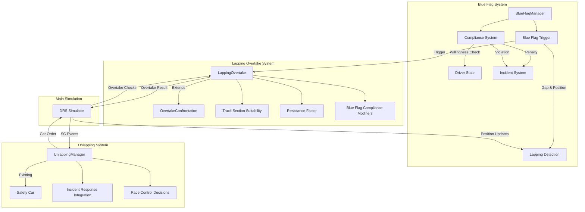

# Lapping and Unlapping System Plan

## Overview

This document outlines the architecture for implementing lapping (blue flags) and unlapping procedures in the F1 simulation system.

## Architecture Diagram



## Part 1: Blue Flag System

### 1.1 BlueFlagState Enum
```python
class BlueFlagState(Enum):
    """Blue flag states for lapped cars"""
    NONE = "none"           # No blue flag
    WARNING = "warning"     # First warning (shown 2-3 corners before)
    FINAL = "final"         # Final warning (last chance to give way)
    COMPLIED = "complied"   # Driver complied
    VIOLATION = "violation" # Driver ignored blue flags
```

### 1.2 LappingDetection

**Purpose**: Detect when a faster car is about to lap a slower car.

**Trigger Conditions**:
- Gap between leader and lapped car < 3.0 seconds
- Leader is on a higher lap number
- Both cars in same sector or adjacent sectors
- Leader approaching within 5-8 track intervals

**Parameters**:
```python
@dataclass
class LappingDetectionConfig:
    """Configuration for lapping detection"""
    warning_gap: float = 3.0        # Show warning when gap < 3s
    final_gap: float = 1.5          # Final warning at 1.5s
    min_sections_apart: int = 0     # Min sectors apart to trigger
    max_sections_apart: int = 1     # Max sectors apart to trigger
```

### 1.3 Driver Compliance System (Dice-Based)

The compliance system uses dice rolls to determine if a driver will give way, making blue flag violations relatively rare (as in real F1 where drivers want to avoid penalties).

#### 1.3.1 Compliance Roll Mechanics

```python
class BlueFlagComplianceRoller:
    """
    Dice-based compliance system for blue flags.
    Roll 1d20 against a target number to determine compliance.
    """

    def __init__(self):
        self.base_target = 15  # Roll 15+ to comply (75% base compliance)

    def get_compliance_target(
        self,
        driver: DriverRaceState,
        leader: DriverRaceState,
        blue_flag_count: int,
        track_section: str,
        race_progress: float
    ) -> int:
        """
        Calculate target number for compliance roll (1d20).
        Higher target = easier to comply.

        Returns: Target number (roll >= this to comply)
        """
        target = self.base_target  # Start at 15

        # DR Modifier: Professional drivers comply more readily
        # DR 85: +1, DR 90: +2, DR 95: +3
        dr_bonus = max(0, (driver.dr_value - 80) // 5)
        target += dr_bonus

        # Team Status Modifier
        if driver.team_status == "backmarker":
            target += 2  # Backmarkers used to giving way
        elif driver.team_status == "championship_contender":
            target -= 1  # Less willing to yield

        # Blue Flag Repetition Modifier (frustration)
        # Each additional blue flag shown reduces willingness
        if blue_flag_count == 1:
            target += 1  # First time - very willing
        elif blue_flag_count == 2:
            target += 0  # Second time - neutral
        elif blue_flag_count >= 3:
            target -= (blue_flag_count - 2)  # Increasing frustration

        # Track Section Safety Modifier
        # Drivers won't risk moving over in unsafe sections
        section_modifiers = {
            "straight": 2,         # Easy to give way
            "drs_zone": 2,         # Easy to give way
            "corner_exit": 1,      # Generally safe
            "corner_entry": -2,    # Unsafe - justified hold-up
            "corner_apex": -5,     # Never move over at apex
            "braking_zone": -3,    # Never move over under braking
            "narrow_section": -2,  # Tight sections are risky
        }
        target += section_modifiers.get(track_section, 0)

        # Race Progress Modifier
        if race_progress >= 0.9:  # Final 10% of race
            target -= 2  # More desperate
        elif race_progress >= 0.75:
            target -= 1

        # Leader Identity Modifier (relationship/history)
        # Drivers may be more/less willing to let specific drivers pass
        target += self._get_driver_relationship_modifier(driver, leader)

        return max(3, min(19, target))  # Clamp between 3-19
```

#### 1.3.2 Compliance Levels

| Roll Result | Compliance Level | Action | Penalty Risk |
|-------------|------------------|--------|--------------|
| Natural 20  | Perfect Compliance | Immediate, professional give-way | None |
| Target + 5+ | Full Compliance | Gives way at safe opportunity | None |
| Target to +4| Delayed Compliance | Gives way after 1-2 corners | None |
| Target - 1 to -3 | Reluctant Compliance | Holds position briefly, then gives way | Warning if held too long |
| Target - 4 to -6 | Resistance | Defends for several corners | Likely penalty |
| Below Target - 6 | Violation | Ignores blue flags completely | Certain penalty |

#### 1.3.3 Driver Relationship Modifiers

```python
def _get_driver_relationship_modifier(
    self,
    lapped_driver: DriverRaceState,
    leader: DriverRaceState
) -> int:
    """
    Modifiers based on driver relationships.
    Can be positive (willing to help) or negative (rivalry).
    """
    modifier = 0

    # Team relationship
    if lapped_driver.team == leader.team:
        modifier += 3  # Teammates always give way quickly
    elif lapped_driver.team_alliance == leader.team_alliance:
        modifier += 1  # Allied teams more cooperative

    # Historical rivalry (would be stored in driver data)
    if self._has_rivalry(lapped_driver.name, leader.name):
        modifier -= 2  # Less willing to help rival

    # Championship consideration
    if leader.championship_position <= 3:
        modifier += 1  # More willing to let championship contender through

    # Reputation consideration
    if leader.reputation == "aggressive":
        modifier += 1  # Give way faster to avoid contact

    return modifier
```

#### 1.3.4 Resistance Trigger Thresholds

Resistance is relatively rare and based on multiple factors:

```python
class ResistanceLevel(Enum):
    """Levels of resistance to blue flags"""
    NONE = "none"           # No resistance, immediate compliance
    MINOR = "minor"         # Brief hesitation, then complies
    MODERATE = "moderate"   # Defends for 2-3 corners
    STRONG = "strong"       # Extended defense, likely penalty
    VIOLATION = "violation" # Complete refusal, certain penalty


def determine_resistance_level(
    self,
    roll: int,
    target: int,
    driver_aggression: float
) -> ResistanceLevel:
    """
    Determine resistance level based on roll result.
    """
    difference = roll - target

    if difference >= 0:
        return ResistanceLevel.NONE
    elif difference >= -2:
        return ResistanceLevel.MINOR
    elif difference >= -4:
        return ResistanceLevel.MODERATE
    elif difference >= -6:
        return ResistanceLevel.STRONG
    else:
        return ResistanceLevel.VIOLATION
```

#### 1.3.5 Non-Compliance Penalty Escalation

Penalties escalate based on resistance level and repetition:

| Resistance Level | First Offense | Second Offense | Third+ Offense |
|-----------------|---------------|----------------|----------------|
| NONE | - | - | - |
| MINOR | Warning (logged) | Warning (announced) | 5s penalty |
| MODERATE | Warning (announced) | 5s penalty | Drive-through |
| STRONG | 5s penalty | Drive-through | Stop-go |
| VIOLATION | Drive-through | Stop-go | Black flag |

```python
@dataclass
class BlueFlagViolation:
    """Record of a blue flag violation"""
    driver: str
    lap: int
    resistance_level: ResistanceLevel
    offense_count: int
    penalty: str
    narrative: str
    track_section: str  # For context
```

#### 1.3.6 Driver Personality Attributes

Additional personality factors that affect compliance:

```python
@dataclass
class DriverPersonality:
    """
    Personality traits affecting blue flag compliance.
    These would be defined per driver in configuration.
    """
    professionalism: float  # 0.0-1.0, affects base compliance
    aggression: float       # 0.0-1.0, higher = more resistance
    team_loyalty: float     # 0.0-1.0, affects teammate cooperation
    stubbornness: float     # 0.0-1.0, affects frustration buildup
    sportsmanship: float    # 0.0-1.0, affects willingness to help rivals

    def get_compliance_modifier(self) -> int:
        """Convert personality to compliance modifier"""
        modifier = 0

        # Professional drivers comply more readily
        modifier += int((self.professionalism - 0.5) * 4)

        # Aggressive drivers resist more
        modifier -= int((self.aggression - 0.5) * 3)

        # Sportsmanlike drivers help rivals too
        modifier += int((self.sportsmanship - 0.5) * 2)

        return modifier

    def get_frustration_rate(self) -> float:
        """How quickly frustration builds with repeated blue flags"""
        # Stubborn drivers get frustrated faster
        return 0.5 + (self.stubbornness * 0.5)
```

**Example Driver Personalities**:
| Driver Type | Professionalism | Aggression | Stubbornness | Sportsmanship |
|-------------|----------------|------------|--------------|---------------|
| Veteran Pro | 0.9 | 0.4 | 0.3 | 0.8 |
| Aggressive Youngster | 0.5 | 0.9 | 0.7 | 0.5 |
| Team Player | 0.8 | 0.5 | 0.4 | 0.9 |
| Hot Head | 0.4 | 0.8 | 0.9 | 0.3 |
| Calculating | 0.9 | 0.6 | 0.5 | 0.6 |

#### 1.3.7 Example Compliance Scenarios

**Scenario A: Professional Backmarker (High Compliance)**
- Driver: DR 88, Team: Backmarker, Section: Straight
- Personality: Veteran Pro (+1 modifier)
- Target: 15 + 1 (DR) + 2 (backmarker) + 2 (straight) + 1 (personality) = 21 (capped at 19)
- Rolls 1d20: 14 → Delayed Compliance (gives way next corner)

**Scenario B: Frustrated Midfield Driver (Moderate Resistance)**
- Driver: DR 82, Blue flags shown: 3 times, Section: Corner entry
- Personality: Hot Head (-1 modifier, 0.9 frustration rate)
- Target: 15 + 0 (DR) - 2 (frustration) - 2 (corner entry) - 1 (personality) = 10
- Rolls 1d20: 7 → Resistance (defends, likely gets warning)

**Scenario C: Championship Battle (Strong Resistance)**
- Driver: DR 90, Race progress: 95%, Section: Straight
- Personality: Aggressive Youngster (-1 modifier)
- Target: 15 + 2 (DR) - 2 (late race) + 2 (straight) - 1 (personality) = 16
- Rolls 1d20: 3 → Violation (ignores completely, gets drive-through)

**Scenario D: Team Orders (Perfect Compliance)**
- Driver: DR 86, Same team as leader
- Target: 15 + 1 (DR) + 3 (teammate) + 2 (straight) = 21 (capped at 19)
- Rolls 1d20: 18 → Full Compliance (immediate give-way)

**Non-Compliance Penalties**:
1. First offense: Warning
2. Second offense: 5-second time penalty
3. Third offense: Drive-through penalty
4. Continued violation: Stop-and-go or black flag

### 1.4 BlueFlagManager Class

```python
class BlueFlagManager:
    """Manages blue flag situations during race"""

    def __init__(self):
        self.active_blue_flags: Dict[str, BlueFlagState] = {}
        self.lapping_pairs: List[LappingPair] = []
        self.violations: List[BlueFlagViolation] = []

    def check_lapping_situation(
        self,
        leader: DriverRaceState,
        lapped_car: DriverRaceState,
        track_section: str
    ) -> Optional[BlueFlagState]:
        """Check if blue flag should be shown"""

    def evaluate_compliance(
        self,
        driver: DriverRaceState,
        situation: BlueFlagState,
        track_section: str
    ) -> Tuple[bool, float]:
        """
        Evaluate if driver will comply.
        Returns: (will_comply, resistance_score)
        """
```

## Part 2: Lapping Overtake System

### 2.1 LappingOvertake Class

Extends [`OvertakeConfrontation`](src/drs/overtake.py:81) with lapping-specific logic.

**Key Differences from Normal Overtake**:
1. Blue flag compliance gives attacker significant advantage
2. Lapped car can choose to resist (but risks penalty)
3. Track section suitability matters more
4. Less aggressive racing (safety consideration)

```python
class LappingOvertake(OvertakeConfrontation):
    """
    Overtake system for lapping situations.
    Lapped cars are expected to give way per blue flags.
    """

    def resolve_lapping(
        self,
        leader: DriverRaceState,
        lapped_car: DriverRaceState,
        blue_flag_state: BlueFlagState,
        track_section: str
    ) -> LappingResult:
        """
        Resolve a lapping overtake.

        Key considerations:
        - Blue flag compliance modifier (leader gets +3 to +5)
        - Lapped car resistance roll (may refuse to give way)
        - Track section safety (won't move over in corners)
        - Penalty risk for lapped car
        """
```

### 2.2 Track Section Suitability

**Safe Give-Way Locations**:
```python
SUITABLE_SECTIONS = {
    "straight": 1.0,        # Ideal
    "drs_zone": 1.0,        # Ideal
    "corner_exit": 0.7,     # OK if careful
    "corner_entry": 0.3,    # Risky, drivers avoid
    "corner_apex": 0.0,     # Unsafe, won't give way
    "braking_zone": 0.1,    # Very unsafe
}
```

**Lapped Car Behavior**:
- In suitable sections: High compliance probability
- In unsuitable sections: Will stay on racing line for safety
- If pressured in unsuitable section: May defend more aggressively

### 2.3 Resistance Factor System

```python
def calculate_resistance(
    driver: DriverRaceState,
    blue_flag_count: int,           # How many times shown
    track_section: str,
    race_progress: float            # 0.0-1.0
) -> float:
    """
    Calculate resistance to giving way.

    Factors:
    - Base DR modifier (higher DR = less resistance)
    - Blue flag repetition (more flags = more frustration)
    - Track section safety (unsafe = justified resistance)
    - Race progress (later = more desperate)
    """
```

## Part 3: Unlapping Under Safety Car

### 3.1 Integration with Incident Response

**Current State**: [`UnlappingManager`](src/incidents/unlapping.py:111) exists but is standalone.

**Integration Points**:

1. **Trigger**: When SC is deployed, check for lapped cars
2. **Authorization**: Race Control decides when to allow unlapping
3. **Execution**: Lapped cars pass leader and SC
4. **Completion**: SC comes in after procedure

### 3.2 Race Control Decision Logic

```python
def should_authorize_unlapping(
    self,
    sc_duration_laps: int,
    lapped_cars_count: int,
    track_conditions: str,
    laps_remaining: int,
    incident_severity: IncidentSeverity
) -> Tuple[bool, str]:
    """
    Decide whether to authorize unlapping.

    F1 Regulations (Article 55.14-55.15):
    - SC has been out sufficient time
    - There are lapped cars to unlap
    - Sufficient laps remaining
    - Track conditions permit safe unlapping

    Race Control discretion factors:
    - Incident severity (severe incidents = prioritize clearing)
    - Track position density
    - Weather conditions
    """
```

### 3.3 Unlapping Procedure

**Step-by-Step**:
1. Race Control announces "lapped cars may overtake"
2. Lapped cars proceed past leader and SC
3. Lapped cars rejoin at back of field
4. All cars maintain SC pace
5. Once last lapped car passes leader, SC comes in next lap
6. Race resumes

### 3.4 Enhanced UnlappingManager

```python
class IncidentResponseUnlappingManager(UnlappingManager):
    """Extended unlapping with incident response integration"""

    def __init__(self, safety_car_manager: SafetyCarManager):
        super().__init__()
        self.sc_manager = safety_car_manager
        self.race_control = RaceControlDecision()

    def on_sc_deployed(
        self,
        lap: int,
        car_positions: Dict[str, int],
        car_laps: Dict[str, int],
        leader_laps: int
    ):
        """Called when SC is deployed - prepares unlapping"""

    def update(self, lap: int) -> Optional[UnlappingEvent]:
        """
        Update unlapping state each lap.
        Returns event if state changes.
        """
```

## Part 4: Integration Points

### 4.1 DRS Simulator Integration

**Position Tracking**:
```python
# In TimeSteppedDRSSimulator

def update_positions_with_lapping(self):
    """
    Update positions considering lapping situations.
    """
    # 1. Identify lapping situations
    lapping_pairs = self.blue_flag_manager.detect_lapping_situations(
        self.drivers
    )

    # 2. Process blue flags
    for leader, lapped in lapping_pairs:
        blue_state = self.blue_flag_manager.evaluate_situation(
            leader, lapped
        )

        if blue_state == BlueFlagState.FINAL:
            # Check for overtake
            result = self.lapping_overtake.resolve_lapping(
                leader, lapped, blue_state, section
            )

            if result.success:
                self.apply_position_change(leader, lapped)
            elif result.violation:
                self.incident_manager.report_blue_flag_violation(lapped)
```

### 4.2 Overtake Trigger Integration

**Modified should_overtake**:
```python
def should_overtake(
    self,
    current_time: float,
    lap: int,
    total_laps: int,
    in_drs_zone: bool,
    gap_ahead: float,
    section_type: str = SECTION_STRAIGHT,
    drivers_in_range: int = 1,
    attacker_name: str = "Unknown",
    defender_name: str = "Unknown",
    sector_flag_manager=None,
    current_sector: int = 1,
    safety_response_manager=None,
    blue_flag_manager=None,          # NEW PARAMETER
) -> Tuple[bool, str, Dict]:
    """
    Check if overtake should occur.
    NEW: Checks for lapping situations and blue flags.
    """
    # Check for blue flag situation (lapping)
    if blue_flag_manager and blue_flag_manager.is_lapping_situation(
        attacker_name, defender_name
    ):
        # Use lapping overtake logic
        return self._handle_lapping_overtake(...)

    # Normal overtake logic...
```

### 4.3 Incident Manager Integration

**New Incident Type**:
```python
class IncidentType(Enum):
    # ... existing types
    BLUE_FLAG_VIOLATION = "blue_flag_violation"
    LAPPING_INCIDENT = "lapping_incident"
```

**Blue Flag Violation Handling**:
```python
def _check_blue_flag_violation(
    self,
    driver: Dict,
    blue_flag_state: BlueFlagState,
    compliance_roll: float
) -> Optional[Incident]:
    """
    Check if driver violated blue flags.

    Returns incident if violation occurred.
    """
```

## Part 5: Data Structures

### 5.1 LappingPair
```python
@dataclass
class LappingPair:
    """Represents a lapping situation"""
    leader: str                     # Car doing the lapping
    lapped_car: str                 # Car being lapped
    gap: float                      # Current gap in seconds
    lap_difference: int             # How many laps ahead leader is
    track_section: str              # Current track section
    blue_flag_state: BlueFlagState
    warnings_shown: int
```

### 5.2 BlueFlagViolation
```python
@dataclass
class BlueFlagViolation:
    """Record of a blue flag violation"""
    driver: str
    lap: int
    violation_number: int           # 1st, 2nd, 3rd offense
    penalty: str                    # Warning, 5s, drive-through, etc.
    narrative: str
```

### 5.3 LappingResult
```python
@dataclass
class LappingResult:
    """Result of a lapping overtake attempt"""
    success: bool
    leader: str
    lapped_car: str
    compliance_score: float         # 0.0-1.0
    resistance_score: float         # 0.0-1.0
    violation: bool
    penalty: Optional[str]
    narrative: str
```

## Part 6: Events and Logging

### 6.1 Blue Flag Events
```python
BLUE_FLAG_EVENTS = [
    "blue_flag_shown",              # Blue flag first shown
    "blue_flag_warning",            # Warning level increased
    "blue_flag_complied",           # Driver gave way
    "blue_flag_ignored",            # Driver ignored (violation)
    "blue_flag_penalty_issued",     # Penalty applied
]
```

### 6.2 Unlapping Events
```python
UNLAPPING_EVENTS = [
    "unlapping_authorized",         # Race Control authorizes
    "unlapping_started",            # First car starts unlapping
    "car_unlapped",                 # Individual car completed
    "unlapping_completed",          # All cars unlapped
    "sc_ready_to_come_in",          # SC can return to pits
]
```

## Part 7: Configuration

### 7.1 Blue Flag Config
```python
@dataclass
class BlueFlagConfig:
    """Configuration for blue flag behavior"""
    # Timing
    warning_threshold: float = 3.0   # Seconds gap for warning
    final_threshold: float = 1.5     # Seconds for final warning

    # Compliance
    base_compliance: float = 0.85    # 85% base compliance
    dr_compliance_factor: float = 0.05  # +5% per DR point above 85

    # Penalties
    first_offense: str = "warning"
    second_offense: str = "5s_penalty"
    third_offense: str = "drive_through"
    fourth_offense: str = "stop_go"

    # Safety
    unsafe_sections_timeout: int = 3  # Corners to wait for safe section
```

### 7.2 Unlapping Config
```python
@dataclass
class UnlappingConfig:
    """Configuration for SC unlapping"""
    min_sc_laps_before_unlap: int = 3
    require_dry_conditions: bool = True
    min_laps_remaining: int = 5
    max_cars_to_unlap: int = 10     # Practical limit
```

## Part 8: File Structure

```
src/
├── incidents/
│   ├── blue_flag.py              # NEW - Blue flag system
│   ├── lapping_overtake.py       # NEW - Lapping overtake logic
│   ├── unlapping.py              # EXTEND - Enhanced unlapping
│   └── tests/
│       ├── test_blue_flags.py    # NEW
│       └── test_lapping.py       # NEW
├── drs/
│   ├── overtake.py               # EXTEND - Add LappingOvertake
│   └── simulator.py              # EXTEND - Blue flag integration
└── simulation/
    └── long_dist_sim_with_box.py # EXTEND - Integration
```

## Part 9: Implementation Order

1. **Core Blue Flag System** (`blue_flag.py`)
   - LappingDetection
   - BlueFlagManager
   - Basic compliance logic

2. **Lapping Overtake** (`lapping_overtake.py`)
   - Extend OvertakeConfrontation
   - Add track section checks
   - Resistance factor system

3. **Unlapping Integration** (`unlapping.py` extensions)
   - Connect to incident response
   - Race Control decisions
   - SC coordination

4. **Simulator Integration**
   - Update DRS simulator
   - Add event logging
   - Test with race scenarios

5. **Testing**
   - Unit tests for blue flags
   - Integration tests for lapping
   - End-to-end race scenarios

## Part 10: Example Race Scenarios

### Scenario 1: Normal Lapping
1. Verstappen leads, closing on Zhou
2. Gap drops below 3s → Blue flag warning to Zhou
3. Gap drops below 1.5s → Final blue flag
4. Zhou moves aside on main straight
5. Verstappen laps Zhou cleanly

### Scenario 2: Blue Flag Violation
1. Hamilton closing on Stroll
2. Blue flags shown to Stroll
3. Stroll ignores (resistance roll fails)
4. Hamilton makes aggressive pass
5. Stroll receives 5-second penalty

### Scenario 3: Unlapping Under SC
1. Incident on lap 15 → SC deployed
2. 3 cars are lapped
3. Race Control authorizes unlapping after 2 SC laps
4. Lapped cars pass leader and SC
5. All cars rejoin in correct order
6. SC comes in, race resumes
