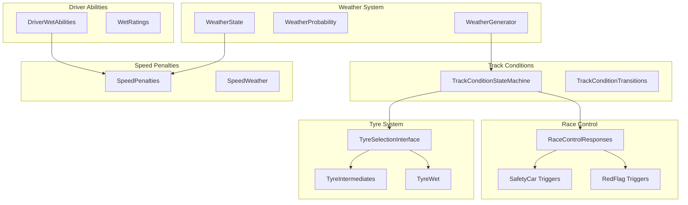

# F1 Weather System Implementation Plan

## Overview

This document outlines the comprehensive weather system design for the Mujica F1 Modeler. The weather system adds realistic weather simulation including rain development, track conditions, tyre selection, and race control responses to create dramatic and unpredictable race simulations.

## Research Summary (to build upon)

### 1. Weather Changes
- Rain develops gradually (5-30 minutes)
- Localized showers can affect only certain sectors
- Patterns: Light drizzle (10-30 min), Moderate rain (20-60 min), Heavy rain (10-30 min), Torrential (variable)

### 2. Track Conditions (4 states)
- DRY: Full dry line, no standing water
- DAMP: Damp/misty, no standing water
- WET: Wet but draining, light patches
- FLOODED: Standing water significant

### 3. Tyres
- Intermediate (Green, I): 31 L/s water displacement, for damp/wet
- Full Wet (Blue, W): 85 L/s water displacement, for heavy rain
- Crossover points: Slick→Intermediate at 110-112% of dry time

### 4. Race Control Responses
- Safety Car: Heavy rain, standing water, visibility issues
- Red Flag: Torrential rain, visibility near zero
- Wet Start Regulations (2026): >40% precipitation probability triggers modifications

### 5. Speed Impact
- Light rain: +8-12%
- Moderate rain: +12-18%
- Heavy rain: +18-25%
- Flooded: +25-40%
- Wrong tyre: +20-30 seconds per lap

### 6. Driver Abilities
- Wet weather rating: 60-99
- Key attributes: throttle_control, brake_consistency, visibility_adaptation, risk_tolerance
- Elite wet drivers can gain 1-3 seconds per lap

---

## 1. System Architecture

### 1.1 High-Level Architecture



### 1.2 File Structure

```
src/weather/
├── __init__.py                      # Package exports
├── weather_generator.py              # WeatherGenerator class
├── weather_types.py                 # WeatherType enum, WeatherState dataclass
├── weather_probability.py           # WeatherProbability models
├── track_condition/
│   ├── __init__.py
│   ├── track_condition.py           # TrackCondition enum, state definitions
│   ├── track_condition_state.py     # TrackConditionStateMachine
│   └── track_condition_transitions.py # Transition triggers
├── tyre/
│   ├── __init__.py
│   ├── wet_tyre_selection.py        # Intermediate/Wet tyre selection
│   └── wet_tyre_performance.py      # Wet tyre performance model
├── race_control/
│   ├── __init__.py
│   ├── safety_car_weather.py        # Safety Car weather triggers
│   └── red_flag_weather.py         # Red Flag weather triggers
├── penalties/
│   ├── __init__.py
│   ├── weather_speed_penalty.py     # Speed penalties per condition
│   └── wrong_tyre_penalty.py        # Wrong tyre penalty calculation
├── driver/
│   ├── __init__.py
│   ├── wet_weather_rating.py       # Driver wet weather ratings
│   └── wet_ability_calculator.py   # Driver ability calculations
└── integrators/
    ├── __init__.py
    ├── race_simulation_weather.py   # Integration with race simulation
    └── incident_weather.py          # Weather-incident interactions
```

---

## 2. Weather Generator (Component 1)

### 2.1 WeatherType Enum

```python
# src/weather/weather_types.py

from enum import Enum
from dataclasses import dataclass
from typing import Dict, List, Optional, Tuple
from datetime import datetime


class WeatherType(Enum):
    """Weather conditions for the race"""
    
    CLEAR = "clear"
    PARTLY_CLOUDY = "partly_cloudy"
    OVERCAST = "overcast"
    LIGHT_DRIZZLE = "light_drizzle"      # 10-30 min duration
    MODERATE_RAIN = "moderate_rain"      # 20-60 min duration
    HEAVY_RAIN = "heavy_rain"            # 10-30 min duration
    TORRENTIAL_RAIN = "torrential_rain"  # Variable duration
    THUNDERSTORM = "thunderstorm"         # With lightning risk


class PrecipitationIntensity(Enum):
    """Precipitation intensity levels"""
    
    NONE = 0.0
    LIGHT = 0.5     # < 2mm/h
    MODERATE = 1.0  # 2-8mm/h
    HEAVY = 2.0     # 8-15mm/h
    TORRENTIAL = 3.0 # >15mm/h


@dataclass
class WeatherState:
    """
    Current weather state for the race.
    
    Attributes:
        weather_type: Current weather condition
        precipitation_intensity: Current precipitation level (0-3)
        temperature: Track temperature in Celsius
        humidity: Relative humidity (0-100%)
        wind_speed: Wind speed in km/h
        visibility: Visibility in meters
        track_temperature: Surface temperature in Celsius
        is_developing: True if weather is changing
        development_progress: 0-1 progress of current change
        affected_sectors: List of affected sector IDs (empty = all)
    """
    
    weather_type: WeatherType = WeatherType.CLEAR
    precipitation_intensity: float = 0.0
    temperature: float = 25.0
    humidity: float = 50.0
    wind_speed: float = 10.0
    visibility: int = 5000  # meters
    track_temperature: float = 30.0
    is_developing: bool = False
    development_progress: float = 0.0
    affected_sectors: List[int] = None  # None = all sectors
    
    def __post_init__(self):
        if self.affected_sectors is None:
            self.affected_sectors = []


@dataclass
class WeatherForecast:
    """Weather forecast for race planning"""
    
    race_start: WeatherState
    hour_forecasts: Dict[int, WeatherState]  # hour -> forecast
    precipitation_probability: float  # 0-100%
    update_time: datetime
```

### 2.2 WeatherGenerator Class

```python
# src/weather/weather_generator.py

from typing import Dict, List, Optional, Tuple
from datetime import datetime, timedelta
import random
from .weather_types import WeatherType, WeatherState, PrecipitationIntensity


class WeatherGeneratorConfig:
    """Configuration for weather generation"""
    
    # Base probabilities for weather changes (per race hour)
    base_rain_chance: float = 0.15
    base_storm_chance: float = 0.02
    
    # Development times in minutes
    light_drizzle_development: Tuple[int, int] = (10, 30)
    moderate_rain_development: Tuple[int, int] = (20, 60)
    heavy_rain_development: Tuple[int, int] = (10, 30)
    torrential_development: Tuple[int, int] = (5, 15)
    
    # Localized shower probability
    localized_shower_probability: float = 0.25
    sector_affection_probability: float = 0.35
    
    # Track-specific modifiers
    tropical_track_rain_chance: float = 0.35  # Singapore, Malaysia
    temperate_track_rain_chance: float = 0.15  # Europe
    desert_track_rain_chance: float = 0.05    # Bahrain, Abu Dhabi


class WeatherGenerator:
    """
    Generate weather patterns for race simulation.
    
    Features:
    - Gradual weather development
    - Localized sector-specific rain
    - Weather pattern duration modeling
    - Track-specific weather probability
    """
    
    def __init__(self, config: Optional[WeatherGeneratorConfig] = None):
        self.config = config or WeatherGeneratorConfig()
        self.current_weather: Optional[WeatherState] = None
        self.development_start_time: Optional[datetime] = None
        self.development_duration: Optional[int] = None
        self.weather_history: List[WeatherState] = []
    
    def initialize_race_weather(
        self,
        track_location: str,
        race_start_time: datetime,
        preset_weather: Optional[WeatherType] = None
    ) -> WeatherState:
        """
        Initialize weather for race start.
        
        Args:
            track_location: Track location for weather probability
            race_start_time: Race start datetime
            preset_weather: Optional preset weather type
            
        Returns:
            Initial weather state
        """
        if preset_weather:
            weather_type = preset_weather
        else:
            # Determine initial weather based on track and random chance
            weather_type = self._determine_initial_weather(track_location)
        
        self.current_weather = WeatherState(
            weather_type=weather_type,
            precipitation_intensity=self._get_precipitation_intensity(weather_type),
        )
        self.current_weather.affected_sectors = []
        self.weather_history.append(self.current_weather)
        
        return self.current_weather
    
    def update_weather(
        self,
        current_time: datetime,
        elapsed_minutes: float,
        track_drainage: float = 0.5
    ) -> WeatherState:
        """
        Update weather state for each simulation tick.
        
        Args:
            current_time: Current simulation time
            elapsed_minutes: Minutes since race start
            track_drainage: Track drainage capability (0-1)
            
        Returns:
            Updated weather state
        """
        # Handle weather development
        if self.current_weather.is_developing:
            self._update_weather_development(current_time)
        
        # Check for new weather events
        if not self.current_weather.is_developing:
            self._check_for_weather_change(current_time, elapsed_minutes)
        
        # Update track condition based on weather
        self._update_track_from_weather(track_drainage)
        
        return self.current_weather
    
    def get_sector_weather(self, sector_id: int) -> WeatherState:
        """
        Get weather state for a specific sector.
        
        Args:
            sector_id: Sector ID (1-3)
            
        Returns:
            Weather state for that sector
        """
        if not self.current_weather.affected_sectors:
            return self.current_weather
        
        if sector_id in self.current_weather.affected_sectors:
            return self.current_weather
        else:
            # Non-affected sector has clear weather
            clear_state = WeatherState(
                weather_type=WeatherType.CLEAR,
                precipitation_intensity=0.0,
            )
            return clear_state
    
    def _determine_initial_weather(self, track_location: str) -> WeatherType:
        """Determine initial weather based on track location"""
        if track_location in ["Singapore", "Malaysia", "Japan"]:
            rain_chance = self.config.tropical_track_rain_chance
        elif track_location in ["Bahrain", "Abu Dhabi", "Saudi Arabia"]:
            rain_chance = self.config.desert_track_rain_chance
        else:
            rain_chance = self.config.temperate_track_rain_chance
        
        if random.random() < rain_chance:
            return random.choice([
                WeatherType.LIGHT_DRIZZLE,
                WeatherType.MODERATE_RAIN,
                WeatherType.OVERCAST,
            ])
        
        return random.choice([
            WeatherType.CLEAR,
            WeatherType.PARTLY_CLOUDY,
            WeatherType.OVERCAST,
        ])
    
    def _get_precipitation_intensity(self, weather_type: WeatherType) -> float:
        """Get precipitation intensity for weather type"""
        intensities = {
            WeatherType.CLEAR: 0.0,
            WeatherType.PARTLY_CLOUDY: 0.0,
            WeatherType.OVERCAST: 0.1,
            WeatherType.LIGHT_DRIZZLE: 0.5,
            WeatherType.MODERATE_RAIN: 1.0,
            WeatherType.HEAVY_RAIN: 2.0,
            WeatherType.TORRENTIAL_RAIN: 3.0,
            WeatherType.THUNDERSTORM: 3.0,
        }
        return intensities.get(weather_type, 0.0)
    
    def _check_for_weather_change(
        self,
        current_time: datetime,
        elapsed_minutes: float
    ):
        """Check and potentially trigger weather changes"""
        if random.random() < self.config.base_rain_chance * 0.1:
            new_type = random.choice([
                WeatherType.LIGHT_DRIZZLE,
                WeatherType.MODERATE_RAIN,
                WeatherType.HEAVY_RAIN,
            ])
            self._start_weather_development(new_type, current_time)
    
    def _start_weather_development(
        self,
        new_type: WeatherType,
        start_time: datetime
    ):
        """Start developing new weather"""
        self.current_weather.is_developing = True
        self.current_weather.development_progress = 0.0
        self.development_start_time = start_time
        
        if new_type == WeatherType.LIGHT_DRIZZLE:
            duration_range = self.config.light_drizzle_development
        elif new_type == WeatherType.MODERATE_RAIN:
            duration_range = self.config.moderate_rain_development
        elif new_type == WeatherType.HEAVY_RAIN:
            duration_range = self.config.heavy_rain_development
        else:
            duration_range = self.config.torrential_development
        
        self.development_duration = random.randint(*duration_range)
        
        # Localized shower check
        if random.random() < self.config.localized_shower_probability:
            num_sectors = random.randint(1, 2)
            self.current_weather.affected_sectors = random.sample([1, 2, 3], num_sectors)
    
    def _update_weather_development(self, current_time: datetime):
        """Update weather development progress"""
        if not self.development_start_time:
            return
        
        elapsed = (current_time - self.development_start_time).total_seconds() / 60
        progress = min(elapsed / self.development_duration, 1.0)
        
        self.current_weather.development_progress = progress
        self.current_weather.precipitation_intensity = (
            self._get_precipitation_intensity(self.current_weather.weather_type) * progress
        )
        
        if progress >= 1.0:
            self.current_weather.is_developing = False
            self.current_weather.precipitation_intensity = (
                self._get_precipitation_intensity(self.current_weather.weather_type)
            )
    
    def _update_track_from_weather(self, track_drainage: float):
        """Update weather state based on current precipitation"""
        intensity = self.current_weather.precipitation_intensity
        effective_intensity = max(0, intensity - (track_drainage * 0.5))
        
        if intensity >= 2.0:
            self.current_weather.visibility = 200
        elif intensity >= 1.0:
            self.current_weather.visibility = 500
        elif intensity >= 0.5:
            self.current_weather.visibility = 1000
        else:
            self.current_weather.visibility = 5000
```

### 2.3 WeatherProbability Class

```python
# src/weather/weather_probability.py

from typing import Dict, List, Optional, Tuple
from dataclasses import dataclass
from .weather_types import WeatherType, PrecipitationIntensity


@dataclass
class WeatherProbability:
    """
    Probability models for weather forecasting and race control decisions.
    
    Based on 2026 F1 Sporting Regulations:
    - >40% precipitation probability triggers wet start modifications
    """
    
    # Precipitation probability thresholds
    WET_START_THRESHOLD: float = 40.0  # 40% probability
    MODERATE_RAIN_THRESHOLD: float = 60.0  # 60% probability
    HEAVY_RAIN_THRESHOLD: float = 80.0  # 80% probability
    
    # Forecast update interval
    FORECAST_UPDATE_MINUTES: int = 15
    
    @staticmethod
    def calculate_precipitation_probability(
        weather_history: List[WeatherType],
        current_type: WeatherType,
        humidity: float,
        pressure_trend: str = "stable"  # rising, falling, stable
    ) -> float:
        """
        Calculate probability of precipitation.
        
        Args:
            weather_history: Recent weather history
            current_type: Current weather type
            humidity: Current humidity (0-100)
            pressure_trend: Barometric pressure trend
            
        Returns:
            Precipitation probability (0-100%)
        """
        base_prob = 0.0
        
        # Current weather contribution
        if current_type == WeatherType.OVERCAST:
            base_prob += 30.0
        elif current_type == WeatherType.PARTLY_CLOUDY:
            base_prob += 15.0
        elif current_type in [WeatherType.LIGHT_DRIZZLE, WeatherType.MODERATE_RAIN]:
            base_prob += 70.0
        elif current_type in [WeatherType.HEAVY_RAIN, WeatherType.TORRENTIAL_RAIN]:
            base_prob += 95.0
        
        # Humidity contribution
        if humidity > 80:
            base_prob += 20.0
        elif humidity > 70:
            base_prob += 10.0
        
        # Pressure trend contribution
        if pressure_trend == "falling":
            base_prob += 15.0
        elif pressure_trend == "rising":
            base_prob -= 10.0
        
        # History contribution
        recent_rain = sum(1 for w in weather_history[-3:] 
                        if w in [WeatherType.LIGHT_DRIZZLE, WeatherType.MODERATE_RAIN,
                                WeatherType.HEAVY_RAIN])
        if recent_rain >= 2:
            base_prob += 20.0
        
        return min(100.0, max(0.0, base_prob))
    
    @staticmethod
    def should_use_wet_start(precipitation_probability: float) -> bool:
        """
        Determine if wet start should be used.
        
        Based on 2026 F1 regulations:
        - >40% precipitation probability triggers wet start modifications
        """
        return precipitation_probability >= WeatherProbability.WET_START_THRESHOLD
    
    @staticmethod
    def get_expected_duration(weather_type: WeatherType) -> Tuple[int, int]:
        """Get expected duration range for weather type."""
        durations = {
            WeatherType.CLEAR: (0, 0),
            WeatherType.PARTLY_CLOUDY: (30, 120),
            WeatherType.OVERCAST: (30, 180),
            WeatherType.LIGHT_DRIZZLE: (10, 30),
            WeatherType.MODERATE_RAIN: (20, 60),
            WeatherType.HEAVY_RAIN: (10, 30),
            WeatherType.TORRENTIAL_RAIN: (5, 20),
            WeatherType.THUNDERSTORM: (10, 40),
        }
        return durations.get(weather_type, (0, 0))
```

---

## 3. Track Condition State Machine (Component 2)

### 3.1 TrackCondition Enum

```python
# src/weather/track_condition/track_condition.py

from enum import Enum
from dataclasses import dataclass
from typing import List, Optional


class TrackCondition(Enum):
    """
    Track surface conditions.
    
    States:
    - DRY: Full dry line, no standing water
    - DAMP: Damp/misty, no standing water  
    - WET: Wet but draining, light water patches
    - FLOODED: Standing water significant
    """
    
    DRY = "dry"
    DAMP = "damp"
    WET = "wet"
    FLOODED = "flooded"


@dataclass
class TrackConditionState:
    """
    Current track condition state.
    
    Attributes:
        condition: Current track condition
        standing_water_depth: Standing water depth in mm (0 for dry/damp)
        drying_rate: Track drying rate per minute
        sector_conditions: Per-sector condition overrides
    """
    
    condition: TrackCondition = TrackCondition.DRY
    standing_water_depth: float = 0.0  # mm
    drying_rate: float = 0.5  # mm per minute
    sector_conditions: Optional[Dict[int, TrackCondition]] = None
    
    def __post_init__(self):
        if self.sector_conditions is None:
            self.sector_conditions = {}
    
    def get_sector_condition(self, sector_id: int) -> TrackCondition:
        """Get condition for specific sector"""
        return self.sector_conditions.get(sector_id, self.condition)


@dataclass 
class TrackConditionConfig:
    """Configuration for track condition transitions"""
    
    # Water depth thresholds (mm)
    DAMP_THRESHOLD: float = 0.1
    WET_THRESHOLD: float = 2.0
    FLOODED_THRESHOLD: float = 8.0
    
    # Drying rates
    BASE_DRYING_RATE: float = 0.5
    HOT_DRYING_BONUS: float = 0.3
    WIND_DRYING_BONUS: float = 0.2
```

### 3.2 TrackConditionStateMachine

```python
# src/weather/track_condition/track_condition_state.py

from typing import Dict, List, Optional, Tuple
from dataclasses import dataclass
from .track_condition import TrackCondition, TrackConditionState, TrackConditionConfig


class TrackConditionStateMachine:
    """
    State machine for track conditions.
    
    Transitions:
    DRY -> DAMP: Light rain or drizzle starts
    DAMP -> WET: Moderate/heavy rain continues
    WET -> FLOODED: Heavy/torrential rain accumulates
    FLOODED -> WET: Rain stops, drainage works
    WET -> DAMP: Rain stops, surface starts drying
    DAMP -> DRY: Drying completes
    """
    
    def __init__(self, config: Optional[TrackConditionConfig] = None):
        self.config = config or TrackConditionConfig()
        self.current_state = TrackConditionState()
        self.state_history: List[Tuple[float, TrackCondition]] = []
        self.precipitation_accumulation: float = 0.0
    
    def initialize(self, initial_condition: TrackCondition = TrackCondition.DRY):
        """Initialize track conditions"""
        self.current_state.condition = initial_condition
        self.precipitation_accumulation = 0.0
        self.state_history.append((0.0, initial_condition))
    
    def update(
        self,
        precipitation_intensity: float,  # 0-3 scale
        elapsed_time: float,  # seconds since last update
        temperature: float,   # track temperature
        wind_speed: float,   # km/h
        drainage_capacity: float = 0.5,
        is_racing: bool = True
    ) -> TrackConditionState:
        """Update track conditions based on weather."""
        # Update precipitation accumulation
        if precipitation_intensity > 0:
            rain_rate = precipitation_intensity * 5.0
            self.precipitation_accumulation += rain_rate * (elapsed_time / 60)
        
        # Calculate drainage
        drainage = self._calculate_drainage(
            temperature, wind_speed, drainage_capacity, is_racing
        )
        
        # Apply drainage
        self.precipitation_accumulation = max(0, self.precipitation_accumulation - drainage)
        
        # Determine new condition
        new_condition = self._determine_condition()
        
        if new_condition != self.current_state.condition:
            self.current_state.condition = new_condition
            self.state_history.append((elapsed_time, new_condition))
        
        self.current_state.standing_water_depth = self.precipitation_accumulation
        self.current_state.drying_rate = drainage / (elapsed_time / 60) if elapsed_time > 0 else 0
        
        return self.current_state
    
    def get_sector_condition(
        self,
        sector_id: int,
        sector_precipitation: float
    ) -> TrackCondition:
        """Get condition for specific sector with local precipitation"""
        if sector_precipitation > 0:
            if sector_precipitation >= 2.0:
                return TrackCondition.FLOODED
            elif sector_precipitation >= 1.0:
                return TrackCondition.WET
            elif sector_precipitation >= 0.3:
                return TrackCondition.DAMP
        
        return self.current_state.condition
    
    def _calculate_drainage(
        self,
        temperature: float,
        wind_speed: float,
        drainage_capacity: float,
        is_racing: bool
    ) -> float:
        """Calculate drainage in mm"""
        drainage = self.config.BASE_DRYING_RATE
        
        if temperature > 40:
            drainage += self.config.HOT_DRYING_BONUS
        if wind_speed > 20:
            drainage += self.config.WIND_DRYING_BONUS
        
        drainage *= drainage_capacity
        
        if is_racing:
            drainage *= 1.2
        
        return drainage
    
    def _determine_condition(self) -> TrackCondition:
        """Determine current condition based on water accumulation"""
        depth = self.precipitation_accumulation
        
        if depth >= self.config.FLOODED_THRESHOLD:
            return TrackCondition.FLOODED
        elif depth >= self.config.WET_THRESHOLD:
            return TrackCondition.WET
        elif depth >= self.config.DAMP_THRESHOLD:
            return TrackCondition.DAMP
        else:
            return TrackCondition.DRY
```

---

## 4. Tyre System for Wet Conditions (Component 3)

### 4.1 Wet Tyre Selection

```python
# src/weather/ tyre/wet_tyre_selection.py

from enum import Enum
from dataclasses import dataclass
from typing import Optional, Tuple


class WetTyreType(Enum):
    """Wet weather tyre types"""
    
    INTERMEDIATE = "intermediate"  # Green, I
    FULL_WET = "full_wet"         # Blue, W


@dataclass
class WetTyrePerformance:
    """
    Wet tyre performance characteristics.
    
    Based on Pirelli 2024 data:
    - Intermediate: 31 L/s water displacement
    - Full Wet: 85 L/s water displacement
    """
    
    tyre_type: WetTyreType
    water_displacement: float  # Liters per second
    
    # Performance modifiers
    grip_loss: float = 0.0
    degradation_rate: float = 1.0
    
    # Operating window
    min_precipitation: float = 0.0
    max_precipitation: float = 3.0
    
    optimal_condition: str = "damp_to_wet"


INTERMEDIATE_TYRE = WetTyrePerformance(
    tyre_type=WetTyreType.INTERMEDIATE,
    water_displacement=31.0,
    grip_loss=0.15,
    degradation_rate=1.2,
    min_precipitation=0.1,
    max_precipitation=1.5,
    optimal_condition="damp_to_wet"
)

FULL_WET_TYRE = WetTyrePerformance(
    tyre_type=WetTyreType.FULL_WET,
    water_displacement=85.0,
    grip_loss=0.25,
    degradation_rate=1.5,
    min_precipitation=1.0,
    max_precipitation=3.0,
    optimal_condition="heavy_rain"
)


class WetTyreSelection:
    """
    Determine optimal wet tyre selection based on conditions.
    
    Crossover points (based on research):
    - Slick -> Intermediate: 110-112% of dry lap time
    - Intermediate -> Full Wet: 115-120% of dry lap time
    - Full Wet -> Intermediate: When rain eases
    
    Note: Wet tyres rarely used - race would be red flagged before needed.
    """
    
    SLICK_TO_INTERMEDIATE_CROSSOVER: float = 1.10
    INTERMEDIATE_TO_WET_CROSSOVER: float = 1.18
    WET_TO_INTERMEDIATE_CROSSOVER: float = 1.05
    
    def __init__(self):
        self.intermediate = INTERMEDIATE_TYRE
        self.full_wet = FULL_WET_TYRE
    
    def select_tyre(
        self,
        current_tyre: Optional[WetTyreType],
        track_condition: str,
        precipitation_intensity: float,
        lap_time_percent: float
    ) -> WetTyreType:
        """Select appropriate wet tyre."""
        if track_condition == "dry":
            return WetTyreType.INTERMEDIATE  # Placeholder
        
        if track_condition == "flooded" or precipitation_intensity >= 2.5:
            recommended = WetTyreType.FULL_WET
        elif track_condition == "wet" or precipitation_intensity >= 1.5:
            if lap_time_percent >= self.INTERMEDIATE_TO_WET_CROSSOVER:
                recommended = WetTyreType.FULL_WET
            else:
                recommended = WetTyreType.INTERMEDIATE
        elif track_condition == "damp" or precipitation_intensity >= 0.3:
            recommended = WetTyreType.INTERMEDIATE
        else:
            recommended = WetTyreType.INTERMEDIATE
        
        if current_tyre and recommended != current_tyre:
            if not self._should_change_tyre(current_tyre, recommended, lap_time_percent):
                return current_tyre
        
        return recommended
    
    def _should_change_tyre(
        self,
        current: WetTyreType,
        recommended: WetTyreType,
        lap_time_percent: float
    ) -> bool:
        """Determine if pit stop is worth the time loss."""
        if recommended == WetTyreType.FULL_WET and current == WetTyreType.INTERMEDIATE:
            return True
        
        if recommended == WetTyreType.INTERMEDIATE and current == WetTyreType.FULL_WET:
            if lap_time_percent < 1.08:
                return True
        
        return False
    
    def calculate_crossover_time(
        self,
        dry_lap_time: float,
        crossover_percent: float
    ) -> float:
        """Calculate lap time threshold for tyre change."""
        return dry_lap_time * crossover_percent
```

### 4.2 Wet Tyre Performance

```python
# src/weather/ tyre/wet_tyre_performance.py

from typing import Dict, Optional
from dataclasses import dataclass
from .wet_tyre_selection import WetTyreType, WetTyrePerformance


@dataclass
class WetTyreState:
    """State of wet tyre including degradation"""
    
    tyre_type: WetTyreType
    laps_on_tyre: int = 0
    degradation: float = 0.0
    grip_level: float = 1.0
    water_clearing: float = 1.0
    core_temp: float = 80.0
    surface_temp: float = 70.0


class WetTyrePerformanceCalculator:
    """Calculate performance of wet tyres based on conditions and degradation."""
    
    OPTIMAL_TEMP_MIN = 85.0
    OPTIMAL_TEMP_MAX = 105.0
    
    BASE_DEGRADATION_INTERMEDIATE = 0.03
    BASE_DEGRADATION_WET = 0.04
    
    DEGRADATION_IMPACT = 0.15
    
    def calculate_grip(
        self,
        tyre_state: WetTyreState,
        track_condition: str,
        precipitation: float,
        temperature: float
    ) -> float:
        """Calculate grip level for wet tyre."""
        if tyre_state.tyre_type == WetTyreType.INTERMEDIATE:
            base_grip = 0.85
        else:
            base_grip = 0.75
        
        degradation_loss = tyre_state.degradation * self.DEGRADATION_IMPACT
        grip = base_grip - degradation_loss
        
        temp_factor = self._get_temperature_factor(temperature)
        grip *= temp_factor
        
        precip_factor = self._get_precipitation_factor( tyre_state. tyre_type, precipitation)
        grip *= precip_factor
        
        condition_factor = self._get_condition_factor( tyre_state. tyre_type, track_condition)
        grip *= condition_factor
        
        return max(0.5, min(1.0, grip))
    
    def calculate_lap_time_penalty(
        self,
        base_lap_time: float,
        grip: float,
        is_first_lap: bool = False
    ) -> float:
        """Calculate lap time with wet tyre penalty."""
        grip_penalty = (1.0 - grip) * base_lap_time
        first_lap_penalty = 3.0 if is_first_lap else 0.0
        return base_lap_time + grip_penalty + first_lap_penalty
    
    def _get_temperature_factor(self, temperature: float) -> float:
        if self.OPTIMAL_TEMP_MIN <= temperature <= self.OPTIMAL_TEMP_MAX:
            return 1.0
        elif temperature < self.OPTIMAL_TEMP_MIN:
            return 0.85
        else:
            return 0.80
    
    def _get_precipitation_factor(
        self,
        tyre_type: WetTyreType,
        precipitation: float
    ) -> float:
        if tyre_type == WetTyreType.INTERMEDIATE:
            if precipitation <= 1.0:
                return 1.0
            elif precipitation <= 1.5:
                return 0.95
            else:
                return 0.75
        else:
            if precipitation <= 2.0:
                return 1.0
            elif precipitation <= 2.5:
                return 0.95
            else:
                return 0.85
    
    def _get_condition_factor(
        self,
        tyre_type: WetTyreType,
        track_condition: str
    ) -> float:
        factors = {
            WetTyreType.INTERMEDIATE: {
                "dry": 1.1, "damp": 1.0, "wet": 0.95, "flooded": 0.7
            },
            WetTyreType.FULL_WET: {
                "dry": 0.7, "damp": 0.9, "wet": 1.0, "flooded": 0.95
            }
        }
        return factors.get( tyre_type, {}).get(track_condition, 1.0)
```

---

## 5. Wet Track Pit Stop Response (Component 4)

### 5.1 Wet Pit Stop Strategy

```python
# src/weather/integrators/pit_stop_wet_response.py

from typing import Dict, List, Optional, Tuple
from dataclasses import dataclass
from enum import Enum


class PitStopReason(Enum):
    """Reasons for pit stop"""
    
    SCHEDULED = "scheduled"
    TYRE_CHANGE = " tyre_change"
    WET_WEATHER = "wet_weather"
    DAMAGE = "damage"


@dataclass
class WetPitStopConfig:
    """Configuration for wet weather pit stops"""
    
    DRY_PIT_TIME: float = 22.0
    WET_PIT_TIME: float = 24.0
    INTERMEDIATE_PIT_TIME: float = 23.0
    
    WET_PIT_WINDOW_START: float = 1.08
    WET_PIT_WINDOW_END: float = 1.25
    
    MIN_LAPS_ON_WET: int = 2
    
    RAIN_START_THRESHOLD: float = 0.3
    TRACK_WET_THRESHOLD: str = "damp"


class WetPitStopStrategy:
    """
    Handle pit stop decisions for wet weather conditions.
    
    Key decisions:
    1. When to pit for intermediates (rain starting)
    2. When to pit for full wet (heavy rain)
    3. When to return to slicks (drying)
    4. When to stay out (Safety Car / red flag incoming)
    """
    
    def __init__(self, config: Optional[WetPitStopConfig] = None):
        self.config = config or WetPitStopConfig()
        self.last_wet_pit_lap: Dict[str, int] = {}
    
    def should_pit_for_wet(
        self,
        driver: str,
        current_lap: int,
        current_tyre: str,
        track_condition: str,
        precipitation: float,
        lap_time_percent: float,
        total_laps: int,
        remaining_laps: int,
        position: int,
        is_safety_car: bool = False,
        is_red_flag_possible: bool = False
    ) -> Tuple[bool, str]:
        """Determine if driver should pit for wet tyres."""
        if current_tyre in ["intermediate", "wet"]:
            return self._check_wet_tyre_change(
                driver, current_lap, current_tyre, track_condition,
                precipitation, lap_time_percent
            )
        
        if current_tyre == "slick":
            return self._check_slick_to_wet(
                current_lap, track_condition, precipitation,
                lap_time_percent, remaining_laps, position,
                is_safety_car, is_red_flag_possible
            )
        
        return False, "current_tyre_appropriate"
    
    def _check_slick_to_wet(
        self,
        current_lap: int,
        track_condition: str,
        precipitation: float,
        lap_time_percent: float,
        remaining_laps: int,
        position: int,
        is_safety_car: bool,
        is_red_flag_possible: bool
    ) -> Tuple[bool, str]:
        """Check if should pit from slicks to wet tyres"""
        if precipitation < self.config.RAIN_START_THRESHOLD:
            if track_condition not in ["wet", "flooded"]:
                return False, "conditions_not_wet_yet"
        
        if track_condition == "dry":
            return False, "track_dry"
        
        if lap_time_percent >= self.config.WET_PIT_WINDOW_START:
            if is_safety_car and position <= 5:
                return False, "stay_out_under_sc"
            if is_red_flag_possible and remaining_laps > 10:
                return False, "stay_out_for_potential_red_flag"
            if remaining_laps <= 3:
                return False, "too_late_to_pit"
            return True, "wet_conditions"
        
        return False, "lap_time_still_acceptable"
    
    def _check_wet_tyre_change(
        self,
        driver: str,
        current_lap: int,
        current_tyre: str,
        track_condition: str,
        precipitation: float,
        lap_time_percent: float
    ) -> Tuple[bool, str]:
        """Check if should change wet tyre compound"""
        last_pit = self.last_wet_pit_lap.get(driver, 0)
        laps_since_pit = current_lap - last_pit
        
        if laps_since_pit < self.config.MIN_LAPS_ON_WET:
            return False, "recently_pitted"
        
        if current_tyre == "intermediate":
            if track_condition == "flooded" or precipitation >= 2.0:
                if lap_time_percent >= 1.15:
                    return True, "upgrade_to_full_wet"
        
        if current_tyre == "wet":
            if precipitation < 1.0 and track_condition != "flooded":
                if lap_time_percent < 1.08:
                    return True, "downgrade_to_intermediate"
        
        return False, "current_wet_tyre_appropriate"
    
    def calculate_pit_time(
        self,
        current_tyre: str,
        new_tyre: str,
        is_wet_conditions: bool
    ) -> float:
        """Calculate pit stop time."""
        base_time = self.config.DRY_PIT_TIME
        
        if is_wet_conditions:
            if new_tyre == "intermediate":
                return self.config.INTERMEDIATE_PIT_TIME
            elif new_tyre == "wet":
                return self.config.WET_PIT_TIME
        
        if current_tyre != new_tyre:
            base_time += 1.0
        
        return base_time
    
    def update_pit_lap(self, driver: str, lap: int):
        """Record when driver last pitted for wet tyres"""
        self.last_wet_pit_lap[driver] = lap
```

---

## 6. Race Control Rain Responses (Component 5)

### 6.1 Safety Car Weather Triggers

```python
# src/weather/race_control/safety_car_weather.py

from enum import Enum
from dataclasses import dataclass
from typing import Optional, Tuple


class SafetyCarTriggerType(Enum):
    WEATHER = "weather"
    INCIDENT = "incident"
    TRACK = "track"


@dataclass
class SafetyCarWeatherCriteria:
    """
    Weather criteria for Safety Car deployment.
    
    Based on F1 Race Director guidelines:
    - Heavy rain with standing water
    - Poor visibility
    """
    
    HEAVY_RAIN_THRESHOLD: float = 2.0
    STANDING_WATER_DEPTH: float = 5.0  # mm
    MIN_VISIBILITY: int = 300  # meters
    MODERATE_RAIN_WITH_POOR_DRAINAGE: float = 1.5


class SafetyCarWeatherTrigger:
    """Determine if weather conditions warrant Safety Car deployment."""
    
    def __init__(self, criteria: Optional[SafetyCarWeatherCriteria] = None):
        self.criteria = criteria or SafetyCarWeatherCriteria()
    
    def should_deploy_safety_car(
        self,
        precipitation_intensity: float,
        standing_water_depth: float,
        visibility: int,
        track_condition: str,
        drainage_capacity: float = 0.5,
        is_racing: bool = True
    ) -> Tuple[bool, str]:
        """Determine if Safety Car should be deployed."""
        # Check 1: Heavy rain with standing water
        if precipitation_intensity >= self.criteria.HEAVY_RAIN_THRESHOLD:
            if standing_water_depth >= self.criteria.STANDING_WATER_DEPTH:
                return True, "heavy_rain_standing_water"
        
        # Check 2: Very poor visibility
        if visibility < self.criteria.MIN_VISIBILITY:
            return True, "poor_visibility"
        
        # Check 3: Moderate rain + poor drainage + poor track
        if (precipitation_intensity >= 1.0 and 
            drainage_capacity < 0.4 and
            track_condition == "flooded"):
            return True, "moderate_rain_poor_drainage"
        
        # Check 4: Flooded track
        if track_condition == "flooded" and precipitation_intensity >= 1.0:
            return True, "flooded_track"
        
        return False, "conditions_acceptable"
    
    def should_end_safety_car(
        self,
        precipitation_intensity: float,
        standing_water_depth: float,
        visibility: int,
        drying_rate: float
    ) -> Tuple[bool, str]:
        """Determine if Safety Car period should end."""
        if precipitation_intensity == 0:
            if visibility >= 1000:
                if standing_water_depth < 3.0 or drying_rate > 0.5:
                    return True, "conditions_improving"
        
        return False, "conditions_still_dangerous"
```

### 6.2 Red Flag Weather Triggers

```python
# src/weather/race_control/red_flag_weather.py

from dataclasses import dataclass
from typing import Optional, Tuple


class RedFlagWeatherCriteria:
    """
    Weather criteria for Red Flag deployment.
    
    Based on F1 Sporting Regulations:
    - Torrential rain
    - Visibility near zero
    - Conditions unsafe for racing
    """
    
    TORRENTIAL_RAIN_THRESHOLD: float = 2.8
    MIN_VISIBILITY: int = 100
    FLOODED_DEPTH: float = 10.0
    SUSTAINED_HEAVY_RAIN_TIME: int = 300


class RedFlagWeatherTrigger:
    """
    Determine if weather conditions warrant Red Flag.
    
    Note: In modern F1, red flags for rain are relatively rare.
    """
    
    def __init__(self, criteria: Optional[RedFlagWeatherCriteria] = None):
        self.criteria = criteria or RedFlagWeatherCriteria()
        self.sustained_heavy_rain_start: Optional[float] = None
    
    def should_deploy_red_flag(
        self,
        precipitation_intensity: float,
        visibility: int,
        standing_water_depth: float,
        safety_car_active: bool = True,
        safety_car_duration: float = 0.0
    ) -> Tuple[bool, str]:
        """Determine if Red Flag should be deployed."""
        # Check 1: Torrential rain
        if precipitation_intensity >= self.criteria.TORRENTIAL_RAIN_THRESHOLD:
            return True, "torrential_rain"
        
        # Check 2: Near zero visibility
        if visibility < self.criteria.MIN_VISIBILITY:
            return True, "visibility_near_zero"
        
        # Check 3: Flooded track (severe)
        if standing_water_depth >= self.criteria.FLOODED_DEPTH:
            return True, "severely_flooded_track"
        
        # Check 4: Sustained heavy rain under Safety Car
        if (safety_car_active and 
            precipitation_intensity >= 2.0 and
            safety_car_duration >= self.criteria.SUSTAINED_HEAVY_RAIN_TIME):
            return True, "sustained_heavy_rain_under_sc"
        
        return False, "conditions_not_warrant_red_flag"
    
    def should_resume_race(
        self,
        precipitation_intensity: float,
        visibility: int,
        standing_water_depth: float,
        drying_rate: float
    ) -> Tuple[bool, str]:
        """Determine if race should resume after Red Flag."""
        if precipitation_intensity < 1.0:
            if visibility >= 500:
                if standing_water_depth < 5.0:
                    if drying_rate > 0.3:
                        return True, "conditions_safe_to_resume"
        
        return False, "conditions_still_unsafe"
```

---

## 7. Rain Speed Penalties (Component 6)

### 7.1 Weather Speed Penalty Calculator

```python
# src/weather/penalties/weather_speed_penalty.py

from typing import Dict, Tuple
from dataclasses import dataclass
from enum import Enum


class SpeedPenaltyType(Enum):
    WEATHER = "weather"
    WRONG_TYRE = "wrong_tyre"
    VISIBILITY = "visibility"


@dataclass
class SpeedPenaltyConfig:
    """
    Speed penalty configuration based on research:
    
    | Condition      | Time Penalty   |
    |----------------|----------------|
    | Light rain     | +8-12%         |
    | Moderate rain  | +12-18%        |
    | Heavy rain     | +18-25%        |
    | Flooded        | +25-40%        |
    | Wrong tyre    | +20-30s/lap   |
    """
    
    LIGHT_RAIN_PENALTY: Tuple[float, float] = (0.08, 0.12)
    MODERATE_RAIN_PENALTY: Tuple[float, float] = (0.12, 0.18)
    HEAVY_RAIN_PENALTY: Tuple[float, float] = (0.18, 0.25)
    FLOODED_PENALTY: Tuple[float, float] = (0.25, 0.40)
    
    WRONG_TYRE_PENALTY_MIN: float = 20.0
    WRONG_TYRE_PENALTY_MAX: float = 30.0
    
    POOR_VISIBILITY_PENALTY: float = 0.05
    VERY_POOR_VISIBILITY_PENALTY: float = 0.10


class WeatherSpeedPenalty:
    """Calculate speed penalties due to weather conditions."""
    
    def __init__(self, config: Optional[SpeedPenaltyConfig] = None):
        self.config = config or SpeedPenaltyConfig()
    
    def calculate_weather_penalty(
        self,
        dry_lap_time: float,
        precipitation_intensity: float,
        track_condition: str,
        driver_wet_skill: float
    ) -> Tuple[float, str]:
        """Calculate weather-related speed penalty."""
        if track_condition == "flooded":
            penalty_range = self.config.FLOODED_PENALTY
        elif precipitation_intensity >= 2.0:
            penalty_range = self.config.HEAVY_RAIN_PENALTY
        elif precipitation_intensity >= 1.0:
            penalty_range = self.config.MODERATE_RAIN_PENALTY
        elif precipitation_intensity >= 0.3:
            penalty_range = self.config.LIGHT_RAIN_PENALTY
        else:
            return 0.0, "no_weather_penalty"
        
        import random
        penalty_pct = random.uniform(*penalty_range)
        
        skill_modifier = self._get_skill_modifier(driver_wet_skill)
        penalty_pct *= skill_modifier
        
        penalty_seconds = dry_lap_time * penalty_pct
        
        return penalty_seconds, f"weather_{track_condition}"
    
    def calculate_wrong_tyre_penalty(
        self,
        precipitation_intensity: float,
        track_condition: str,
        is_wet_tyre: bool
    ) -> Tuple[float, str]:
        """Calculate penalty for wrong tyre choice."""
        if track_condition == "dry":
            return 0.0, "track_dry"
        
        if track_condition in ["damp", "wet"] and is_wet_tyre:
            return 0.0, "correct_wet_tyre"
        
        if track_condition == "flooded" and is_wet_tyre:
            return 0.0, "correct_wet_tyre"
        
        import random
        penalty = random.uniform(
            self.config.WRONG_TYRE_PENALTY_MIN,
            self.config.WRONG_TYRE_PENALTY_MAX
        )
        
        if track_condition == "flooded":
            penalty *= 1.5
        elif track_condition == "wet":
            penalty *= 1.2
        
        return penalty, "wrong_tyre"
    
    def _get_skill_modifier(self, driver_wet_skill: float) -> float:
        """Get penalty modifier based on driver skill."""
        if driver_wet_skill >= 90:
            return 0.7
        elif driver_wet_skill >= 80:
            return 0.85
        elif driver_wet_skill >= 70:
            return 1.0
        else:
            return 1.15
```

---

## 8. Driver Wet Condition Abilities (Component 7)

### 8.1 Driver Wet Weather Rating

```python
# src/weather/driver/wet_weather_rating.py

from dataclasses import dataclass
from typing import Dict, List, Optional


@dataclass
class WetWeatherAttributes:
    """
    Driver wet weather ability attributes.
    
    Key attributes:
    - throttle_control: 60-99
    - brake_consistency: 60-99  
    - visibility_adaptation: 60-99
    - risk_tolerance: 60-99
    """
    
    driver_name: str
    team: str
    
    throttle_control: int = 80
    brake_consistency: int = 80
    visibility_adaptation: int = 80
    risk_tolerance: int = 80
    
    wet_weather_rating: int = 80
    
    def __post_init__(self):
        self.wet_weather_rating = self._calculate_rating()
    
    def _calculate_rating(self) -> int:
        return (
            self.throttle_control + 
            self.brake_consistency + 
            self.visibility_adaptation + 
            self.risk_tolerance
        ) // 4
    
    @classmethod
    def create_from_rating(cls, driver_name: str, team: str, rating: int):
        import random
        variance = random.randint(-5, 5)
        base = rating + variance
        return cls(
            driver_name=driver_name,
            team=team,
            throttle_control=base + random.randint(-3, 3),
            brake_consistency=base + random.randint(-3, 3),
            visibility_adaptation=base + random.randint(-3, 3),
            risk_tolerance=base + random.randint(-3, 3),
        )


# Default wet weather ratings
DEFAULT_WET_RATINGS: Dict[str, int] = {
    "Verstappen": 95,
    "Hamilton": 93,
    "Norris": 90,
    "Leclerc": 88,
    "Russell": 87,
    "Alonso": 92,
    "Vettel": 90,
    "Piastri": 85,
    "Sainz": 86,
    "Perez": 84,
    "Albon": 83,
    "Ocon": 82,
    "Gasly": 81,
    "Bottas": 80,
    "Zhou": 78,
    "Magnussen": 79,
    "Ricciardo": 83,
    "Tsunoda": 82,
    "Stroll": 77,
    "Hulkenberg": 78,
}


class DriverWetRatingManager:
    """Manage driver wet weather ratings."""
    
    def __init__(self):
        self.ratings: Dict[str, WetWeatherAttributes] = {}
        self._load_default_ratings()
    
    def _load_default_ratings(self):
        for driver, rating in DEFAULT_WET_RATINGS.items():
            team = self._get_team_for_driver(driver)
            attrs = WetWeatherAttributes.create_from_rating(driver, team, rating)
            self.ratings[driver] = attrs
    
    def _get_team_for_driver(self, driver: str) -> str:
        team_map = {
            "Verstappen": "Red Bull",
            "Perez": "Red Bull",
            "Hamilton": "Mercedes",
            "Russell": "Mercedes",
            "Leclerc": "Ferrari",
            "Sainz": "Ferrari",
            "Norris": "McLaren",
            "Piastri": "McLaren",
            "Ricciardo": "RB",
            "Tsunoda": "RB",
            "Alonso": "Aston Martin",
            "Stroll": "Aston Martin",
            "Gasly": "Alpine",
            "Ocon": "Alpine",
            "Bottas": "Sauber",
            "Zhou": "Sauber",
            "Magnussen": "Haas",
            "Hulkenberg": "Haas",
            "Albon": "Williams",
        }
        return team_map.get(driver, "Unknown")
    
    def get_rating(self, driver: str) -> WetWeatherAttributes:
        return self.ratings.get(driver)
    
    def get_wet_skill(self, driver: str) -> int:
        attrs = self.ratings.get(driver)
        return attrs.wet_weather_rating if attrs else 80
```

### 8.2 Wet Ability Calculator

```python
# src/weather/driver/wet_ability_calculator.py

from typing import Tuple
from .wet_weather_rating import WetWeatherAttributes


class WetAbilityCalculator:
    """
    Calculate driver performance in wet conditions.
    
    Elite wet drivers can gain 1-3 seconds per lap.
    """
    
    # Skill thresholds
    ELITE_THRESHOLD = 90
    GOOD_THRESHOLD = 80
    AVERAGE_THRESHOLD = 70
    
    # Performance modifiers
    ELITE_LAP_TIME_BONUS = -2.0  # Seconds saved per lap
    GOOD_LAP_TIME_BONUS = -1.0
    AVERAGE_LAP_TIME_BONUS = 0.0
    POOR_LAP_TIME_PENALTY = 1.0
    
    def calculate_wet_lap_time(
        self,
        base_lap_time: float,
        weather_attributes: WetWeatherAttributes,
        precipitation: float,
        track_condition: str
    ) -> Tuple[float, str]:
        """
        Calculate adjusted lap time for driver in wet conditions.
        
        Returns:
            Tuple of (adjusted_lap_time, performance_level)
        """
        rating = weather_attributes.wet_weather_rating
        
        # Determine base modifier
        if rating >= self.ELITE_THRESHOLD:
            modifier = self.ELITE_LAP_TIME_BONUS
            level = "elite"
        elif rating >= self.GOOD_THRESHOLD:
            modifier = self.GOOD_LAP_TIME_BONUS
            level = "good"
        elif rating >= self.AVERAGE_THRESHOLD:
            modifier = self.AVERAGE_LAP_TIME_BONUS
            level = "average"
        else:
            modifier = self.POOR_LAP_TIME_PENALTY
            level = "poor"
        
        # Apply condition-specific modifiers
        if track_condition == "flooded":
            modifier *= 1.5
        elif track_condition == "wet":
            modifier *= 1.2
        
        # Risk tolerance affects aggressive vs conservative driving
        if weather_attributes.risk_tolerance >= 85:
            # Aggressive - higher variance but potentially faster
            import random
            modifier += random.uniform(-0.5, 0.5)
        
        adjusted_time = base_lap_time + modifier
        
        return adjusted_time, level
    
    def calculate_overtake_bonus(
        self,
        attacker_attributes: WetWeatherAttributes,
        defender_attributes: WetWeatherAttributes,
        is_wet: bool
    ) -> float:
        """
        Calculate overtake bonus for wet conditions.
        
        In wet conditions, skilled wet weather drivers gain advantage.
        """
        if not is_wet:
            return 0.0
        
        attacker_rating = attacker_attributes.wet_weather_rating
        defender_rating = defender_attributes.wet_weather_rating
        
        rating_diff = attacker_rating - defender_rating
        
        # Bonus scales with rating difference
        if rating_diff >= 10:
            return 1.5  # Significant advantage
        elif rating_diff >= 5:
            return 1.0
        elif rating_diff >= 0:
            return 0.5
        else:
            return 0.0
    
    def calculate_error_probability(
        self,
        weather_attributes: WetWeatherAttributes,
        precipitation: float,
        track_condition: str
    ) -> float:
        """
        Calculate probability of driver error in wet conditions.
        
        Higher skill = lower error probability.
        """
        # Base error probability
        base_prob = 0.02  # 2% per lap in normal conditions
        
        # Adjust for conditions
        if track_condition == "flooded":
            base_prob *= 3.0
        elif track_condition == "wet":
            base_prob *= 2.0
        elif track_condition == "damp":
            base_prob *= 1.3
        
        # Adjust for driver skill
        skill_factor = (100 - weather_attributes.wet_weather_rating) / 40
        # Rating 90 -> factor 0.25
        # Rating 70 -> factor 0.75
        # Rating 50 -> factor 1.25
        
        error_prob = base_prob * skill_factor
        
        # Risk tolerance affects error probability
        if weather_attributes.risk_tolerance >= 90:
            error_prob *= 1.3  # Higher risk tolerance = more errors
        elif weather_attributes.risk_tolerance <= 65:
            error_prob *= 0.8  # Conservative = fewer errors
        
        return min(0.2, error_prob)  # Cap at 20%
```

---

## 9. Integration with Existing Simulation

### 9.1 Race Simulation Integration

```python
# src/weather/integrators/race_simulation_weather.py

from typing import Dict, Optional, Tuple
from datetime import datetime


class RaceSimulationWeatherIntegration:
    """
    Integrate weather system with race simulation.
    
    Key integration points:
    1. Initialize weather at race start
    2. Update weather each lap/tick
    3. Apply speed penalties to lap times
    4. Trigger pit stop decisions
    5. Trigger race control responses (SC/Red Flag)
    """
    
    def __init__(
        self,
        weather_generator,
        track_condition_state,
        wet_tyre_selection,
        wet_pit_stop_strategy,
        safety_car_trigger,
        red_flag_trigger,
        speed_penalty_calculator,
        driver_wet_ratings
    ):
        self.weather = weather_generator
        self.track_condition = track_condition_state
        self.tyres = wet_tyre_selection
        self.pit_stop = wet_pit_stop_strategy
        self.safety_car = safety_car_trigger
        self.red_flag = red_flag_trigger
        self.speed_penalty = speed_penalty_calculator
        self.driver_ratings = driver_wet_ratings
    
    def initialize(
        self,
        track_location: str,
        race_start_time: datetime,
        preset_weather: Optional[str] = None
    ):
        """Initialize weather for race start."""
        # Initialize weather
        weather_state = self.weather.initialize_race_weather(
            track_location=track_location,
            race_start_time=race_start_time,
            preset_weather=preset_weather
        )
        
        # Initialize track conditions
        self.track_condition.initialize()
        
        return weather_state
    
    def update_per_lap(
        self,
        current_time: datetime,
        elapsed_minutes: float,
        drivers: Dict[str, dict]
    ) -> dict:
        """
        Update weather and return race-affecting events.
        
        Returns:
            dict with:
            - weather_state: Current weather
            - track_condition: Current track condition
            - safety_car_needed: bool
            - red_flag_needed: bool
            - driver_events: dict of driver-specific events
        """
        # Update weather
        weather_state = self.weather.update_weather(
            current_time=current_time,
            elapsed_minutes=elapsed_minutes,
            track_drainage=0.5
        )
        
        # Update track conditions
        track_state = self.track_condition.update(
            precipitation_intensity=weather_state.precipitation_intensity,
            elapsed_time=elapsed_minutes * 60,
            temperature=weather_state.temperature,
            wind_speed=weather_state.wind_speed
        )
        
        # Check for Safety Car
        sc_needed, sc_reason = self.safety_car.should_deploy_safety_car(
            precipitation_intensity=weather_state.precipitation_intensity,
            standing_water_depth=track_state.standing_water_depth,
            visibility=weather_state.visibility,
            track_condition=track_state.condition.value
        )
        
        # Check for Red Flag
        rf_needed, rf_reason = self.red_flag.should_deploy_red_flag(
            precipitation_intensity=weather_state.precipitation_intensity,
            visibility=weather_state.visibility,
            standing_water_depth=track_state.standing_water_depth,
            safety_car_active=sc_needed
        )
        
        return {
            "weather_state": weather_state,
            "track_condition": track_state,
            "safety_car_needed": sc_needed,
            "safety_car_reason": sc_reason,
            "red_flag_needed": rf_needed,
            "red_flag_reason": rf_reason,
        }
    
    def calculate_driver_lap_time(
        self,
        driver: str,
        base_lap_time: float,
        current_tyre: str,
        weather_state,
        track_state
    ) -> float:
        """Calculate lap time with weather penalties."""
        # Get driver wet skill
        driver_skill = self.driver_ratings.get_wet_skill(driver)
        
        # Calculate weather penalty
        weather_penalty, _ = self.speed_penalty.calculate_weather_penalty(
            dry_lap_time=base_lap_time,
            precipitation_intensity=weather_state.precipitation_intensity,
            track_condition=track_state.condition.value,
            driver_wet_skill=driver_skill
        )
        
        # Calculate wrong tyre penalty
        is_wet_tyre = current_tyre in ["intermediate", "wet"]
        wrong_tyre_penalty, _ = self.speed_penalty.calculate_wrong_tyre_penalty(
            precipitation_intensity=weather_state.precipitation_intensity,
            track_condition=track_state.condition.value,
            is_wet_tyre=is_wet_tyre
        )
        
        total_penalty = weather_penalty + wrong_tyre_penalty
        
        return base_lap_time + total_penalty
```

---

## 10. Usage Examples

### 10.1 Basic Initialization

```python
from src.weather import (
    WeatherGenerator,
    TrackConditionStateMachine,
    WetTyreSelection,
    WetPitStopStrategy,
    SafetyCarWeatherTrigger,
    RedFlagWeatherTrigger,
    WeatherSpeedPenalty,
    DriverWetRatingManager
)

# Initialize all components
weather = WeatherGenerator()
track = TrackConditionStateMachine()
tyres = WetTyreSelection()
pit_stop = WetPitStopStrategy()
safety_car = SafetyCarWeatherTrigger()
red_flag = RedFlagWeatherTrigger()
speed_penalty = WeatherSpeedPenalty()
driver_ratings = DriverWetRatingManager()

# Initialize race weather
weather_state = weather.initialize_race_weather(
    track_location="Monaco",
    race_start_time=datetime.now()
)

# Initialize track conditions
track.initialize()
```

### 10.2 Per-Lap Update

```python
# Each lap
events = update_per_lap(
    current_time=datetime.now(),
    elapsed_minutes=lap * 1.5,
    drivers=all_drivers
)

# Check for race control
if events["safety_car_needed"]:
    deploy_safety_car(events["safety_car_reason"])

if events["red_flag_needed"]:
    deploy_red_flag(events["red_flag_reason"])

# Calculate lap times with weather
for driver in drivers:
    lap_time = calculate_driver_lap_time(
        driver=driver,
        base_lap_time=base_times[driver],
        current_tyre=current_tyres[driver],
        weather_state=events["weather_state"],
        track_condition=events["track_condition"]
    )
```

### 10.3 Pit Stop Decision

```python
# Check pit stop decisions
should_pit, reason = pit_stop.should_pit_for_wet(
    driver=driver,
    current_lap=current_lap,
    current_tyre=current_tyres[driver],
    track_condition=track.condition.value,
    precipitation=weather.precipitation_intensity,
    lap_time_percent=lap_time / dry_lap_time,
    remaining_laps=total_laps - current_lap,
    position=positions[driver],
    is_safety_car=safety_car_active,
    is_red_flag_possible=red_flag_prob > 0.3
)

if should_pit:
    new_tyre = tyres.select_tyre(
        current_tyre=current_tyres[driver],
        track_condition=track.condition.value,
        precipitation_intensity=weather.precipitation_intensity,
        lap_time_percent=lap_time / dry_lap_time
    )
    pit_time = pit_stop.calculate_pit_time(
        current_tyre=current_tyres[driver],
        new_tyre=new_tyre,
        is_wet_conditions=weather.precipitation_intensity > 0
    )
```

---

## 11. Implementation Priority

| Priority | Component | Files | Notes |
|----------|-----------|-------|-------|
| 1 | Weather Types & State | `weather_types.py` | Core enums and data classes |
| 2 | Weather Generator | `weather_generator.py` | Basic weather simulation |
| 3 | Track Condition State | `track_condition_state.py` | Track state transitions |
| 4 | Speed Penalties | `weather_speed_penalty.py` | Lap time calculations |
| 5 | Driver Wet Ratings | `wet_weather_rating.py` | Driver abilities |
| 6 | Tyre Selection | `wet_tyre_selection.py` | Intermediate/Wet selection |
| 7 | Pit Stop Strategy | `pit_stop_wet_response.py` | Wet pit decisions |
| 8 | Safety Car Triggers | `safety_car_weather.py` | SC deployment |
| 9 | Red Flag Triggers | `red_flag_weather.py` | RF deployment |
| 10 | Integration | `race_simulation_weather.py` | Full system integration |
