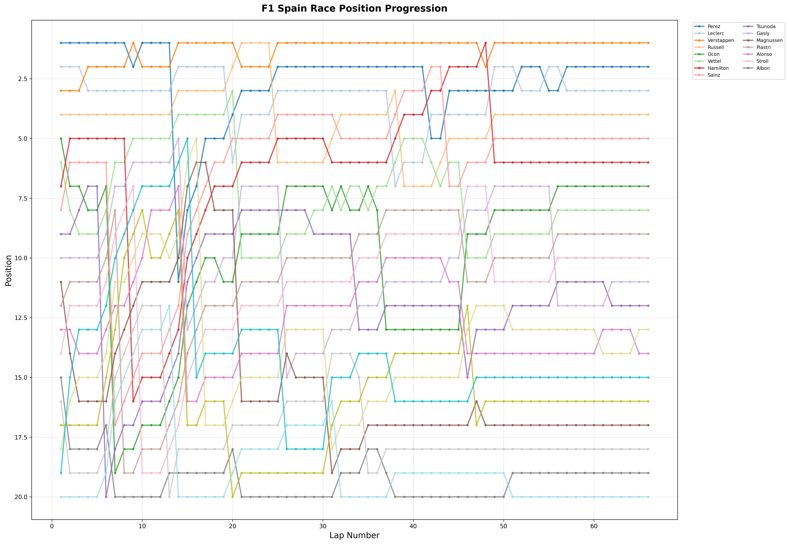
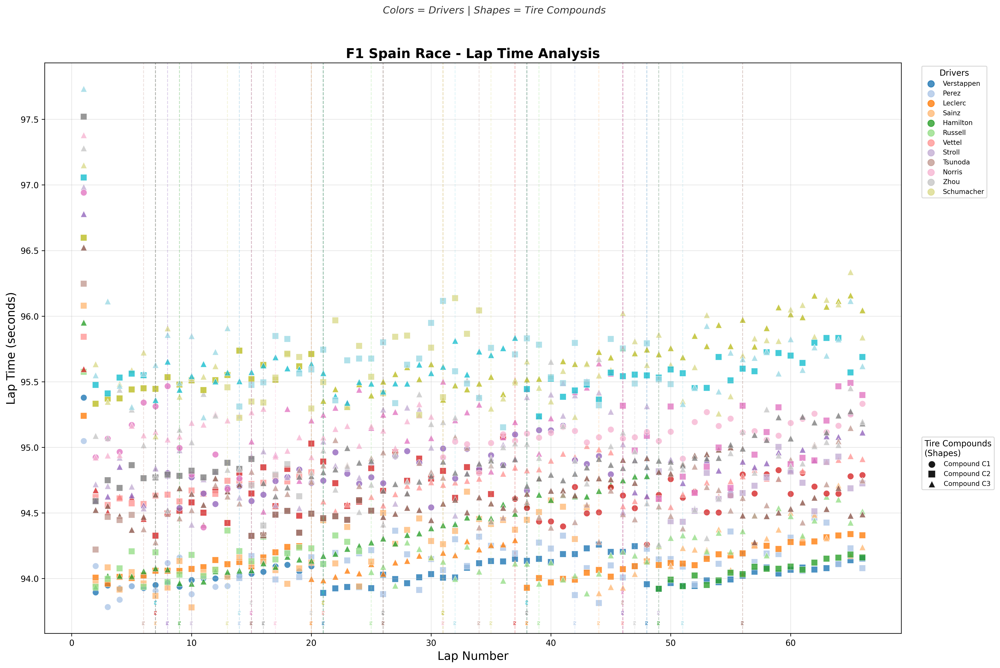

# F1 Spain 2022 Race Simulation Report

**Generated on:** 2025-11-02 19:41:35

## 🏁 Race Results

| Pos | Driver | Total Time | Minutes | Strategy | Grid | Start Delta |
|-----|--------|------------|----------|-----------|-------|-------------|
| 1 | Verstappen | 6252.1s | 104.2min | 2 | 3 | +1.413s |
| 2 | Perez | 6257.1s | 104.3min | 2 | 6 | +1.300s |
| 3 | Leclerc | 6258.8s | 104.3min | 2 | 4 | +1.292s |
| 4 | Sainz | 6265.2s | 104.4min | 2 | 9 | +1.830s |
| 5 | Hamilton | 6265.2s | 104.4min | 2 | 13 | +1.996s |
| 6 | Russell | 6265.6s | 104.4min | 2 | 8 | +1.461s |
| 7 | Ocon | 6292.8s | 104.9min | 2 | 2 | +1.114s |
| 8 | Vettel | 6297.8s | 105.0min | 2 | 5 | +1.316s |
| 9 | Piastri | 6304.4s | 105.1min | 2 | 14 | +2.169s |
| 10 | Stroll | 6308.6s | 105.1min | 2 | 18 | +2.490s |
| 11 | Gasly | 6311.7s | 105.2min | 3 | 16 | +2.177s |
| 12 | Tsunoda | 6313.1s | 105.2min | 3 | 11 | +1.687s |
| 13 | Alonso | 6323.5s | 105.4min | 2 | 15 | +2.167s |
| 14 | Norris | 6324.6s | 105.4min | 2 | 19 | +2.422s |
| 15 | Bottas | 6330.5s | 105.5min | 3 | 17 | +2.880s |
| 16 | Zhou | 6334.5s | 105.6min | 3 | 12 | +2.055s |
| 17 | Magnussen | 6357.8s | 106.0min | 2 | 1 | +1.169s |
| 18 | Schumacher | 6361.4s | 106.0min | 2 | 10 | +1.831s |
| 19 | Albon | 6378.7s | 106.3min | 3 | 7 | +1.603s |
| 20 | Latifi | 6381.3s | 106.4min | 3 | 20 | +2.611s |

## 🛠️ Pit Stop Strategy Analysis

| Driver | Strategy | Pit Laps | Pit Times | Tire Change Times | Tire Sequence |
|--------|-----------|-----------|------------|-------------------|---------------|
| Verstappen | 2 | 21, 48 | 21.94s, 22.07s | 2.44s, 2.57s | C1 → C2 → C2 |
| Perez | 2 | 14, 42 | 21.51s, 22.53s | 2.01s, 3.03s | C1 → C2 → C2 |
| Leclerc | 2 | 20, 38 | 22.79s, 22.32s | 3.29s, 2.82s | C2 → C3 → C2 |
| Sainz | 2 | 7, 44 | 22.54s, 22.19s | 3.04s, 2.69s | C2 → C2 → C3 |
| Hamilton | 2 | 9, 49 | 21.70s, 22.07s | 2.20s, 2.57s | C3 → C3 → C2 |
| Russell | 2 | 25, 39 | 21.54s, 25.61s | 2.04s, 6.11s | C2 → C3 → C3 |
| Ocon | 2 | 7, 37 | 21.56s, 22.96s | 2.06s, 3.46s | C3 → C2 → C1 |
| Vettel | 2 | 21, 46 | 21.99s, 22.48s | 2.49s, 2.98s | C2 → C3 → C3 |
| Piastri | 2 | 8, 46 | 21.55s, 22.81s | 2.05s, 3.31s | C3 → C1 → C3 |
| Stroll | 2 | 10, 49 | 22.30s, 22.78s | 2.80s, 3.28s | C3 → C3 → C2 |
| Gasly | 3 | 15, 26, 56 | 21.68s, 22.15s, 22.05s | 2.18s, 2.65s, 2.55s | C3 → C2 → C3 → C3 |
| Tsunoda | 3 | 6, 34, 46 | 21.32s, 22.30s, 21.97s | 1.82s, 2.80s, 2.47s | C2 → C3 → C3 → C3 |
| Alonso | 2 | 15, 46 | 21.66s, 22.21s | 2.16s, 2.71s | C1 → C3 → C2 |
| Norris | 2 | 17, 31 | 22.37s, 22.67s | 2.87s, 3.17s | C3 → C3 → C1 |
| Bottas | 3 | 16, 26, 38 | 22.10s, 21.66s, 22.35s | 2.60s, 2.16s, 2.85s | C2 → C3 → C3 → C3 |
| Zhou | 3 | 15, 20, 47 | 22.08s, 21.62s, 21.35s | 2.58s, 2.12s, 1.85s | C3 → C2 → C3 → C3 |
| Magnussen | 2 | 21, 31 | 21.51s, 22.91s | 2.01s, 3.41s | C2 → C3 → C3 |
| Schumacher | 2 | 13, 35 | 25.70s, 22.22s | 6.20s, 2.72s | C3 → C2 → C3 |
| Albon | 3 | 7, 21, 38 | 21.99s, 22.87s, 24.89s | 2.49s, 3.37s, 5.39s | C2 → C3 → C3 → C2 |
| Latifi | 3 | 14, 32, 51 | 21.57s, 22.48s, 22.94s | 2.07s, 2.98s, 3.44s | C3 → C2 → C2 → C3 |

## 🚀 Start Performance Analysis

### 🏁 Track Characteristics

- **Start Straight Length:** 830m
- **Complexity Level:** medium
- **Category:** medium

### 📊 Start Performance Rankings

| Pos | Driver | Grid | R-Value | Start Delta | Main Factors |
|-----|--------|------|----------|-------------|--------------|
| 1 | Ocon | 2 | 297.7 | 1.114s | Perfect Start |
| 2 | Magnussen | 1 | 280.3 | 1.169s | Normal start |
| 3 | Leclerc | 4 | 308.9 | 1.292s | Grid penalty 0.13s |
| 4 | Perez | 6 | 308.0 | 1.300s | Grid penalty 0.23s |
| 5 | Vettel | 5 | 297.5 | 1.316s | Grid penalty 0.22s |
| 6 | Verstappen | 3 | 309.9 | 1.413s | Grid penalty 0.12s |
| 7 | Russell | 8 | 308.0 | 1.461s | Grid penalty 0.35s |
| 8 | Albon | 7 | 279.8 | 1.603s | Grid penalty 0.34s |
| 9 | Tsunoda | 11 | 299.9 | 1.687s | Grid penalty 0.65s |
| 10 | Sainz | 9 | 308.0 | 1.830s | Grid penalty 0.48s |
| 11 | Schumacher | 10 | 279.0 | 1.831s | Grid penalty 0.49s |
| 12 | Hamilton | 13 | 309.2 | 1.996s | Grid penalty 0.83s |
| 13 | Zhou | 12 | 292.8 | 2.055s | Grid penalty 0.74s |
| 14 | Alonso | 15 | 289.9 | 2.167s | Grid penalty 1.01s |
| 15 | Piastri | 14 | 294.7 | 2.169s | Grid penalty 0.92s |
| 16 | Gasly | 16 | 299.8 | 2.177s | Grid penalty 1.00s |
| 17 | Norris | 19 | 289.1 | 2.422s | Grid penalty 1.30s |
| 18 | Stroll | 18 | 296.5 | 2.490s | Grid penalty 1.20s |
| 19 | Latifi | 20 | 278.4 | 2.611s | Grid penalty 1.40s |
| 20 | Bottas | 17 | 294.6 | 2.880s | Grid penalty 1.10s, Bad Start |

### 📈 Start Statistics

- **Average Start Delta:** 1.849s
- **Standard Deviation:** 0.504s
- **Minimum Start Delta:** 1.114s
- **Maximum Start Delta:** 2.880s

### ⚠️ Special Events

- **Perfect Start:** 1 occurrence(s)
- **Bad Start:** 1 occurrence(s)

## 📊 Race Visualization

### 🏁 Position Progression

### ⏱️ Lap Time Distribution

---
*Report generated by F1 Race Simulation System*
*Simulation time: 2025-11-02 19:41:35*
