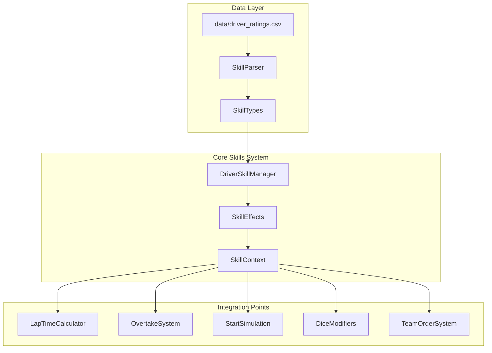

# Driver Skills System Design

## Overview

This document outlines the implementation plan for the F1 driver skills system based on `data/driver_ratings.csv`. Each driver has 1-2 unique skills that modify their R rating under specific conditions, adding strategic depth and character to the simulation.

## Skill Categories

Based on the CSV data, skills fall into these categories:

### 1. Weather-Related Skills
- **老潘课堂** (Verstappen): +0.5 R in rain
- **直感A** (Stroll): +0.3 R when defending or in rain

### 2. Qualifying Skills
- **勒一圈/刘一圈** (Leclerc/Hamilton): +0.5 R in qualifying (Q3/Q1/Q2 danger only)
- **排位神车** (Magnussen/Schumacher): +0.8 R in qualifying

### 3. Defense Skills
- **Smooth Operator** (Sainz): +0.3 R when defending, additional +0.3 when forming a train
- **WIDELONSO** (Alonso): +0.8 R when defending, vehicle damage check after 10 consecutive defenses
- **狮子** (Ocon): +0.5 R when defending (ignores team orders)
- **WIDEZHOU** (Zhou): +0.5 R when defending
- **画龙高手** (Magnussen): +0.8 R when defending, risk of double line change penalty

### 4. Overtaking Skills
- **振金超车** (Hamilton/Russell): Dice-based R boost when overtaking, may cause contact
- **极限哥** (Leclerc): +0.5 R when in DRS zone for 3+ laps, with Ra10 deformation check
- **斗小牛士** (Gasly): +0.5 R
- **武士道！** (Tsunoda): +1 R but extra dice for next overtake point mistake
- **我也是舒马赫** (Schumacher): +1 R but extra dice for next overtake point mistake

### 5. Tire Management Skills
- **保胎大师** (Perez/Albon): -0.3 R loss after tire cliff point

### 6. Start/Launch Skills
- **昏厥起步** (Bottas/Zhou): -0.5 R at start, 10% dice chance (improves over time)

### 7. Team Order Skills
- **团队精神** (Russell): 80% dice chance to obey team orders
- **好大哥** (Bottas): +1 R when helping Zhou or following team orders
- **车手都是自私的** (Sainz): +0.5 R when behind Leclerc with direct threat

### 8. Vehicle/Control Skills
- **拉力传承** (Sainz): 90% dice chance to recover from loss of control
- **全能老农** (Vettel): +0.8 R (car synergy)
- **冰人继承人** (Piastri): Immune to racing incidents, no damage when behind accidents

### 9. Random/Variable Skills
- **盲盒车** (Norris/Ricciardo): Dice-based R change per race (-0.5 to +0.5)
- **嗦球队** (Hulkenberg): +0.5 R against Magnussen specifically
- **总导演** (Latifi: Dice-based chance to cause incidents
- **抽象怪** (Piastri): R bonus with "godfather" driver (post-Australia)

## System Architecture



## Implementation Components

### 1. Skill Types (src/skills/skill_types.py)

```python
from enum import Enum, auto
from dataclasses import dataclass
from typing import Dict, List, Optional, Callable, Any

class SkillTrigger(Enum):
    """When a skill can activate"""
    WEATHER_RAIN = auto()           # Rain conditions
    QUALIFYING = auto()             # Qualifying session
    DEFENDING = auto()              # Defending position
    ATTACKING = auto()              # Attacking/overtaking
    START = auto()                  # Race start
    TIRE_CLIFF = auto()             # After tire degradation cliff
    DRS_ZONE = auto()               # In DRS zone for multiple laps
    TEAM_ORDER = auto()             # Team order situation
    EVERY_RACE = auto()             # Applied every race
    VS_SPECIFIC_DRIVER = auto()     # Against specific driver

class SkillEffectType(Enum):
    """Types of skill effects"""
    RATING_BOOST = auto()           # Direct R value boost
    RATING_PENALTY = auto()         # R value penalty
    DICE_MODIFIER = auto()          # Modify dice roll
    DICE_CHANCE = auto()            # Chance-based activation
    PREVENT_INCIDENT = auto()       # Prevent certain incidents
    CAUSE_INCIDENT = auto()         # Can cause incidents
    TIRE_MODIFIER = auto()          # Modify tire degradation

@dataclass
class DriverSkill:
    """Represents a driver skill"""
    name_cn: str                    # Chinese name
    name_en: str                    # English name (for code)
    description: str                # Skill description
    trigger: SkillTrigger           # When it activates
    effect_type: SkillEffectType    # Type of effect
    effect_value: float             # Magnitude of effect
    conditions: Dict[str, Any]      # Additional conditions
    dice_check: Optional[Dict]      # Dice roll requirements (if any)
```

### 2. Skill Parser (src/skills/skill_parser.py)

Parses the Chinese skill descriptions from CSV and converts to structured data:

```python
SKILL_DEFINITIONS = {
    "老潘课堂": {
        "name_en": "RainMaster",
        "trigger": SkillTrigger.WEATHER_RAIN,
        "effect_type": SkillEffectType.RATING_BOOST,
        "effect_value": 0.5,
        "description": "R+0.5 in rainy conditions",
    },
    "保胎大师": {
        "name_en": "TireSaver",
        "trigger": SkillTrigger.TIRE_CLIFF,
        "effect_type": SkillEffectType.TIRE_MODIFIER,
        "effect_value": -0.3,
        "description": "-0.3 R loss after tire cliff",
    },
    # ... more skills
}
```

### 3. Driver Skill Manager (src/skills/driver_skill_manager.py)

Central manager for skill lookups and activation:

```python
class DriverSkillManager:
    """Manages all driver skills and their activation"""
    
    def __init__(self, csv_path: str = "data/driver_ratings.csv"):
        self.driver_skills: Dict[str, List[DriverSkill]] = {}
        self._load_skills(csv_path)
    
    def get_active_skills(
        self, 
        driver: str, 
        context: SkillContext
    ) -> List[ActiveSkillEffect]:
        """Get all active skills for driver given context"""
        
    def calculate_rating_modifier(
        self, 
        driver: str, 
        base_r: float, 
        context: SkillContext
    ) -> float:
        """Calculate total R value modifier from active skills"""
```

### 4. Skill Context (src/skills/skill_context.py)

Provides context for skill activation decisions:

```python
@dataclass
class SkillContext:
    """Context for skill activation checks"""
    session_type: str           # "race", "qualifying", "practice"
    lap_number: int
    weather_condition: str      # "dry", "light_rain", "heavy_rain"
    is_defending: bool
    is_attacking: bool
    drs_zone_laps: int          # Consecutive laps in DRS zone
    tire_compound: str
    tire_age: int
    position: int
    gap_to_ahead: float
    gap_to_behind: float
    teammate_position: int
    teammate_gap: float
    opponent_driver: Optional[str]  # For VS_SPECIFIC_DRIVER skills
```

## Integration Points

### 1. Lap Time Calculation

In `enhanced_long_dist_sim.py`, modify `calculate_base_lap_time()`:

```python
def calculate_base_lap_time(
    r_value: float, 
    track_name: str,
    driver: str,
    context: SkillContext,
    skill_manager: DriverSkillManager
) -> float:
    base_time = TRACK_BASE_LAP_TIMES.get(track_name.lower(), (88.0, 300))[0]
    
    # Apply skill modifiers
    adjusted_r = skill_manager.calculate_rating_modifier(
        driver, r_value, context
    )
    
    adjustment = (adjusted_r - 300) * 0.01
    return base_time + adjustment
```

### 2. Overtake System

In `drs/overtake.py`, modify `_calc_attacker_mods()` and `_calc_defender_mods()`:

```python
def _calc_attacker_mods(self, attacker, defender, situation, interval_history):
    mods = {"base": 0.0}
    
    # Get skill bonuses
    context = SkillContext(
        is_attacking=True,
        opponent_driver=defender.name,
        # ... other context
    )
    
    skill_bonus = skill_manager.get_overtake_bonus(attacker.name, context)
    mods["skill"] = skill_bonus
    
    return mods
```

### 3. Start Simulation

In `enhanced_long_dist_sim.py`, modify `simulate_start()`:

```python
def simulate_start(self, grid_positions):
    for driver, grid_pos in grid_positions.items():
        # Check for start-related skills
        context = SkillContext(session_type="race", lap_number=0)
        start_modifier = skill_manager.get_start_modifier(driver, context)
        
        # Apply to reaction time or start delta
        reaction_time += start_modifier
```

### 4. Dice Roll Integration

Skills that add dice checks (like 武士道！, 我也是舒马赫):

```python
def roll_with_skill_checks(driver: str, skill_manager: DriverSkillManager):
    base_roll = roll_d10()
    
    # Check for extra dice requirements
    extra_dice = skill_manager.get_required_extra_dice(driver, context)
    
    for dice_check in extra_dice:
        check_roll = roll_d10()
        if check_roll <= dice_check["threshold"]:
            # Apply failure effect
            pass
    
    return base_roll
```

## Skill Effects Summary Table

| Driver | Skill 1 | Skill 2 | Primary Effect |
|--------|---------|---------|----------------|
| 维斯塔潘 | Rain +0.5 | - | Weather boost |
| 佩雷兹 | Tire save -0.3 | - | Tire management |
| 勒克莱尔 | Quali +0.5 | DRS bonus +0.5 w/ risk | Quali + Race |
| 塞恩斯 | Defense +0.3/+0.6 | Recovery 90% | Defense + Control |
| 汉密尔顿 | Quali +0.5 | Overtake dice | Quali + Attack |
| 拉塞尔 | Team orders 80% | Overtake dice | Team play + Attack |
| 加斯利 | R +0.5 | - | Constant boost |
| 角田裕毅 | R +1 w/ risk | - | High risk/reward |
| 维特尔 | R +0.8 | - | Car synergy |
| 斯特罗尔 | Defense/Rain +0.3 | - | Defense/Weather |
| 阿隆索 | Defense +0.8 w/ risk | - | Strong defense |
| 奥康 | Defense +0.5 | - | Defense (selfish) |
| 博塔斯 | Start -0.5 | Team help +1 | Start penalty/Team |
| 周冠宇 | Start -0.5 | Defense +0.5 | Start penalty/Defense |
| 诺里斯 | Random R ±0.5 | - | Variable |
| 里卡多 | Random R ±0.5 | - | Variable |
| 马格努森 | Defense +0.8 w/ risk | Quali +0.8 | Defense + Quali |
| 米克 | R +1 w/ risk | Quali +0.8 | Risk + Quali |
| 阿尔本 | Tire save -0.3 | - | Tire management |
| 拉提菲 | Incident dice | - | Chaos factor |
| 霍肯伯格 | vs MAG +0.5 | - | Rivalry bonus |
| 皮亚斯特里 | Incident immune | Godfather bonus | Safety + Team |
| 格罗斯让 | Team +0.5 | Indestructible | Team + Safety |

## Implementation Phases

### Phase 1: Core Infrastructure
1. Create skill types and data models
2. Implement skill parser from CSV
3. Build driver skill manager
4. Create skill context system

### Phase 2: Basic Effects
1. Constant R boost skills (Gasly, Vettel)
2. Weather-based skills (Verstappen, Stroll)
3. Qualifying skills (Leclerc, Hamilton, Magnussen)
4. Defense skills (Sainz, Alonso, Zhou, Ocon)

### Phase 3: Complex Effects
1. Dice-based skills (Tsunoda, Schumacher, Hamilton, Russell)
2. Tire management skills (Perez, Albon)
3. Start skills (Bottas, Zhou)
4. Variable skills (Norris, Ricciardo)

### Phase 4: Advanced Integration
1. Team order skills (Russell, Bottas, Sainz)
2. Rivalry skills (Hulkenberg)
3. Incident immunity (Piastri, Grosjean)
4. Special mechanics (Leclerc's DRS deformation, Alonso's damage check)

### Phase 5: Testing & Polish
1. Unit tests for each skill
2. Integration tests in full races
3. Balance adjustments
4. Documentation

## Files to Create/Modify

### New Files
- `src/skills/__init__.py`
- `src/skills/skill_types.py`
- `src/skills/skill_parser.py`
- `src/skills/skill_effects.py`
- `src/skills/driver_skill_manager.py`
- `src/skills/skill_context.py`
- `src/skills/tests/test_skills.py`
- `docs/SKILL_SYSTEM.md`

### Modified Files
- `src/simulation/enhanced_long_dist_sim.py` - Lap time and start integration
- `src/drs/overtake.py` - Overtake skill integration
- `src/incidents/driver_error.py` - Error prevention skills
- `src/utils/generate_driver_tables.py` - Include skills in output
- `main.py` - Initialize skill manager

## Testing Strategy

1. **Unit Tests**: Test each skill in isolation
2. **Integration Tests**: Test skills in race scenarios
3. **Balance Tests**: Verify skill effects are reasonable
4. **Edge Cases**: Test skill interactions and conflicts

## Open Questions

1. Should skills stack if multiple conditions are met?
2. How to handle skill conflicts (e.g., both drivers have defense bonuses)?
3. Should skills have cooldowns or usage limits?
4. How to display skill activations in race reports?
5. Should skills be visible to players or hidden mechanics?

## Success Criteria

- [ ] All 27 drivers have their skills implemented
- [ ] Skills activate correctly under specified conditions
- [ ] Dice roll mechanics work as described
- [ ] Race reports show skill activations
- [ ] System is extensible for future skills
- [ ] Tests cover all skill types
